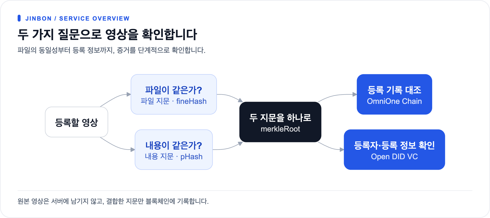
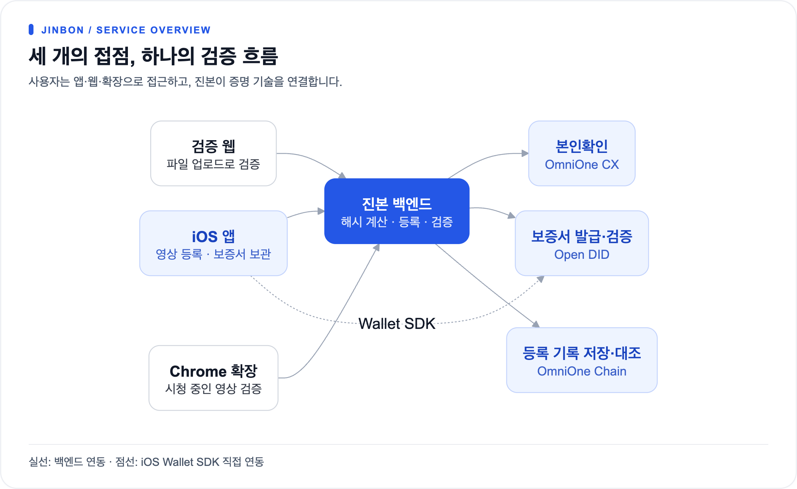

# 진본 (JinBon)

> **영상이 진짜인지, 블록체인과 DID로 증명합니다.**

## 진본이란?

영상은 복제와 재인코딩이 쉽습니다. 편집, 자막 추가, 재업로드를 거치면 파일 자체가 달라지기 때문에 단순 파일 비교로는 "같은 영상"인지조차 판단하기 어렵습니다.

**진본**은 이 문제를 해결하는 블록체인 기반 영상 진위 검증 서비스입니다. 원본 영상의 디지털 지문(해시)을 블록체인에 기록하고, 누가 언제 등록했는지를 DID 보증서(VC)로 증명합니다.

### 핵심 원리

[크게 보기](assets/diagrams/README-1.png) · [Mermaid 원본](assets/diagrams/README-1.mmd)

| 증명 | 질문 | 기술 |
|---|---|---|
| **무결성** | 이 영상이 변조되지 않았는가? | 블록체인 해시 대조 (OmniOne Chain) |
| **신뢰성** | 누가 언제 등록했는가? | DID + VC 보증서 (Open DID) |
| **본인확인** | 등록자가 진짜 본인인가? | 모바일 신분증 (OmniOne CX) |

**원본 영상은 서버에 저장하지 않습니다.** 해시만 계산한 뒤 임시 파일은 즉시 삭제합니다.

### 두 종류의 해시

- **fineHash** -- 파일 전체의 SHA-256. 바이트 단위로 동일한 원본인지 확인합니다.
- **perceptualHash** -- 프레임에서 뽑은 DCT 기반 지각해시. 재인코딩, 리사이즈, 압축을 거쳐도 비슷한 값이 나와 **내용이 같은 영상**을 찾아냅니다.

두 해시를 이어 SHA-256을 한 번 더 계산한 값이 **merkleRoot**이고, 블록체인에 기록되는 것은 이 값입니다.

### 검증 판정 (7단계)

| 판정 | 의미 |
|---|---|
| **EXACT_MATCH** | 등록된 원본 파일 그대로 |
| **SAME_CONTENT** | 파일은 다르지만 내용이 동일한 영상 |
| **SIMILAR_MATCH** | 재인코딩된 같은 영상 (해밍 거리 < 10) |
| **NOT_REGISTERED** | 등록 이력 없음 |
| **REGISTERED_BUT_REVOKED** | 등록 후 비활성화된 영상 |
| **CERTIFICATE_INVALID** | 보증서(VC)가 무효 |
| **VERIFICATION_UNAVAILABLE** | 외부 시스템 장애로 검증 불가 |

> **미등록은 조작의 증거가 아닙니다.** 등록된 적이 없다는 뜻일 뿐입니다.

---

## 시스템 구성

[크게 보기](assets/diagrams/README-2.png) · [Mermaid 원본](assets/diagrams/README-2.mmd)

| 저장소 | 역할 | 기술 스택 | 포트 |
|---|---|---|---|
| **jinbon-backend** | 등록, 검증, 인증 API 허브 | Java 21, Spring Boot 4.1, PostgreSQL 16.4, Redis 7 | 8070 |
| **jinbon-ios** | 등록자용 Wallet 앱 (등록, DID/VC 관리) | Swift, UIKit, DIDWalletSDK 2.0.1 | -- |
| **jinbon-web** | 파일 업로드 기반 영상 검증 | Next.js 16, React 19, Tailwind CSS, Cloudflare Workers | 8071 |
| **jinbon-extension** | YouTube·Instagram 시청 중 즉시 검증 | Manifest V3, 순수 JavaScript | -- |

### 채널별 역할

| 채널 | 하는 일 | 로그인 |
|---|---|---|
| **iOS 앱** | 가입, DID/Wallet 관리, **영상 등록**, 보증서 보관 | 필요 |
| **웹** | 영상 파일 올려 검증 | 불필요 |
| **Chrome 확장** | YouTube·Instagram 영상 URL 기반 즉시 검증 | 불필요 |

### 외부 연동

| 서비스 | 용도 |
|---|---|
| **OmniOne CX** | 등록자 본인확인 (모바일 신분증) |
| **Open DID** | VC 발급 및 검증 (Issuer, Verifier, TAS) |
| **OmniOne Chain** | 영상 해시(merkleRoot) 온체인 기록 (BESU 기반) |
| **yt-dlp** | URL 기반 검증 시 영상 다운로드 |

### 설계 원칙

| 원칙 | 방법 |
|---|---|
| 원본 영상을 서버에 남기지 않음 | 해시 계산 후 임시 파일 즉시 삭제 |
| 개인 식별정보(CI)를 저장하지 않음 | HMAC-SHA256 해시만 보관 |
| 등록과 보증서 발급을 분리 | VC 발급 실패해도 블록체인 등록은 유지, 나중에 재발급 가능 |
| 중복 등록 차단 | 파일해시 + 내용해시 + DB 유니크 제약 3중 방어 |
| 동시 요청에 중복 트랜잭션 방지 | DB 선점(saveAndFlush) 후 블록체인 전송 |

---

## 문서 안내

### 시각 자료

- **[서비스 한눈에](visual/01-service-at-a-glance.md)** -- 문제, 해결, 구조를 다이어그램으로 정리

### 상세 문서

**개요**
- [서비스 개요](reference/00-overview/service-overview.md) -- 문제 정의, 해시 구조, 사용자 유형
- [저장소 지도](reference/00-overview/repositories.md) -- 4개 저장소의 기술 스택과 구성

**아키텍처**
- [시스템 아키텍처](reference/10-architecture/system-architecture.md) -- 전체 시스템 구성도, 포트, 데이터 흐름
- [백엔드](reference/10-architecture/component-backend.md) -- Spring Boot 패키지 구조, 주요 서비스
- [iOS](reference/10-architecture/component-ios.md) -- Swift 앱 구조, 화면 계층, Wallet 연동
- [웹](reference/10-architecture/component-web.md) -- Next.js 단일 페이지 구조
- [Chrome 확장](reference/10-architecture/component-extension.md) -- Manifest V3, 콘텐츠 스크립트

**핵심 플로우**
- [영상 등록](reference/20-flows/video-register.md) -- 7단계 등록 시퀀스 (해시 -> 블록체인 -> VC)
- [영상 검증](reference/20-flows/video-verify.md) -- 판정 로직, 캐싱, SSRF 방어
- [가입/로그인](reference/20-flows/signup-login.md) -- OmniOne CX 인증, JWT, DID 연결
- [VC 발급](reference/20-flows/vc-issuance.md) -- Open DID 보증서 발급 흐름

**인터페이스 & 데이터**
- [API 명세](reference/30-api/backend-api.md) -- 19개 엔드포인트, 에러 코드
- [데이터 모델](reference/40-data/data-model.md) -- PostgreSQL 스키마 (Members, Videos)
- [스마트 컨트랙트](reference/40-data/smart-contract.md) -- JinBon.sol 구조

**보안 & 운영**
- [보안/개인정보](reference/50-security/security-and-privacy.md) -- CI 해싱, SSRF 방어, 서명 검증
- [로컬 실행 가이드](reference/60-operations/local-setup.md) -- Docker, Gradle, 포트 설정
- [환경 변수](reference/60-operations/environment-config.md) -- 40개 이상의 설정값 문서

---

> 실행 방법은 **[로컬 실행 가이드](reference/60-operations/local-setup.md)** 를 참고하세요.
