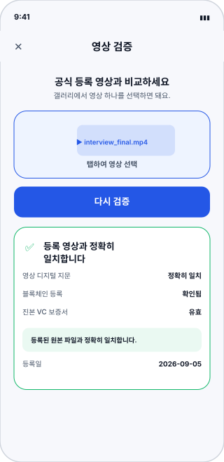
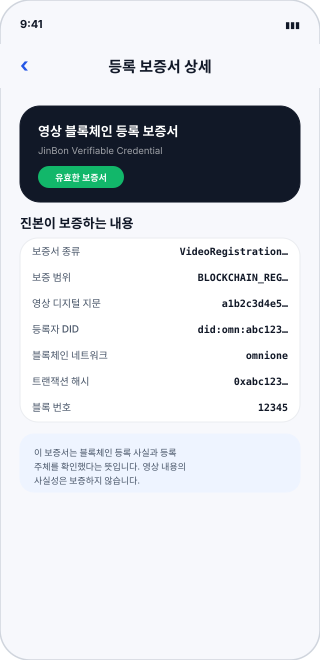
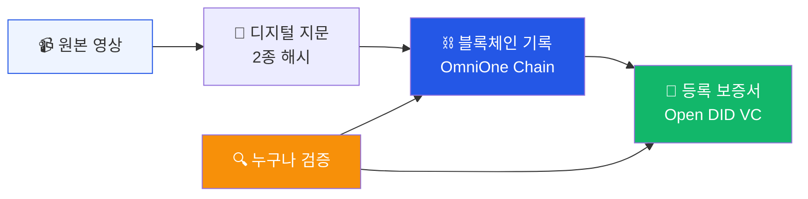
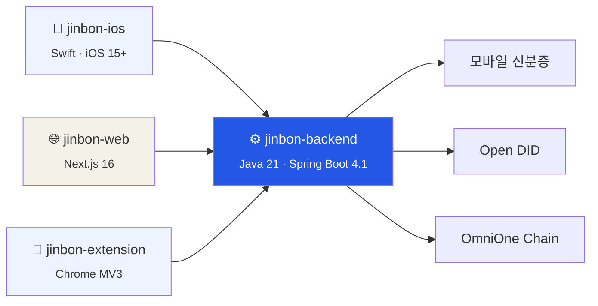

# 진본 (JinBon)

> **영상이 진짜인지, 블록체인과 DID로 증명합니다.**
> 2026 블록체인 & AI 해커톤 · Track 2

<table>
<tr>
<td width="33%" align="center"> <b>iOS Wallet</b> 등록 · 보증서 보관</td>
<td width="33%" align="center"> <b>영상 검증</b> 7단계 판정</td>
<td width="33%" align="center"> <b>등록 보증서</b> Open DID VC</td>
</tr>
</table>

---

## 30초 요약

| | 질문 | 답하는 기술 |
|---|---|---|
| **무결성** | 이 영상이 변조되지 않았는가? | 블록체인 (OmniOne Chain) |
| **신뢰성** | 누가 언제 등록했는가? | DID + VC (Open DID) |
| **본인확인** | 등록자가 진짜 본인인가? | 모바일 신분증 (OmniOne CX) |

**원본 영상은 서버에 저장하지 않습니다.** 해시만 기록합니다.

---

## 📂 문서

### 먼저 보세요 — 시각 자료

| | 문서 | 내용 |
|---|---|---|
| 🎯 | **[서비스 한눈에](visual/01-service-at-a-glance.md)** | 문제 → 해결 → 구조를 그림으로 |
| 📱 | **[화면 흐름](visual/02-screen-flow.md)** | 전 채널 화면 목업과 이동 경로 |
| 🔄 | **[핵심 시퀀스](visual/03-key-sequences.md)** | 등록 · 검증 · 발급 동작 순서 |

### 필요할 때 보세요 — 상세 자료

<b>reference/ 펼쳐보기</b> — API 명세, 데이터 모델, 보안, 운영 등 20개 문서

 

**개요** · [서비스 개요](reference/00-overview/service-overview.md) · [용어 사전](reference/00-overview/glossary.md) · [저장소 지도](reference/00-overview/repositories.md)

**아키텍처** · [시스템 구성](reference/10-architecture/system-architecture.md) · [백엔드](reference/10-architecture/component-backend.md) · [iOS](reference/10-architecture/component-ios.md) · [웹](reference/10-architecture/component-web.md) · [확장](reference/10-architecture/component-extension.md) · [외부 연동](reference/10-architecture/external-integrations.md)

**플로우** · [가입·로그인](reference/20-flows/signup-login.md) · [영상 등록](reference/20-flows/video-register.md) · [VC 발급](reference/20-flows/vc-issuance.md) · [영상 검증](reference/20-flows/video-verify.md)

**인터페이스** · [API 명세](reference/30-api/backend-api.md) · [클라이언트 매트릭스](reference/30-api/client-api-matrix.md)

**데이터·보안** · [데이터 모델](reference/40-data/data-model.md) · [스마트 컨트랙트](reference/40-data/smart-contract.md) · [보안·개인정보](reference/50-security/security-and-privacy.md)

**운영** · [로컬 실행](reference/60-operations/local-setup.md) · [환경 설정값](reference/60-operations/environment-config.md)

**화면 명세** · [화면 목록](reference/70-screens/screen-inventory.md) · [iOS](reference/70-screens/ios-screens.md) · [웹](reference/70-screens/web-screens.md) · [확장](reference/70-screens/extension-screens.md)

**현황** · [구현 현황](reference/90-status/implementation-status.md) · [알려진 이슈](reference/90-status/open-issues.md)

---

## 구성

| 저장소 | 역할 | 포트 |
|---|---|---|
| `jinbon-backend` | 등록 · 검증 · 인증 허브 | 8070 |
| `jinbon-ios` | 등록자용 Wallet 앱 | — |
| `jinbon-web` | 파일 업로드 검증 | 8071 |
| `jinbon-extension` | YouTube 즉시 검증 | — |

→ 실행 방법은 **[로컬 실행 가이드](reference/60-operations/local-setup.md)**

---

모든 문서는 각 저장소의 **코드를 직접 읽어** 작성했습니다. 화면 목업은 실제 구현된 문구·색상·레이아웃을 그대로 옮긴 것입니다.
저장소 README와 코드가 다를 경우 코드를 정본으로 삼았고, 차이는 [알려진 이슈](reference/90-status/open-issues.md)에 기록했습니다.
