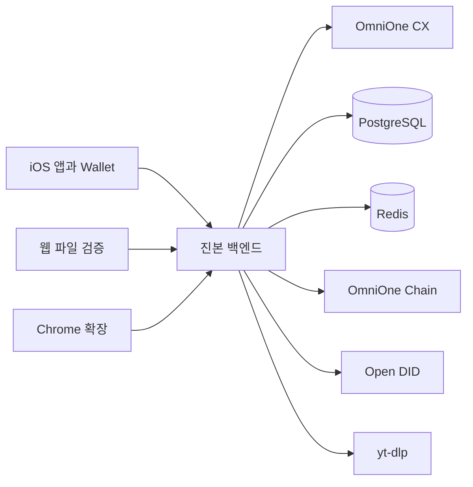

# 기술 구현 설명

기준일: 2026-09-07

## 구성

OmniOne Chain은 영상 등록 기록에, Open DID는 DID와 VC에 사용됩니다. 영상 등록 서명은 백엔드가 만들며 Wallet 서명과 다릅니다.

## 핵심 API

| 경로 | 용도 |
|---|---|
| `/api/signup/*` | 가입 본인확인과 DID 연결 |
| `/api/auth/*` | 로그인, 갱신, 로그아웃, DID 복구 |
| `POST /api/videos` | 영상 등록 |
| `GET /api/videos` | 내 영상 조회 |
| `POST /api/videos/{id}/vc/prepare` | VC 발급 준비 |
| `POST /api/videos/{id}/vc/complete` | VC 발급 완료 |
| `POST /api/verify` | 파일 검증 |
| `POST /api/verify/url` | URL 검증 |

파일 검증은 SHA-256 캐시와 정확 매칭을 먼저 사용하고, 미일치하면 pHash로 활성 영상을 비교합니다. URL은 허용 목록 확인 뒤 yt-dlp로 내려받습니다. 검증 캐시 TTL은 10분입니다.

## 알려진 제한

체인 receipt 확정과 DB 커밋은 하나의 원자 트랜잭션이 아닙니다. VC 완료 API에서 VC Claim과 대상 영상의 완전한 대조도 보완 대상입니다.
