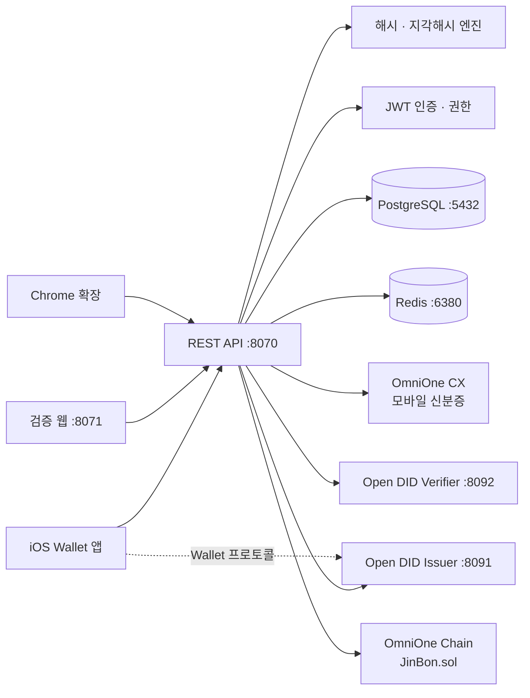

# 시스템 구성

## 전체 아키텍처

## 기술 스택

| 저장소 | 역할 | 기술 스택 | 포트 |
|---|---|---|---|
| **jinbon-backend** | 등록, 검증, 인증 API 허브 | Java 21, Spring Boot 4.1, PostgreSQL 16.4, Redis 7 | 8070 |
| **jinbon-ios** | 등록자용 Wallet 앱 | Swift, UIKit, DIDWalletSDK 2.0.1 | — |
| **jinbon-web** | 파일 업로드 기반 영상 검증 | Next.js 16, React 19, Tailwind CSS | 8071 |
| **jinbon-extension** | YouTube·Instagram 시청 중 검증 | Manifest V3, 순수 JavaScript | — |

## 계층별 책임

| 계층 | 책임 | 대표 클래스 |
|---|---|---|
| Controller | HTTP 요청 수신, 인증 주체 추출 | `VideoRegisterController`, `VideoVerifyController` |
| Service (domain) | 등록·검증·인증 비즈니스 규칙 | `VideoRegisterService`, `VideoVerifyService` |
| Service (기술) | 해시·서명 계산 | `HashService`, `PerceptualHashService`, `SignatureService` |
| Infra | 외부 시스템 호출 | `OmniOneChainClient`, `OpenDidIssuerClient` |
| Global | 공통 응답·예외·보안 설정 | `CommonResponse`, `ErrorCode`, `SecurityConfig` |

## 포트 맵

### 진본 구성 요소

| 포트 | 프로세스 | 비고 |
|---|---|---|
| 8070 | 진본 백엔드 | `SERVER_PORT`로 변경 가능 |
| 8071 | 검증 웹 (`npm run dev`) | 고정 |
| 5432 | PostgreSQL | `DB_PORT`로 변경 가능 |
| 6380 | Redis | 컨테이너 내부 6379 매핑 |

### Open DID Orchestrator

| 포트 | 서버 |
|---|---|
| 8091 | Issuer |
| 8092 | Verifier |
| 8090 | TAS |
| 8093 | API Gateway |
| 8094 | CA |
| 8095 | Wallet |
| 9001 | Orchestrator 관리 UI |

백엔드는 이 중 **Issuer(8091)와 Verifier(8092)만** 호출합니다.

## 데이터 흐름 요약

### 등록 (앱 → 백엔드 → 체인 → Issuer)

1. 앱이 영상 파일과 제목을 `POST /api/videos`로 전송
2. 백엔드가 fineHash · perceptualHash · merkleRoot · signature 계산
3. DB에 먼저 저장(unique 제약으로 중복 선점) 후 온체인 `register` 전송
4. 확정된 온체인 기록을 다시 조회해 대조
5. Open DID Issuer에 Holder와 클레임 등록 → 발급 Offer 생성
6. 앱이 Offer로 Wallet 발급 진행 후 `vcId`를 백엔드에 연결

### 검증 (웹·확장 → 백엔드)

1. 파일 또는 URL 수신
2. Redis 캐시 조회 (TTL 10분)
3. fineHash 정확 매칭 → 실패 시 perceptualHash 유사도 검색
4. 매칭된 영상에 대해 온체인 기록 조회 + 서명 재계산 대조
5. VC가 발급된 영상이면 Verifier로 상태·서명 확인
6. verdict 산출 후 캐싱
