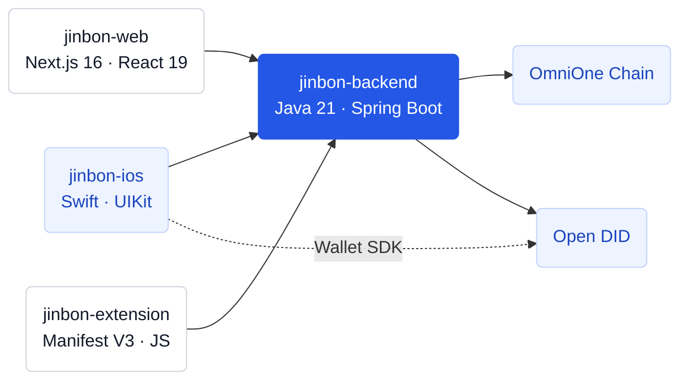

# 저장소 구조

## 4개 저장소

## jinbon-backend

| 항목 | 내용 |
|---|---|
| 언어 | Java 21 |
| 프레임워크 | Spring Boot 4.1 |
| DB | PostgreSQL 16.4, Redis 7 |
| 포트 | 8070 |
| 역할 | 등록, 검증, 인증 API 허브, 외부 연동 |

## jinbon-ios

| 항목 | 내용 |
|---|---|
| 언어 | Swift |
| UI | UIKit (WebView 기반 인증 화면) |
| SDK | DIDWalletSDK 2.0.1, OmniOneCXSDK |
| 역할 | 회원가입, DID/Wallet 관리, 영상 등록, VC 보관 |

## jinbon-web

| 항목 | 내용 |
|---|---|
| 프레임워크 | Next.js 16, React 19 |
| 스타일 | Tailwind CSS |
| 포트 | 8071 |
| 역할 | 파일 업로드 기반 영상 검증 (비로그인) |

## jinbon-extension

| 항목 | 내용 |
|---|---|
| 매니페스트 | Manifest V3 |
| 언어 | 순수 JavaScript |
| 역할 | YouTube·Instagram 시청 중 URL 기반 즉시 검증 |
| 권한 | `localhost:8070` 고정 (임의 호스트 요청 불가) |

## 채널별 역할 요약

| 채널 | 등록 | 검증 | 로그인 |
|---|---|---|---|
| iOS 앱 | O | O | 필요 |
| 웹 | — | O (파일) | 불필요 |
| Chrome 확장 | — | O (URL) | 불필요 |
