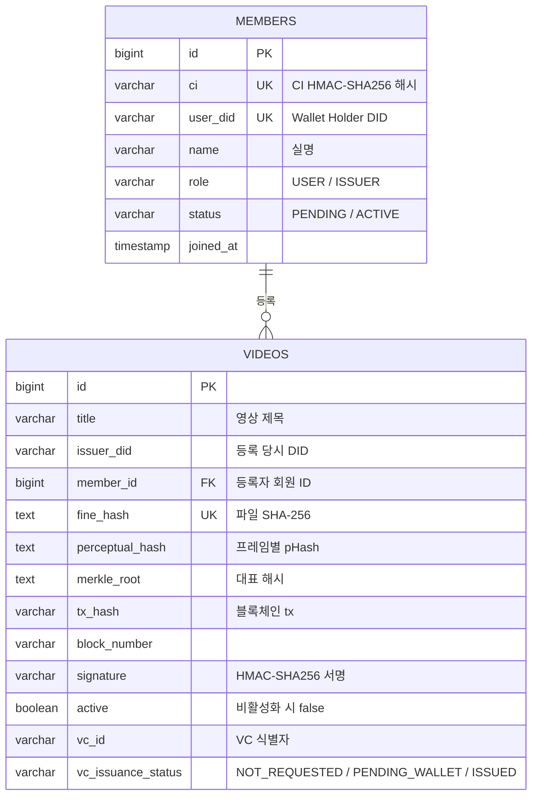
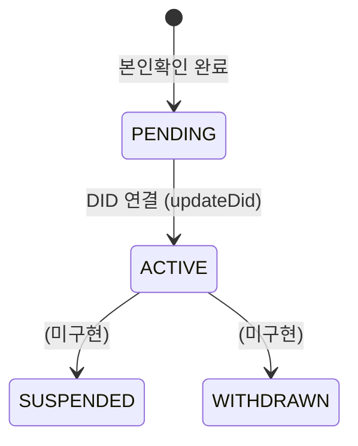
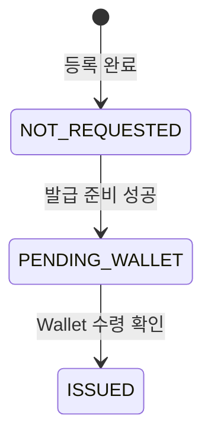

# 데이터 모델

PostgreSQL 16.4, JPA `ddl-auto: update`로 스키마를 관리합니다.

## ER 개요

## members

| 컬럼 | 타입 | 제약 | 설명 |
|---|---|---|---|
| `id` | bigint | PK, identity | |
| `ci` | varchar | not null, **unique** | CI의 HMAC-SHA256 해시. `h1:` 접두사 |
| `user_did` | varchar | unique | Holder DID. 가입 전 null |
| `name` | varchar | not null | 신분증에서 추출한 실명 |
| `birth` | varchar | | 생년월일 |
| `role` | varchar | not null | `USER` / `ISSUER` |
| `status` | varchar | not null | `PENDING` / `ACTIVE` / `SUSPENDED` / `WITHDRAWN` |
| `did_registered_at` | timestamp | | DID 최초 등록 또는 재연결 시각 |
| `joined_at` | timestamp | | 가입 완료 시각 |

::: info CI 컬럼
컬럼명이 `ci`지만 **값은 언제나 해시**입니다. 평문 CI는 어떤 경로로도 저장되지 않습니다.
:::

### 상태 전이

### 역할

| 역할 | 영상 등록 | 비고 |
|---|---|---|
| `USER` | 불가 | 레거시. 로그인 시 자동 승격 |
| `ISSUER` | 가능 | `updateDid()` 시점에 자동 부여 |

## videos

| 컬럼 | 타입 | 제약 | 설명 |
|---|---|---|---|
| `id` | bigint | PK, identity | |
| `title` | varchar | not null | 영상 제목 |
| `issuer_did` | varchar | not null | 등록 당시 등록자 DID |
| `member_id` | bigint | | 등록자 회원 ID (레거시는 null) |
| `perceptual_hash` | text | not null | 프레임별 pHash (쉼표 구분) |
| `fine_hash` | text | not null, **unique** | 파일 전체 SHA-256 |
| `merkle_root` | text | not null | `SHA-256(pHash + fineHash)` |
| `tx_hash` | varchar | | 등록 트랜잭션 해시 |
| `block_number` | varchar | | 등록 트랜잭션 블록 번호 |
| `signature` | varchar | not null | `HMAC-SHA256(issuerDid + merkleRoot)` |
| `active` | boolean | not null | 비활성화 시 false |

### VC 관련 컬럼

| 컬럼 | 채워지는 시점 | 설명 |
|---|---|---|
| `vc_offer_id` | 발급 준비 | 1회성 Offer ID |
| `vc_plan_id` | 발급 준비 | `vcplan-jinbon-01` |
| `vc_issuer_did` | 발급 준비 | 실제 Issuer DID |
| `vc_issuance_status` | 등록 시 초기화 | `NOT_REQUESTED` / `PENDING_WALLET` / `ISSUED` |
| `vc_id` | 발급 완료 | Wallet이 수령한 VC 식별자 |

::: warning 이름 주의
`vc_issuer_did`는 **VC 발급기관**이고 `issuer_did`는 **영상 등록자**입니다.
:::

### VC 상태 전이

## 중복 방지 계층

| 계층 | 방식 | 잡아내는 경우 |
|---|---|---|
| 1 | `fineHash` 조회 | 완전히 같은 파일 |
| 2 | `perceptualHash` 양방향 거리 0 | 컨테이너만 다른 파일 |
| 3 | `fine_hash` unique 제약 | 동시 요청 경합 |

## Redis 키

| 키 | 타입 | TTL | 용도 |
|---|---|---|---|
| `verify:result:{fineHash}` | string | 10분 | 파일 검증 결과 캐시 |
| `verify:result:url:{sha256(url)}` | string | 10분 | URL 검증 결과 캐시 |
| `verify:video:{videoId}` | set | 10분 | 영상별 캐시 키 인덱스 |
| refresh token | — | 7일 | `RefreshTokenService` |
| DID 재연결 토큰 | — | 단기 | `DidRebindTokenService` |
