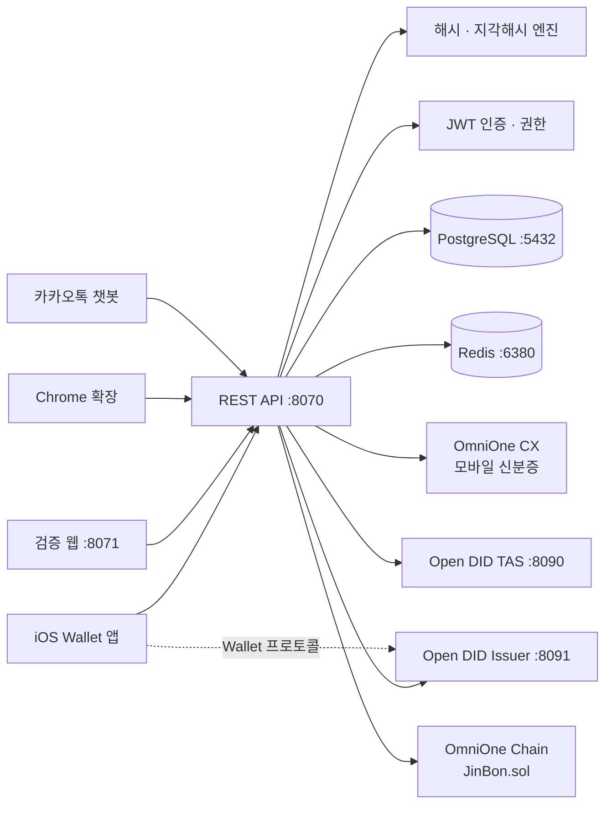

# 시스템 구성

## 전체 아키텍처

## 기술 스택

| 저장소 | 역할 | 기술 스택 | 포트 |
|---|---|---|---|
| **jinbon-backend** | 등록, 검증, 인증 API 허브 | Java 21, Spring Boot 4.1, PostgreSQL 16.4, Redis 7 | 8070 |
| **jinbon-ios** | 등록자용 Wallet 앱 | Swift, UIKit, DIDWalletSDK 2.0.1 | — |
| **jinbon-web** | 파일 업로드·URL 기반 영상 검증 | Next.js 16, React 19, Tailwind CSS | 8071 |
| **jinbon-extension** | YouTube·Instagram 시청 중 검증 | Manifest V3, 순수 JavaScript | — |

## 포트 맵

### 진본 구성 요소

| 포트 | 프로세스 | 비고 |
|---|---|---|
| 8070 | 진본 백엔드 | `SERVER_PORT`로 변경 가능 |
| 8071 | 검증 웹 (`npm run dev`) | 고정 |
| 5432 | PostgreSQL | `DB_PORT`로 변경 가능 |
| 6380 | Redis | 컨테이너 내부 6379 매핑 |

Open DID의 서버별 포트와 호출 관계는 [외부 연동](/developers/architecture/integrations)에서 확인하세요.

## 구현 문서로 이동

- 코드 위치와 컴포넌트별 설명: [저장소 구조](/developers/architecture/repositories)
- DB·블록체인·보증서가 연결되는 순서: [영상 등록](/developers/flows/video-register)
- 후보 검색과 최종 판정: [영상 검증](/developers/flows/video-verify)
- 데이터 보관 위치와 필드: [데이터 모델](/developers/data/model)
