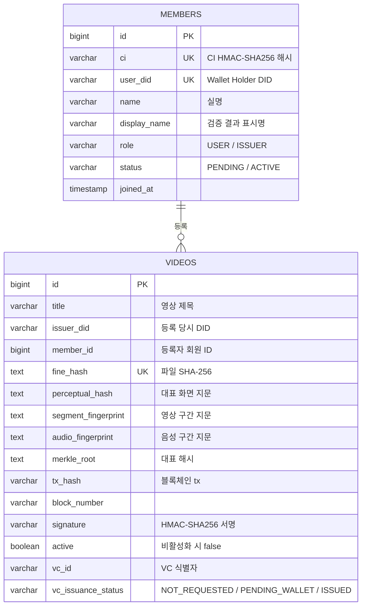
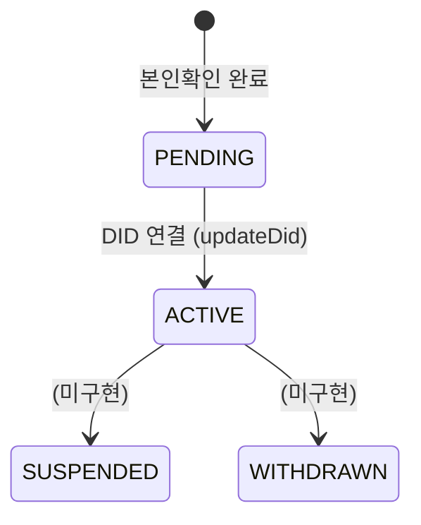

# 데이터 모델

PostgreSQL 16.4, JPA `ddl-auto: update`로 스키마를 관리합니다.

## ER 개요

`member_id`는 회원 ID를 저장하는 필드이며, 현재 JPA 엔티티에는 FK 연관관계가 선언되어 있지 않습니다.

## members

| 컬럼 | 타입 | 제약 | 설명 |
|---|---|---|---|
| `id` | bigint | PK, identity | |
| `ci` | varchar | not null, **unique** | CI의 HMAC-SHA256 해시. `h1:` 접두사 |
| `user_did` | varchar | unique | Holder DID. 가입 전 null |
| `name` | varchar | not null | 신분증에서 추출한 실명 |
| `display_name` | varchar | | 검증 결과에 노출할 표시명(기관명 등). 없으면 `name` 노출 |
| `birth` | varchar | | 생년월일 |
| `role` | varchar | not null | `USER` · `ISSUER` |
| `status` | varchar | not null | `PENDING` · `ACTIVE` · `SUSPENDED` · `WITHDRAWN` |
| `did_registered_at` | timestamp | | DID 최초 등록 또는 재연결 시각 |
| `joined_at` | timestamp | | 가입 완료 시각 |

### 상태 전이

### 역할

| 역할 | 영상 등록 | 비고 |
|---|---|---|
| `USER` | 불가 | 레거시. 로그인 시 자동 승격 |
| `ISSUER` | 가능 | `updateDid()` 시점에 자동 부여 |

## videos

| 컬럼 | 타입 | 제약 | 설명 |
|---|---|---|---|
| `id` | bigint | PK, identity | |
| `title` | varchar | not null | 영상 제목 |
| `issuer_did` | varchar | not null | 등록 당시 등록자 DID |
| `member_id` | bigint | | 등록자 회원 ID (레거시는 null) |
| `perceptual_hash` | text | not null | 버전·길이·대표 화면 지문 |
| `segment_fingerprint` | text | | 영상 구간 지문 |
| `audio_fingerprint` | text | | 음성 구간 지문 |
| `fine_hash` | text | not null, **unique** | 파일 전체 SHA-256 |
| `merkle_root` | text | not null | 등록 대표값 |
| `merkle_path` | text | | 등록 시 생성한 해시 경로 |
| `tx_hash` | varchar | | 등록 트랜잭션 해시 |
| `block_number` | varchar | | 등록 트랜잭션 블록 번호 |
| `signature` | varchar | not null | HMAC-SHA256 서명 |
| `active` | boolean | not null | 비활성화 시 false |
| `version` | integer | | 데이터 스키마 버전 |
| `registered_at` / `deactivated_at` | timestamp | | 등록·비활성화 시각 |

### VC 관련 컬럼

| 컬럼 | 채워지는 시점 | 설명 |
|---|---|---|
| `vc_offer_id` | 발급 준비 | 1회성 Offer ID |
| `vc_plan_id` | 발급 준비 | `vcplan-jinbon-01` |
| `vc_issuer_did` | 발급 준비 | 실제 Issuer DID |
| `vc_issuance_status` | 등록 시 초기화 | `NOT_REQUESTED` / `PENDING_WALLET` / `ISSUED` |
| `vc_claim_snapshot_hash` | 발급 준비 | 등록 클레임의 변경 여부를 확인할 해시 |
| `vc_schema_version` / `vc_assurance_type` | 발급 준비 | 보증서 스키마 버전·보증 범위 |
| `vc_id` | 발급 완료 | Wallet이 수령한 VC 식별자 |
| `vc_credential` | 발급 완료 | 서명 검증을 통과한 VC JSON 원문 (text) |

::: warning 이름 주의
`vc_issuer_did`는 **VC 발급기관**이고 `issuer_did`는 **영상 등록자**입니다.
:::

발급 상태의 의미와 전환 시점은 [VC 보증서 발급](/developers/flows/vc-issuance#issuance-status)을 참고하세요.

## 중복 등록 방지

등록 전에 `fineHash`를 조회하고, DB의 `fine_hash` unique 제약으로 동시 요청도 제한합니다. 화면이 비슷하다는 이유만으로 등록을 차단하지 않습니다. 상황별 응답은 [영상 등록](/developers/flows/video-register)에 정리되어 있습니다.

## Redis

검증 결과 캐시와 인증 토큰을 저장합니다. 검증 키·유효 시간·제외 조건은 [검증 캐시](/developers/flows/video-verify#cache), 토큰 만료·무효화 정책은 [보안 문서](/developers/security/overview#tokens)를 참고하세요.
