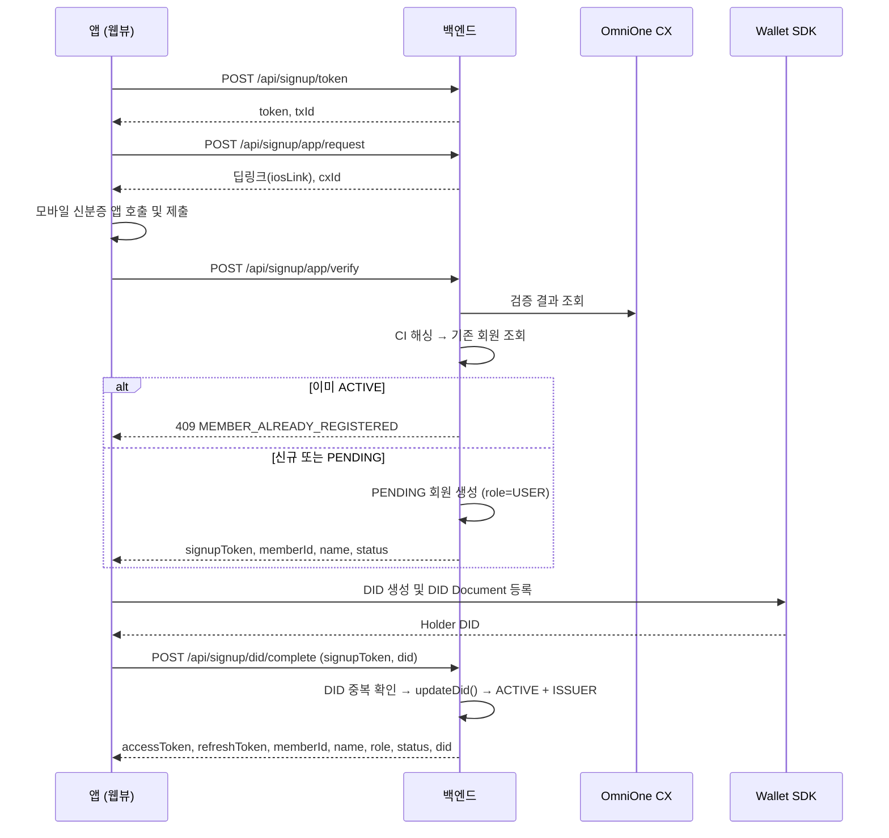

# 회원가입 / 로그인

회원가입과 로그인은 **완전히 분리된 흐름**입니다. 로그인 과정에서 회원을 자동 생성하지 않습니다.

| 흐름 | 엔드포인트 접두사 | 결과 |
|---|---|---|
| 회원가입 | `/api/signup` | `PENDING` 회원 생성 → DID 연결 → `ACTIVE` + `ISSUER` |
| 로그인 | `/api/auth` | 기존 `ACTIVE` 회원 조회 → JWT 발급 |

## 회원가입



### 상태 전이

```
[없음] → PENDING(USER) → ACTIVE(ISSUER)
```

## 로그인

로그인 응답에는 **항상 `didRebindToken`이 포함**됩니다. 앱은 기기 Wallet 상태를 확인한 뒤 필요할 때만 이 토큰을 사용합니다.

## DID 재연결 (앱 재설치)

앱을 지우면 기기의 Wallet과 DID가 사라집니다. 서버에는 이전 DID가 남아 있으므로 새 DID로 교체해야 합니다.

`didRebindToken`은 단기 토큰이며, `POST /api/auth/did/rebind`로 새 DID를 연결합니다.

::: info DID가 바뀌면 기존 영상은?
소유권 판정은 `memberId` 기준이므로 DID가 바뀌어도 내 영상 목록은 유지됩니다. 검증 시 온체인 대조는 등록 당시 DID로 이뤄지므로 과거 영상의 블록체인 검증도 정상 동작합니다.
:::

## 토큰 정책

| 토큰 | 만료 | 저장 위치 |
|---|---|---|
| accessToken | 30분 | 앱 로컬 |
| refreshToken | 7일 | 앱 로컬 + 서버(Redis) |
| signupToken | 단기 | 앱 로컬 (가입 완료 후 삭제) |
| didRebindToken | 단기 | 앱 로컬 (재연결 후 삭제) |

### Refresh Token Rotation

`POST /api/auth/refresh`는 새 accessToken과 **새 refreshToken을 함께** 발급하고 기존 refreshToken을 즉시 무효화합니다.

### JWT 구조

| claim | 값 |
|---|---|
| subject | `memberId` (문자열) |
| `role` | `USER` / `ISSUER` |
| `type` | `access` / `refresh` / `signup` / `did-rebind` |
