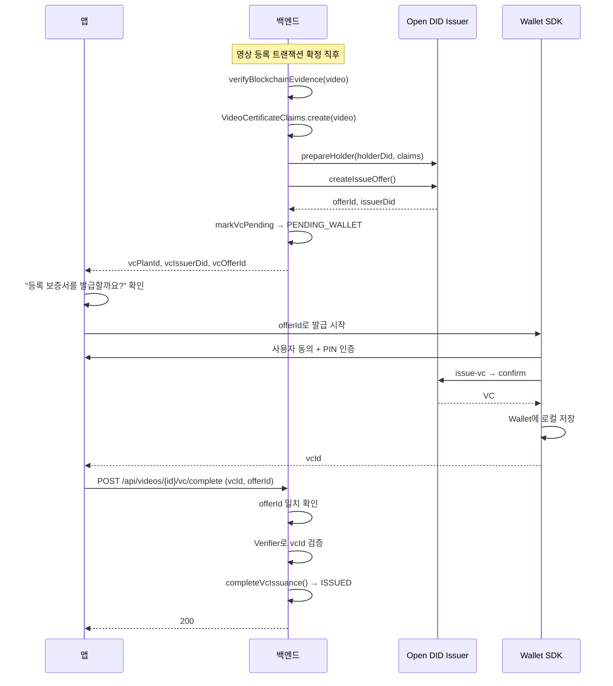

# VC 보증서 발급

## 이 VC가 보증하는 것

진본이 발급하는 VC는 **영상의 내용이 진실하다는 증명이 아닙니다.**

"진본 서비스가 이 영상의 디지털 지문을 확인했고, 그것이 특정 시각에 특정 블록체인 트랜잭션으로 기록되었음을 확인했다"는 사실을 보증합니다.

| 항목 | 값 |
|---|---|
| `credentialType` | `VideoRegistrationCredential` |
| `assuranceType` | `BLOCKCHAIN_REGISTRATION` |
| `schemaVersion` | `1` |
| VC Plan | `vcplan-jinbon-01` |

## 클레임 구성

| 클레임 | 출처 |
|---|---|
| `credentialType` | 고정값 `VideoRegistrationCredential` |
| `assuranceType` | 고정값 `BLOCKCHAIN_REGISTRATION` |
| `videoCommitment` | `video.merkleRoot` |
| `registrantDid` | `video.issuerDid` (등록자 DID) |
| `blockchainNetwork` | 설정값 |
| `chainId` | 설정값 |
| `contractAddress` | 설정값 |
| `transactionHash` | `video.txHash` |
| `blockNumber` | `video.blockNumber` |
| `registeredAt` | `video.registeredAt` |
| `videoTitle` | `video.title` |

::: tip
원본 영상의 해시(`fineHash`, `perceptualHash`)는 VC에 들어가지 않습니다. 대표값인 `merkleRoot`만 `videoCommitment`로 포함됩니다.
:::

## 발급 순서



## 상태 전이

```
NOT_REQUESTED → PENDING_WALLET → ISSUED
```

| 상태 | 의미 |
|---|---|
| `NOT_REQUESTED` | 등록 직후 기본값 |
| `PENDING_WALLET` | Issuer에 Offer 생성 완료, Wallet 수령 대기 |
| `ISSUED` | Wallet 수령·검증 완료 |

역방향 전이는 없습니다.

## 발급 완료 연결

`POST /api/videos/{videoId}/vc/complete`

서버가 확인하는 순서:
1. `opendid.enabled` 확인
2. 영상 소유권 확인
3. `video.vcOfferId == 요청 offerId`
4. Verifier로 `vcId` 검증
5. `completeVcIssuance(vcId, offerId)` → 상태 `ISSUED`

## 발급 재개

`POST /api/videos/{videoId}/vc/prepare` — 앱에서 "나중에"를 선택했거나 발급 도중 앱이 종료된 경우, 영상 파일을 다시 올릴 필요 없이 발급 문맥을 되살릴 수 있습니다.

## 검증 시 VC 확인

| 결과 | verdict 영향 |
|---|---|
| `VERIFIED` | `vcVerified = true`, 판정 그대로 |
| `INVALID` | `CERTIFICATE_INVALID` |
| `UNAVAILABLE` | `VERIFICATION_UNAVAILABLE` (캐싱하지 않음) |
| `DISABLED` | VC 미발급. 블록체인 검증만으로 판정 |

::: warning
VC가 없다고 해서 진본이 아닌 것은 아닙니다. `authentic` 판정의 필수 조건은 블록체인 검증이며, VC는 발급된 경우에만 추가로 확인합니다.
:::

## Open DID를 끈 경우

`OPENDID_ENABLED=false`이면:
- 발급 준비 생략 (등록 응답의 VC 관련 필드 모두 `null`)
- `vc/complete`, `vc/prepare` 호출 시 `VC_FEATURE_DISABLED` (D006, 503)
- 검증 시 `vcVerified`는 항상 `false`
- 영상 등록과 블록체인 기록, 검증은 정상 동작
