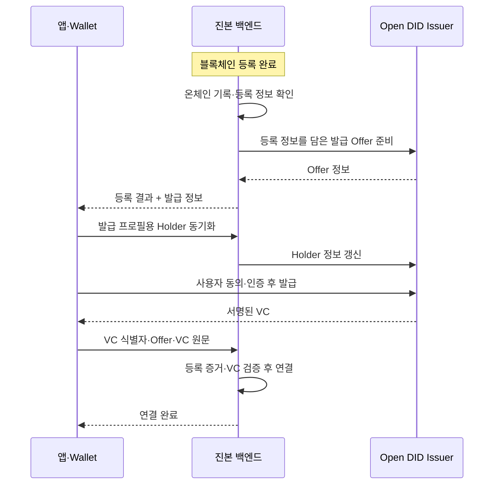

# VC 보증서 발급

영상 등록 후 **Wallet에서 보증서를 받고 백엔드의 등록 건에 연결하는 과정**입니다. 보증서가 연결되어야 검증 시 해당 등록 증거를 확인할 수 있습니다.

## 발급 순서

```mermaid
sequenceDiagram
  participant A as 앱·Wallet
  participant B as 진본 백엔드
  participant I as Open DID Issuer
  Note over B: 블록체인 등록 완료
  B->>B: 온체인 기록·등록 정보 확인
  B->>I: 등록 정보를 담은 발급 Offer 준비
  I-->>B: Offer 정보
  B-->>A: 등록 결과 + 발급 정보
  A->>B: 발급 프로필용 Holder 동기화
  B->>I: Holder 정보 갱신
  A->>I: 사용자 동의·인증 후 발급
  I-->>A: 서명된 VC
  A->>B: VC 식별자·Offer·VC 원문
  B->>B: 등록 증거·VC 검증 후 연결
  B-->>A: 연결 완료
```

## 앱이 호출하는 API

| 시점 | API | 하는 일 |
|---|---|---|
| 발급 준비·재개 | `POST /api/videos/{videoId}/vc/prepare` | 기존 Offer 반환 또는 새 발급 준비. 최초 등록 응답에 발급 정보가 있으면 바로 이용 |
| 발급 프로필 조회 전 | `PUT /api/videos/{videoId}/vc/holder` | Wallet과 Issuer의 Holder 정보 동기화 |
| Wallet에 VC 저장 후 | `POST /api/videos/{videoId}/vc/complete` | `vcId`·`offerId`·서명된 `credential` 원문으로 등록 건에 연결 |

파일을 다시 올리지 않고 발급을 이어갈 수 있습니다. Wallet에 저장만 하고 마지막 연결을 완료하지 않으면 백엔드는 미발급으로 처리합니다. 필드 제약·오류 코드는 [영상 관리 API](/developers/api/videos)에 있습니다.

## 백엔드가 연결 전에 확인하는 것

1. Open DID 기능이 활성이고, 요청자가 해당 영상의 등록자인지 확인합니다.
2. 요청한 Offer, 온체인 기록, 발급 준비 때 저장한 등록 정보가 맞는지 확인합니다.
3. Issuer 발급 원장의 활성 상태와 VC 원문의 서명을 검증합니다.
4. VC의 발급자·등록자·등록 클레임이 해당 영상과 일치하면 연결하고 관련 검증 캐시를 제거합니다.

## 발급 상태 {#issuance-status}

| 상태 | 완료한 일 | 남은 일 |
|---|---|---|
| `NOT_REQUESTED` | 영상 등록 | 발급 준비 |
| `PENDING_WALLET` | Offer 준비 | Wallet 수령·백엔드 연결 |
| `ISSUED` | 보증서 검증·연결 | 이후 검증 요청에서 콘텐츠와 등록 증거 확인 |

발급을 미루거나 준비에 실패해도 영상 등록은 유지됩니다. 이때의 검증 결과는 ‘보증서 없음’입니다.

## 보증서에 담는 정보

이 VC는 **영상의 등록 사실**을 증명합니다. 영상 내용의 사실성을 보증하지 않습니다.

| 항목 | 값 |
|---|---|
| `credentialType` | `VideoRegistrationCredential` |
| `assuranceType` | `BLOCKCHAIN_REGISTRATION` |
| `schemaVersion` | `1` |
| VC Plan | `vcplan-jinbon-01` |

| 클레임 | 출처 |
|---|---|
| `credentialType` / `assuranceType` | 위 고정값 |
| `videoCommitment` | `video.merkleRoot` |
| `registrantDid` | `video.issuerDid` — 영상 등록자 |
| `blockchainNetwork` / `chainId` / `contractAddress` | 블록체인 설정 |
| `transactionHash` / `blockNumber` | 등록 트랜잭션 |
| `registeredAt` / `videoTitle` | 등록 시점·제목 |

개별 파일·화면 해시 대신 대표값인 `merkleRoot`를 담습니다.

## Open DID가 꺼져 있다면

`OPENDID_ENABLED=false`여도 영상의 블록체인 등록은 가능하지만 보증서 발급은 진행하지 않습니다. `vc/prepare`, `vc/holder`, `vc/complete` 호출은 `D006`(503)으로 실패합니다.

검증 시 VC가 없으면 `CERTIFICATE_MISSING`, 기존 VC가 있으나 검증 기능이 꺼져 있으면 `VERIFICATION_UNAVAILABLE`입니다. 비활성 등록·블록체인 오류가 함께 있으면 [최종 판정 우선순위](/developers/flows/video-verify#final-verdict)를 따릅니다.
