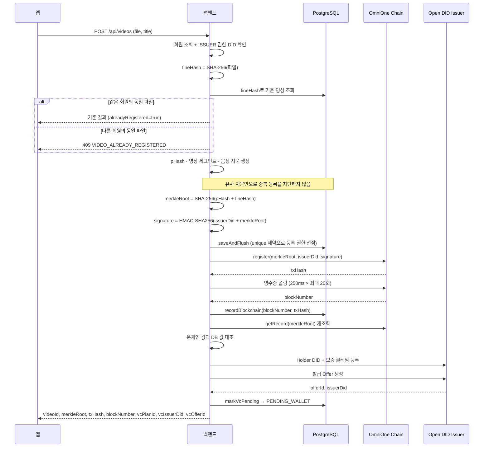

# 영상 등록

`POST /api/videos` · 권한: `ISSUER` · 요청 형식: `multipart/form-data` (`file`, `title`)

## 전체 순서



## 단계별 상세

### 1. 권한 검증

```
role != ISSUER            → ISSUER_ROLE_REQUIRED (V001, 403)
member.userDid == null    → ISSUER_DID_NOT_REGISTERED (V002, 400)
```

### 2. fineHash 생성과 중복 확인

파일 전체를 8KB 버퍼로 스트리밍하며 SHA-256을 계산합니다. `videos.fine_hash`에 unique 제약이 있어 DB 레벨에서도 중복이 막힙니다.

**동일 파일의 기존 등록자 확인:**

| 상황 | 결과 |
|---|---|
| 같은 회원 | 기존 등록 결과 반환, `alreadyRegistered = true` |
| 다른 회원 | `VIDEO_ALREADY_REGISTERED` (V004, 409) |

### 3. 비교 지문 생성

pHash·영상 세그먼트·음성 지문을 생성합니다. 중복 차단은 파일 SHA-256 기준이며, 지각해시가 같거나 유사하다는 이유로 다른 파일의 등록을 막지 않습니다. 동일 파일에 대한 등록 권한 확인도 제작자·저작권자 판정을 뜻하지 않습니다.

### 4. merkleRoot와 서명

```
merkleRoot = SHA-256(perceptualHash || fineHash)
signature  = HMAC-SHA256(issuerDid + merkleRoot)
```

### 5. DB 선점 후 블록체인 기록

동시성 방어의 핵심입니다.

```java
Video saved = videoRepository.saveAndFlush(video);   // 먼저 DB
String txHash = sendBlockchainTx(encodeRegister(...)); // 통과한 요청만 체인
```

트랜잭션 영수증은 250ms 간격으로 최대 20회(약 5초) 폴링합니다.

### 6. 온체인 증거 재확인

VC에 담을 증거가 실제 온체인 상태와 일치하는지 다시 확인합니다.

### 7. VC 발급 준비

발급 준비가 실패해도 등록 결과는 유지됩니다. (`try/catch`로 감싸져 있음)

## 비활성화

`PATCH /api/videos/{videoId}/deactivate`

블록체인 기록이 먼저이고 DB 변경이 나중입니다. 체인 전송이 실패하면 트랜잭션이 롤백되어 DB도 활성 상태로 남습니다.

::: tip 저장하지 않는 것
원본 영상 파일은 서버에 남지 않습니다. 지각해시 계산용 임시 파일은 `finally` 블록에서 즉시 삭제합니다.
:::
