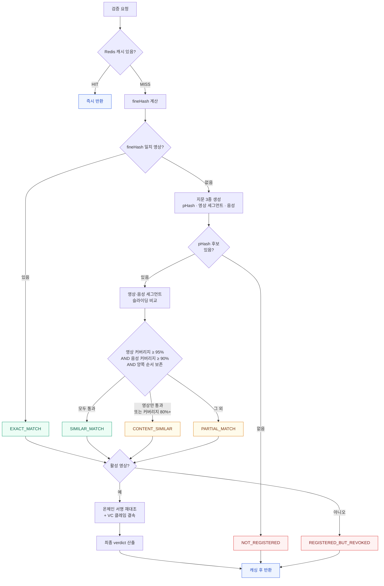

# 영상 검증

인증이 필요 없는 공개 API입니다.

| 엔드포인트 | 입력 | 사용 채널 |
|---|---|---|
| `POST /api/verify` | `multipart/form-data`의 `file` | 웹, iOS 앱 |
| `POST /api/verify/url` | JSON `{ "url": "..." }` | Chrome 확장, 카카오톡 챗봇 |

## 판정 순서

검증은 **콘텐츠 매칭**과 **등록 증거 검증** 두 축으로 나뉩니다. 콘텐츠가 같다는 것만으로는 진본이 되지 않고, 온체인 기록과 VC까지 통과해야 합니다.

::: tip 왜 음성까지 보는가
영상과 음성을 각각 비교하면 화면만으로 드러나지 않는 차이를 찾는 데 도움이 됩니다. 다만 일부 음성 교체나 작은 화면 변화는 임계값 안에 남을 수 있습니다. 딥페이크나 모든 조작의 탐지를 보장하지 않습니다.
:::

## 1단계: 캐시

| 항목 | 값 |
|---|---|
| 결과 키 | `verify:v1:result:{fineHash}` |
| URL 검증 키 | `verify:v1:result:url:{SHA-256(url)}` |
| 영상별 인덱스 | `verify:v1:video:{videoId}` (Set) |
| TTL | 10분 |

다음 결과는 캐싱하지 않습니다.

| 제외 대상 | 이유 |
|---|---|
| `VERIFICATION_UNAVAILABLE` | 일시 장애가 10분간 고정되는 것을 방지 |
| `NOT_REGISTERED` | 등록이 늘면 판정이 달라짐 |
| `similarityDistance`가 있는 결과 | 지각해시 매칭 — 더 가까운 후보가 나중에 등록될 수 있음 |

영상 비활성화 시 `evict`가 해당 영상의 인덱스를 따라 관련 캐시를 모두 지웁니다.

## 2단계: 정확 일치

파일 전체 SHA-256을 계산해 `videos.fine_hash`와 대조합니다. 일치하면 `EXACT_MATCH`이며, 지각해시를 계산하지 않습니다.

## 3단계: 후보 선별 (지각해시)

정확 일치가 없으면 지문 3종을 만들어 활성 영상 전체와 비교합니다.

| 지문 | 형식 | 내용 |
|---|---|---|
| `perceptualHash` | `v2` | 영상 길이 기준 동일 상대 시점 **16프레임**의 DCT pHash (64bit) |
| 영상 세그먼트 | `seg-v1` | **1초 간격** 프레임의 DCT pHash — 구간 단위 대조용 |
| 음성 세그먼트 | `aud-v1` | **1초 간격** 스펙트로그램 해시 (16kHz 리샘플링) |

지각해시는 **후보를 좁히는 1차 필터**입니다. 다음 네 조건을 전부 만족하면 `similar` 후보입니다.

| 조건 | 값 |
|---|---|
| 영상 길이 차이 | ±5% 이내 |
| 평균 해밍 거리 | ≤ 10 |
| 프레임 일치율 (거리 ≤ 10인 프레임 비율) | ≥ 90% |
| 최대 해밍 거리 | ≤ 16 |

순서와 무관하게 60% 이상 대응하면 `partial` 후보로 남겨둡니다. 후보가 하나도 없으면 `NOT_REGISTERED`로 끝납니다.

## 4단계: 정밀 비교 (세그먼트 + 음성)

후보가 정해지면 영상과 음성을 **각각** 1초 세그먼트 단위로 슬라이딩 비교합니다.

1. 제출본 세그먼트 열을 원본 세그먼트 열 위에서 밀어보며 **일치 수가 최대가 되는 오프셋**을 찾습니다
2. 그 오프셋에서 세그먼트별 해밍 거리 ≤ 10이면 일치로 봅니다
3. 일치한 원본 인덱스가 **단조 증가**하는지 확인합니다 (`orderPreserved`)

여기서 나오는 값이 `coverage`(대응 비율), `orderPreserved`(순서 보존), `matchedStartMs`~`matchedEndMs`(원본에서의 대응 구간), `unmatchedRanges`(대응하지 않는 제출본 샘플 구간)입니다.

### 현재 구현의 해석 한계

- `orderPreserved`는 `제출 인덱스 + 고정 오프셋`의 증가 여부를 검사하므로 현재 알고리즘에서는 역행하지 않습니다. 순서 변경은 대응 비율에 영향을 줄 수 있지만 독립적인 순서 변경 탐지 신호는 아닙니다.
- 영상과 음성은 최적 오프셋을 각각 찾으며, 두 오프셋이 같은 원본 시간대인지 교차 검증하지 않습니다.
- 영상은 1초마다 대표 프레임 하나를 비교합니다. 구간 수를 내림 계산하므로 1초 이상 영상의 마지막 1초 미만 구간이 제외될 수 있습니다. 음성 추출에도 같은 구간 수 제한이 있습니다.
- 95%·90%는 일부 불일치를 허용하는 승인 임계값입니다. 정확도·오탐률 또는 전체 무변조 보증으로 해석하지 않습니다.
- 후보 검색이나 정렬에 실패하면 재인코딩본·연속 클립도 승인되지 않을 수 있습니다.

### 판정 임계값

| 조건 | 판정 |
|---|---|
| 영상 커버리지 ≥ **95%** + 순서 보존 **AND** 음성 커버리지 ≥ **90%** + 순서 보존 | `SIMILAR_MATCH` → **진본** |
| 위를 만족하지 못하고, pHash `similar` 또는 영상 커버리지 ≥ **80%** | `CONTENT_SIMILAR` → 콘텐츠 유사 |
| 그 외 | `PARTIAL_MATCH` → 콘텐츠 유사 |
| 원본에 세그먼트 지문이 없음 | pHash `similar`면 `CONTENT_SIMILAR`, 아니면 `PARTIAL_MATCH` |

::: warning 음성이 없으면 유사도 경로로 승인하지 않습니다
음성 지문이 없거나(무음 영상, 추출 실패) 음성 커버리지가 90%에 못 미치면 영상이 아무리 잘 맞아도 `SIMILAR_MATCH`가 되지 않습니다. 파일 SHA-256이 정확히 일치하는 경로는 음성 비교를 생략하며, 등록 증거가 유효하면 무음 파일도 승인됩니다.
:::

### 비교 결과의 해석

| 사례 | 가능한 결과와 한계 |
|---|---|
| 얼굴·입모양 변경 | 대표 프레임 지문에 변화가 반영되면 대응 비율이 낮아질 수 있음. 탐지 보장 없음 |
| 음성만 교체 | 음성 대응 비율이 90% 미만이면 유사도 승인 불가. 일부 교체는 통과할 수 있음 |
| 장면 삽입 | 대응하지 않는 샘플은 `unmatchedRanges`에 포함. 삽입 여부를 확정하지 않음 |
| 구간 순서 변경 | 고정 오프셋에서 대응 비율이 낮아질 수 있음. `orderPreserved: false`로 탐지하는 구조는 아님 |
| 플랫폼 재인코딩·해상도 변경 | 후보 검색·지문 비교·등록 증거 기준을 충족하면 승인 가능 |
| 원본에서 잘라낸 연속 쇼츠 | 후보 검색·지문 비교·등록 증거 기준을 충족하면 승인 가능. 맥락은 보증하지 않음 |

## 5단계: 온체인 검증

DB의 `merkleRoot`로 온체인 등록 상태·등록자 DID를 확인하고, `HMAC-SHA256(issuerDid + merkleRoot)`를 재계산해 DB·온체인 서명과 대조합니다.

현재 검증 경로는 `fineHash`·`perceptualHash`에서 머클 루트를 재계산하지 않습니다. 영상·음성 세그먼트 지문도 머클 루트에 포함되지 않습니다. 따라서 이 검사를 DB의 모든 지문에 대한 위변조 방어로 설명하면 안 됩니다. 서명은 서버 HMAC이며 등록자 DID 개인키 서명이 아닙니다.

## 6단계: VC 검증

`video.vcId`가 있을 때만 Verifier를 호출합니다. 없으면 `CERTIFICATE_MISSING`으로 판정합니다.

## 최종 판정 규칙

4단계까지 나온 콘텐츠 판정을 등록 증거 검증 결과가 **덮어쓰는** 구조입니다. 위쪽 조건이 먼저 적용됩니다.

| 순위 | 조건 | verdict | authentic |
|---|---|---|---|
| 0 | 영상이 비활성 | `REGISTERED_BUT_REVOKED` | `false` |
| 1 | 외부 검증 불가 (체인·Verifier 장애) | `VERIFICATION_UNAVAILABLE` | `false` |
| 2 | 블록체인 서명 재대조 실패 | `VERIFICATION_UNAVAILABLE` | `false` |
| 3 | VC 미발급 | `CERTIFICATE_MISSING` | `false` |
| 4 | VC 무효 또는 클레임 결속 실패 | `CERTIFICATE_INVALID` | `false` |
| 5 | 원본 파일 일치 | `EXACT_MATCH` | `true` |
| 6 | 영상·음성 커버리지와 시간 순서 모두 통과 | `SIMILAR_MATCH` | `true` |
| 7 | 등록 후보는 있으나 유사도 승인 기준 미달 또는 정보 부족 | `CONTENT_SIMILAR` / `PARTIAL_MATCH` | `false` |
| — | 매칭 없음 | `NOT_REGISTERED` | `false` |

`authentic`은 **콘텐츠 일치(5·6순위) + 블록체인 검증 + VC 검증 + 클레임 결속**을 모두 통과했을 때만 `true`입니다.

## 클라이언트 표시 매핑

사용자에게는 verdict를 직접 노출하지 않고 네 가지 상태로 단순화해서 표시합니다.

| displayStatus | verdict | 사용자 화면 |
|---|---|---|
| `AUTHENTICATED` | `EXACT_MATCH`, `SIMILAR_MATCH`, `SAME_CONTENT` | **진본** (+ 등록자 표시명, 등록 시각, 원본 대응 구간) |
| `CONTENT_SIMILAR` | `CONTENT_SIMILAR`, `PARTIAL_MATCH` | **콘텐츠 유사** (+ 등록자·VC 상태, 진본 배지 없음) |
| `NOT_AUTHENTICATED` | `NOT_REGISTERED`, `REGISTERED_BUT_REVOKED`, `CERTIFICATE_MISSING`, `CERTIFICATE_INVALID` | **미인증** |
| `UNAVAILABLE` | `VERIFICATION_UNAVAILABLE` | **확인 중** (외부 장애는 재시도, 무결성 불일치는 운영자 확인) |

## URL 검증의 추가 절차

허용 호스트: `youtube.com`, `youtu.be`, `instagram.com`, `tiktok.com`, `twitter.com`, `x.com`, `vimeo.com`

DNS 응답의 **모든** IP를 검사해 루프백·사설·링크로컬·멀티캐스트가 하나라도 있으면 차단합니다 (DNS 리바인딩 방어).
