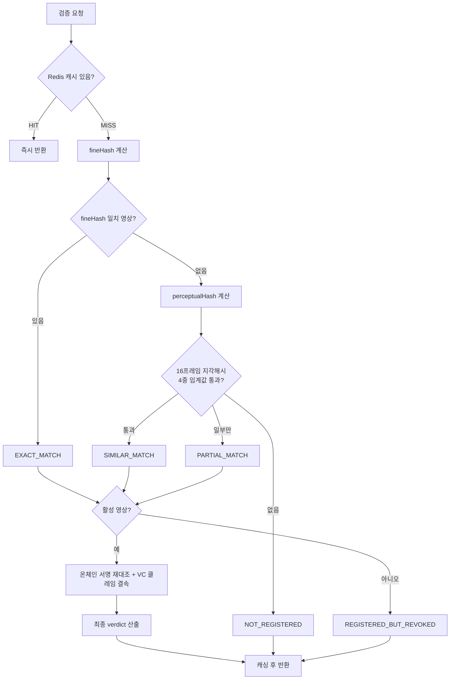

# 영상 검증

인증이 필요 없는 공개 API입니다.

| 엔드포인트 | 입력 | 사용 채널 |
|---|---|---|
| `POST /api/verify` | `multipart/form-data`의 `file` | 웹, iOS 앱 |
| `POST /api/verify/url` | JSON `{ "url": "..." }` | Chrome 확장, 카카오톡 챗봇 |

## 판정 순서

## 1단계: 캐시

| 항목 | 값 |
|---|---|
| 결과 키 | `verify:v4:result:{fineHash}` |
| URL 검증 키 | `verify:v4:result:url:{SHA-256(url)}` |
| 영상별 인덱스 | `verify:v4:video:{videoId}` (Set) |
| TTL | 10분 |

`VERIFICATION_UNAVAILABLE`, `NOT_REGISTERED`, 지각해시 매칭 결과는 캐싱하지 않습니다 (등록이 늘면 판정이 달라지므로).

## 2단계: 정확 일치

파일 전체 SHA-256을 계산해 `videos.fine_hash`와 대조합니다. 일치하면 `EXACT_MATCH`이며, 지각해시를 계산하지 않습니다.

## 3단계: 유사도 검색

정확 일치가 없으면 프레임별 지각해시를 만들어 활성 영상 전체와 비교합니다.

영상 길이 기준 동일한 상대 시점 16프레임의 DCT pHash(64bit)를 비교합니다.

| 조건 (전부 만족해야 `similar`) | 값 |
|---|---|
| 영상 길이 차이 | ±5% 이내 |
| 평균 해밍 거리 | ≤ 10 |
| 프레임 일치율 (거리 ≤ 10인 프레임 비율) | ≥ 90% |
| 최대 해밍 거리 | ≤ 16 |

| 결과 | 판정 |
|---|---|
| 전부 만족 | `SIMILAR_MATCH` → 진본 후보 |
| 순서 무관 대응 60% 이상만 | `PARTIAL_MATCH` → 미인증 |
| 그 외 | `NOT_REGISTERED` |

## 4단계: 온체인 검증

서명을 **재계산해서** DB 값과 온체인 값 양쪽에 대조합니다. DB가 조작되었더라도 서버 비밀키 없이는 서명을 다시 만들 수 없고, 온체인 값은 변경 불가하므로 두 값이 동시에 맞아야 통과합니다.

## 5단계: VC 검증

`video.vcId`가 있을 때만 Verifier를 호출합니다. 없으면 블록체인 검증만으로 판정합니다.

## 최종 판정 규칙

| 순위 | 조건 | verdict | authentic |
|---|---|---|---|
| 0 | 영상이 비활성 | `REGISTERED_BUT_REVOKED` | `false` |
| 1 | 외부 검증 불가 | `VERIFICATION_UNAVAILABLE` | `false` |
| 2 | 블록체인 검증 실패 | `VERIFICATION_UNAVAILABLE` | `false` |
| 3 | VC가 유효하지 않음 | `CERTIFICATE_INVALID` | `false` |
| 3.5 | VC 미발급 | `CERTIFICATE_MISSING` | `false` |
| 4 | 원본 파일 일치 또는 영상·음성·시간 순서 검증 완료 | `EXACT_MATCH` / `SAME_CONTENT` | `true` |
| 5 | pHash 후보 또는 일부 구간만 유사하고 전체 무변조 미확정 | `SIMILAR_MATCH` / `PARTIAL_MATCH` | `false` |
| — | 매칭 없음 | `NOT_REGISTERED` | `false` |

## 클라이언트 표시 매핑

사용자에게는 verdict를 직접 노출하지 않고 **진본 / 콘텐츠 유사 / 미인증**으로 단순화해서 표시합니다.

> 이 매핑은 음성·구간 검증 도입을 반영한 목표 정책입니다. 현재 구현의 SIMILAR_MATCH는 전환 전 과도기 판정으로 취급합니다.

| displayStatus | verdict | 사용자 화면 |
|---|---|---|
| `AUTHENTICATED` | `EXACT_MATCH`, `SAME_CONTENT` | **진본** (+ 등록자 표시명, 등록 시각) |
| `CONTENT_SIMILAR` | `SIMILAR_MATCH`, `PARTIAL_MATCH` | **콘텐츠 유사** (+ 등록자·VC 상태, 진본 배지 없음) |
| `NOT_AUTHENTICATED` | `NOT_REGISTERED`, `REGISTERED_BUT_REVOKED`, `CERTIFICATE_MISSING`, `CERTIFICATE_INVALID` 또는 변경 확인 | **미인증** |

## URL 검증의 추가 절차

허용 호스트: `youtube.com`, `youtu.be`, `instagram.com`, `tiktok.com`, `twitter.com`, `x.com`, `vimeo.com`

DNS 응답의 **모든** IP를 검사해 루프백·사설·링크로컬·멀티캐스트가 하나라도 있으면 차단합니다 (DNS 리바인딩 방어).
