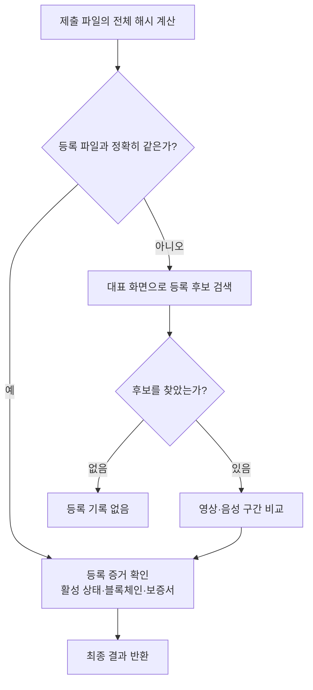

# 영상 검증

제출 영상에서 지문을 만들어 **DB의 등록 지문과 비교한 뒤, 블록체인 기록과 보증서를 확인**합니다. 등록 영상 파일 자체를 다시 불러오지는 않습니다.

파일과 URL의 입력 차이는 [URL·파일 검증 차이](/developers/guide/verification-methods), 요청·응답은 [검증 API](/developers/api/verify)를 참고하세요.

## 판정 순서

```mermaid
flowchart TD
  F[제출 파일의 전체 해시 계산] --> E{등록 파일과 정확히 같은가?}
  E -->|예| B[등록 증거 확인<br/>활성 상태·블록체인·보증서]
  E -->|아니오| C[대표 화면으로 등록 후보 검색]
  C --> D{후보를 찾았는가?}
  D -->|없음| N[등록 기록 없음]
  D -->|있음| S[영상·음성 구간 비교]
  S --> B
  B --> R[최종 결과 반환]
```

새로 분석할 때의 흐름입니다. 재사용 가능한 캐시가 있으면 이전 결과를 반환합니다.

## 1. 정확히 같은 파일인지 확인

파일 전체의 SHA-256을 `videos.fine_hash`와 대조합니다. 같으면 콘텐츠 판정은 `EXACT_MATCH`이고, 영상·음성 지문 비교를 생략합니다. 이후 등록 증거 확인으로 넘어갑니다.

## 2. 비슷한 등록 후보 검색 {#candidate-search}

파일 해시가 다르면 다음 지문을 만듭니다.

| 지문 | 현재 형식 | 추출 방식 |
|---|---|---|
| 대표 화면 · `perceptualHash` | `v4` | 영상 길이에 맞춘 상대 시점 16프레임의 DCT 지각해시. 표시 방향 반영 |
| 영상 구간 | `seg-v3` | 1초 간격 대표·인접 프레임. 면적 평균 축소로 재압축·해상도 변화의 영향 완화 |
| 음성 구간 | `aud-v1` | 1초 간격 스펙트로그램 지문. mono 16kHz로 변환 |

활성 등록의 **대표 화면 지문**과 먼저 비교합니다. 다음 조건을 모두 충족하면 `similar` 후보입니다.

| 조건 | 기준 |
|---|---|
| 영상 길이 차이 | 긴 영상 길이 대비 5% 이내 |
| 평균 해밍 거리 | 10 이하 |
| 거리 10 이하인 프레임 비율 | 90% 이상 |
| 최대 해밍 거리 | 16 이하 |

이 조건을 통과하지 않아도 순서와 무관한 프레임 대응 비율이 양방향 중 한쪽에서 60% 이상이면 `partial` 후보가 됩니다. 잘라낸 클립은 이 경로로 후보가 될 수 있습니다.

`similar` 후보를 우선하고, 같은 분류에서는 평균 거리가 가장 작은 **후보 하나**를 골라 구간 비교합니다. 후보가 없으면 `NOT_REGISTERED`로 끝납니다.

## 3. 영상·음성 구간 비교 {#match-criteria}

후보가 정해지면 제출본 지문을 등록 영상 지문 위에서 **1초 단위로 이동**시키며 가장 많이 대응하는 위치를 찾습니다. 영상과 음성은 각각 비교합니다.

구간의 해밍 거리가 10 이하이면 대응한 것으로 봅니다. 영상 `seg-v3`는 대표·인접 프레임 조합 중 기준을 충족하는 쌍이 있으면 그 구간을 대응으로 셉니다. `coverage`는 **제출본의 비교 구간 중 대응한 비율**입니다.

| 조건 | 콘텐츠 판정 |
|---|---|
| 영상 95% 이상 + 음성 100% + 양쪽 순서 조건 + **같은 원본 대응 시점** | `SIMILAR_MATCH` |
| 위 조건에 미달하고, pHash가 `similar` 또는 영상 대응 비율 80% 이상 | `CONTENT_SIMILAR` |
| 그 외 | `PARTIAL_MATCH` |
| 등록 영상의 구간 지문이 없음 | pHash가 `similar`면 `CONTENT_SIMILAR`, 아니면 `PARTIAL_MATCH` |

잘라낸 영상도 클립의 길이를 기준으로 계산합니다. [30초 클립의 계산 예시와 검색 한계](/developers/guide/verification-methods#extracted-clips)를 참고하세요.

### 비교 결과의 한계

- **샘플 비교:** 모든 프레임·음성을 직접 비교하지 않습니다. 허용 오차 안의 작은 변경이나 샘플 사이의 변경은 놓칠 수 있습니다. 대응 비율은 판정 정확도나 무변조 확률이 아닙니다.
- **순서 조건:** `orderPreserved`는 고정 시간 이동량에서 일치 인덱스가 증가하는지를 봅니다. 현재 알고리즘에서는 역행하지 않으므로 독립적인 순서 변경 탐지 신호가 아닙니다.
- **시간 정렬:** 영상·음성의 `bestOffsetMs`가 같아야 합니다. 반복 장면 등으로 최적 위치가 달라도 승인하지 않습니다.
- **끝부분:** 구간 수를 내림 계산해 1초 이상 영상의 마지막 1초 미만 구간이 제외될 수 있습니다. 음성도 같은 구간 수 제한이 있습니다.
- **이전 지문:** `seg-v1`·`seg-v2`도 읽지만, 저장된 지문을 자동으로 새 형식으로 갱신하지는 않습니다.

오디오 트랙이 없거나 추출에 실패하면 유사도 경로로 승인할 수 없습니다. 트랙 안의 **무음 구간**은 지문으로 표현될 수 있어 무음 포함 자체가 탈락 사유는 아닙니다. 파일 정확 일치는 음성 비교를 생략하므로 오디오 트랙이 없어도 등록 증거가 유효하면 승인됩니다.

## 4. 등록 증거 확인 {#registration-evidence}

**등록이 활성인지** 먼저 확인하고, 비활성이면 `REGISTERED_BUT_REVOKED`로 끝냅니다.

**블록체인**에서는 DB의 `merkleRoot`로 등록 상태·등록자 DID를 조회합니다. `HMAC-SHA256(issuerDid + merkleRoot)`를 다시 계산해 DB와 온체인 서명에 대조합니다. 이 서명은 서버 HMAC입니다. 현재 검증은 파일·대표 화면 해시에서 `merkleRoot`를 다시 계산하지 않으며 구간 지문도 대표값에 포함되지 않으므로, DB의 모든 지문이 보호된다는 뜻은 아닙니다.

**보증서**는 Issuer 발급 원장의 활성 상태, 저장된 VC 원문의 서명, 발급자·등록자·등록 정보를 확인합니다. VC 원문이 없는 과거 등록은 발급 원장의 상태·클레임 확인 경로를 사용합니다. VC가 없으면 ‘보증서 없음’으로 판정합니다.

## 최종 판정 규칙 {#final-verdict}

등록 후보를 찾은 경우 아래 우선순위를 적용합니다. 콘텐츠가 일치해도 등록 증거 확인을 통과하지 못하면 진본으로 승인하지 않습니다.

| 우선순위 | 조건 | 최종 verdict |
|---|---|---|
| 1 | 등록 비활성 | `REGISTERED_BUT_REVOKED` |
| 2 | 체인·Open DID 검증 불가 | `VERIFICATION_UNAVAILABLE` |
| 3 | 블록체인 기록·서명 불일치 | `VERIFICATION_UNAVAILABLE` |
| 4 | 보증서 미발급 | `CERTIFICATE_MISSING` |
| 5 | 보증서 무효 또는 등록 정보 불일치 | `CERTIFICATE_INVALID` |
| 6 | 파일 정확 일치 | `EXACT_MATCH` |
| 7 | 영상·음성 비교 기준 통과 | `SIMILAR_MATCH` |
| 8 | 후보는 있으나 기준 미달·정보 부족 | `CONTENT_SIMILAR` / `PARTIAL_MATCH` |

6·7번만 `authentic: true`입니다. 후보가 없으면 위 표에 진입하지 않고 `NOT_REGISTERED`를 반환합니다. 화면 표시 방식은 [검증 API](/developers/api/verify#display-status)를 참고하세요.

## 반복 요청과 캐시 {#cache}

파일은 SHA-256 계산 후, URL은 URL 검사 후 다운로드 전에 캐시를 조회합니다.

| 항목 | 값 |
|---|---|
| 파일 결과 키 | `verify:v1:result:{fineHash}` |
| URL 결과 키 | `verify:v1:result:url:{SHA-256(url)}` |
| 영상별 키 인덱스 | `verify:v1:video:{videoId}` |
| 유효 시간 | 10분 |

`NOT_REGISTERED`, `VERIFICATION_UNAVAILABLE`, `similarityDistance`가 있는 유사도 검색 결과는 저장하지 않습니다. 보증서 연결 완료·등록 비활성화 시 해당 영상의 캐시를 제거합니다.

URL 캐시는 입력 문자열 기준이므로 쿼리 문자열이 다르면 키도 달라집니다. URL 검증이라고 항상 캐시 결과를 반환하는 것은 아닙니다.
