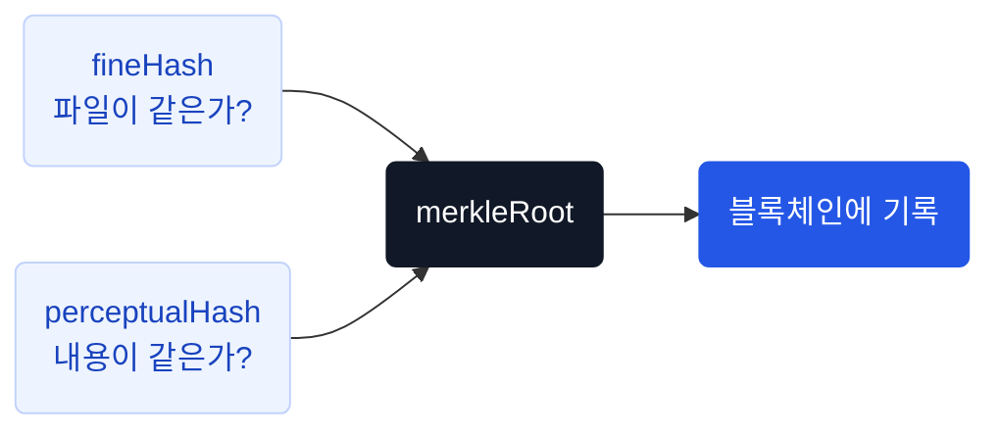

# 핵심 개념

진본을 이해하기 위한 주요 용어와 설계 원칙입니다.

## 용어 정리

| 용어 | 설명 |
|---|---|
| **fineHash** | 파일 전체의 SHA-256 해시. 바이트 단위 동일성 확인 |
| **perceptualHash** | 상대 시점 16프레임의 DCT 기반 지각해시. 후보 선별용 |
| **세그먼트 지문** | 1초 간격 영상(`seg-v1`)·음성(`aud-v1`) 해시 열. 구간 단위 정밀 대조용 |
| **coverage** | 제출 영상 세그먼트 중 원본에 대응하는 비율 |
| **orderPreserved** | 고정 오프셋에서 일치 인덱스의 증가 여부. 현재 구현에서 독립적인 재편집 탐지 신호는 아님 |
| **merkleRoot** | `SHA-256(perceptualHash \|\| fineHash)` — 블록체인에 기록되는 대표값 |
| **signature** | `HMAC-SHA256(issuerDid + merkleRoot)` — 등록 무결성 서명 |
| **DID** | Decentralized Identifier. Wallet이 생성하는 탈중앙 식별자 |
| **VC** | Verifiable Credential. 영상 등록 사실을 증명하는 디지털 보증서 |
| **ISSUER** | 영상 등록 권한이 있는 회원. 가입 완료 시 자동 부여 |
| **verdict** | 검증 결과 내부 판정값 10종. 클라이언트에는 4종 `displayStatus`로 매핑 |

## merkleRoot — 영상의 대표 지문

진본은 하나의 영상에서 두 가지 해시를 뽑고, 이를 합쳐 **블록체인에 기록할 단 하나의 값**을 만듭니다. 이 값이 merkleRoot입니다.



```
merkleRoot = SHA-256( perceptualHash || fineHash )
```

### 왜 두 해시를 합치나?

| 해시 | 역할 | 한계 |
|---|---|---|
| **fineHash** | 파일이 1바이트라도 다르면 다른 값 | 재인코딩하면 파일이 달라져서 못 찾음 |
| **perceptualHash** | 재인코딩해도 같은 영상이면 비슷한 값 | 파일 단위 정확한 동일성은 판단 못함 |

merkleRoot는 등록 당시 두 해시를 묶어 기록하는 값입니다. 파일 정확 일치와 콘텐츠 유사도는 별도로 판단하며, 루트만으로 내용 동일성을 확정하지 않습니다. 현재 검증 경로의 재계산 누락 등 구현 한계는 [영상 검증](/developers/flows/video-verify)을 참고하세요.

### 블록체인에 기록되는 것

온체인에는 merkleRoot, 등록자 DID, 서명만 기록됩니다. fineHash, perceptualHash, 영상 파일, 개인정보는 블록체인에 올라가지 않습니다.

## 세 겹의 지문

진본은 하나의 지문으로 판단하지 않습니다. 역할이 다른 세 가지를 함께 씁니다.

| 지문 | 간격 | 역할 |
|---|---|---|
| `perceptualHash` | 상대 시점 16프레임 | **후보 선별** — 수많은 등록 영상 중 비슷한 것을 빠르게 추림 |
| 영상 세그먼트 (`seg-v1`) | 1초 | **구간 대조** — 어느 구간이 어디에 대응하는지, 순서가 맞는지 |
| 음성 세그먼트 (`aud-v1`) | 1초 | **음성 대조** — 음성 지문의 대응 비율과 불일치 구간 |

파일이 다르면 세그먼트 비교로 유사도 승인 기준을 평가합니다. 샘플 기반 비교이므로 일부 편집·음성 변경은 놓칠 수 있습니다. [판정 의미와 한계](/verification-status)를 함께 확인하세요.

## 진본 판정

| 상황 | 표시 | 근거 |
|---|---|---|
| 원본 파일 그대로 | **진본** | fineHash 일치 + 온체인 서명 재대조 + VC 클레임 결속 |
| 재인코딩·리사이즈된 같은 내용의 영상 (YouTube 등 플랫폼 게시본) | **진본(유사도 기준 통과)** | 후보 검색·등록 증거 검증 + 영상 커버리지 ≥ 95% + 음성 커버리지 ≥ 90% + 양쪽 순서 보존 + 동일한 원본 대응 시간 오프셋 |
| 원본에서 잘라낸 **연속 구간** (쇼츠, 하이라이트) | **진본(일부 구간 대응)** | 위와 동일. 원본에서의 대응 구간 타임코드를 함께 표시 |
| 음성만 교체된 영상 | **콘텐츠 유사 등** | 음성 대응 비율이 승인 기준 미달이면 보류. 일부 교체는 통과 가능 |
| 얼굴·입모양 변경 (딥페이크) | **콘텐츠 유사 등** | 대표 샘플에 변화가 반영되면 대응 비율 하락 가능. 탐지 보장 없음 |
| 장면 삽입·구간 순서 변경 | **콘텐츠 유사 등** | 고정 오프셋에서 대응 비율 하락 가능. 불일치가 편집을 확정하지는 않음 |
| 등록 기록 없음 | **미인증** | "미등록 ≠ 가짜"를 함께 안내 |

::: warning 잘린 클립이라고 무조건 미인증이 아닙니다
연속 구간도 후보 검색·영상·음성 비교·등록 증거 검증을 통과하면 승인될 수 있습니다. 등록 원본의 대응 구간을 함께 표시하며, 전체 맥락이나 모든 편집의 부재를 보증하지 않습니다.
:::

등록자 DID와 등록 증거를 통해 누가 언제 기준 영상을 등록했는지 확인합니다. 서버 HMAC은 등록자 개인키 서명이 아니며, 등록자가 제작자·저작권자임을 증명하지 않습니다.

## 판정이 뒤집히는 순서

콘텐츠가 일치해도 **등록 증거가 무너지면 진본이 아닙니다.** 등록 증거 검증이 콘텐츠 판정을 덮어씁니다.

```
콘텐츠 판정 (EXACT / SIMILAR / CONTENT_SIMILAR / PARTIAL)
        ↓  덮어쓰기
비활성 → 체인 장애 → 서명 불일치 → VC 미발급 → VC 무효
        ↓
     최종 verdict
```

`authentic`은 **콘텐츠 일치 + 블록체인 검증 + VC 검증 + 클레임 결속**을 전부 통과했을 때만 `true`입니다.

## 설계 원칙

| 원칙 | 방법 |
|---|---|
| 원본 영상을 서버에 남기지 않음 | 해시 계산 후 임시 파일 즉시 삭제 |
| 개인 식별정보(CI)를 저장하지 않음 | HMAC-SHA256 해시만 보관 |
| 등록과 보증서 발급을 분리 | VC 발급 실패해도 블록체인 등록은 유지 |
| 중복 등록 차단 | fineHash 조회 + DB unique 제약. pHash 유사도로 중복 등록을 차단하지 않음 |
| 동시 요청에 중복 트랜잭션 방지 | DB 선점(saveAndFlush) 후 블록체인 전송 |

## 등록과 발급의 분리

영상의 블록체인 등록과 VC 보증서 발급은 **별개의 단계**입니다.

```
등록 성공 → 블록체인 기록 완료 → (선택) VC 발급
```

- 등록이 성공하면 VC 발급을 나중으로 미루거나 실패해도 등록 결과는 유지됩니다
- Open DID가 꺼진 환경에서는 `vcVerified`가 `false`이며 진본으로 승인하지 않습니다
- VC 미발급은 `CERTIFICATE_MISSING`, VC가 있으나 검증이 비활성화된 경우는 `VERIFICATION_UNAVAILABLE`로 반환합니다

## 장애 격리

| 장애 지점 | 영향 |
|---|---|
| Open DID Issuer 장애 | 영상 등록은 성공, VC 발급 준비만 생략 |
| Open DID Issuer 장애 (검증 시) | VC 발급된 영상만 `VERIFICATION_UNAVAILABLE` |
| OmniOne Chain 장애 | 검증은 `VERIFICATION_UNAVAILABLE`, 등록은 실패 |
| Redis 장애 | 캐시 미스로 동작 (매 요청이 DB·체인 조회) |

`VERIFICATION_UNAVAILABLE` 결과는 **캐싱하지 않습니다.** 일시 장애가 고정되는 것을 방지합니다.
