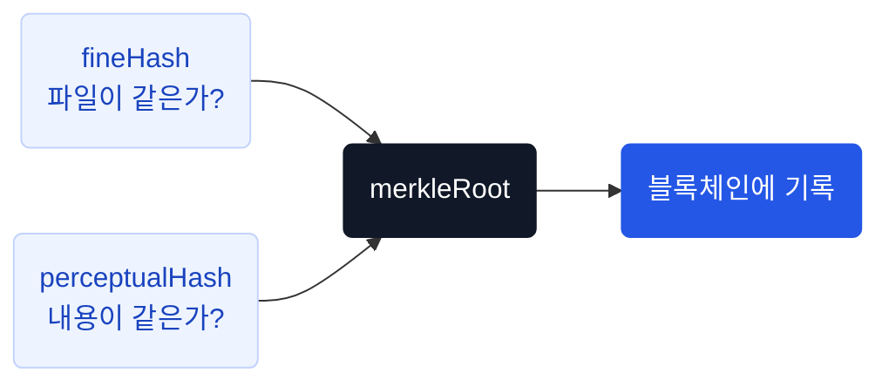

# 핵심 개념

진본을 이해하기 위한 주요 용어와 설계 원칙입니다.

## 용어 정리

| 용어 | 설명 |
|---|---|
| **fineHash** | 파일 전체의 SHA-256 해시. 바이트 단위 동일성 확인 |
| **perceptualHash** | 프레임별 DCT 기반 지각해시. 재인코딩 후에도 유사 영상 탐지 |
| **merkleRoot** | `SHA-256(perceptualHash \|\| fineHash)` — 블록체인에 기록되는 대표값 |
| **signature** | `HMAC-SHA256(issuerDid + merkleRoot)` — 등록 무결성 서명 |
| **DID** | Decentralized Identifier. Wallet이 생성하는 탈중앙 식별자 |
| **VC** | Verifiable Credential. 영상 등록 사실을 증명하는 디지털 보증서 |
| **ISSUER** | 영상 등록 권한이 있는 회원. 가입 완료 시 자동 부여 |
| **verdict** | 검증 결과 내부 판정값. 클라이언트에는 진본 / 콘텐츠 유사 / 미인증으로 매핑 |

## merkleRoot — 영상의 대표 지문

진본은 하나의 영상에서 두 가지 해시를 뽑고, 이를 합쳐 **블록체인에 기록할 단 하나의 값**을 만듭니다. 이 값이 merkleRoot입니다.



```
merkleRoot = SHA-256( perceptualHash || fineHash )
```

### 왜 두 해시를 합치나?

| 해시 | 역할 | 한계 |
|---|---|---|
| **fineHash** | 파일이 1바이트라도 다르면 다른 값 | 재인코딩하면 파일이 달라져서 못 찾음 |
| **perceptualHash** | 재인코딩해도 같은 영상이면 비슷한 값 | 파일 단위 정확한 동일성은 판단 못함 |

두 해시는 서로의 약점을 보완합니다. merkleRoot 하나로 **파일 동일성과 내용 동일성을 동시에 증명**할 수 있습니다.

### 블록체인에 기록되는 것

온체인에는 merkleRoot, 등록자 DID, 서명만 기록됩니다. fineHash, perceptualHash, 영상 파일, 개인정보는 블록체인에 올라가지 않습니다.

## 진본 판정

| 상황 | 표시 | 근거 |
|---|---|---|
| 원본 파일 그대로 | **진본** | fineHash 일치 + 온체인 서명 재대조 + VC 클레임 결속 |
| 재인코딩·리사이즈된 같은 내용의 영상 (YouTube 등 플랫폼 게시본) | **진본** | 16프레임 지각해시 4중 임계값 통과 + 온체인 서명 재대조 + VC 클레임 결속 |
| 일부 프레임만 유사 (잘린 클립, 구간 편집) | **미인증** | 원본 일치를 확인할 수 없음 |
| 등록 기록 없음 | **미인증** | "미등록 ≠ 가짜"를 함께 안내 |

지각해시가 확인하는 것은 **"등록된 원본과 같은 내용의 영상인가"** 입니다. 등록 자체가 모바일 신분증으로 본인확인한 등록자의 서명과 온체인 기록으로 묶여 있으므로, 같은 내용임이 확인되면 그 등록자가 그 시각에 등록한 영상으로 봅니다.

## 설계 원칙

| 원칙 | 방법 |
|---|---|
| 원본 영상을 서버에 남기지 않음 | 해시 계산 후 임시 파일 즉시 삭제 |
| 개인 식별정보(CI)를 저장하지 않음 | HMAC-SHA256 해시만 보관 |
| 등록과 보증서 발급을 분리 | VC 발급 실패해도 블록체인 등록은 유지 |
| 중복 등록 차단 | fineHash + perceptualHash + DB unique 제약 3중 방어 |
| 동시 요청에 중복 트랜잭션 방지 | DB 선점(saveAndFlush) 후 블록체인 전송 |

## 등록과 발급의 분리

영상의 블록체인 등록과 VC 보증서 발급은 **별개의 단계**입니다.

```
등록 성공 → 블록체인 기록 완료 → (선택) VC 발급
```

- 등록이 성공하면 VC 발급을 나중으로 미루거나 실패해도 등록 결과는 유지됩니다
- Open DID가 꺼진 환경(`OPENDID_ENABLED=false`)에서도 등록과 검증은 정상 동작합니다
- 이때 `vcVerified`는 항상 `false`

## 장애 격리

| 장애 지점 | 영향 |
|---|---|
| Open DID Issuer 장애 | 영상 등록은 성공, VC 발급 준비만 생략 |
| Open DID Verifier 장애 | VC 발급된 영상만 `VERIFICATION_UNAVAILABLE` |
| OmniOne Chain 장애 | 검증은 `VERIFICATION_UNAVAILABLE`, 등록은 실패 |
| Redis 장애 | 캐시 미스로 동작 (매 요청이 DB·체인 조회) |

`VERIFICATION_UNAVAILABLE` 결과는 **캐싱하지 않습니다.** 일시 장애가 고정되는 것을 방지합니다.
