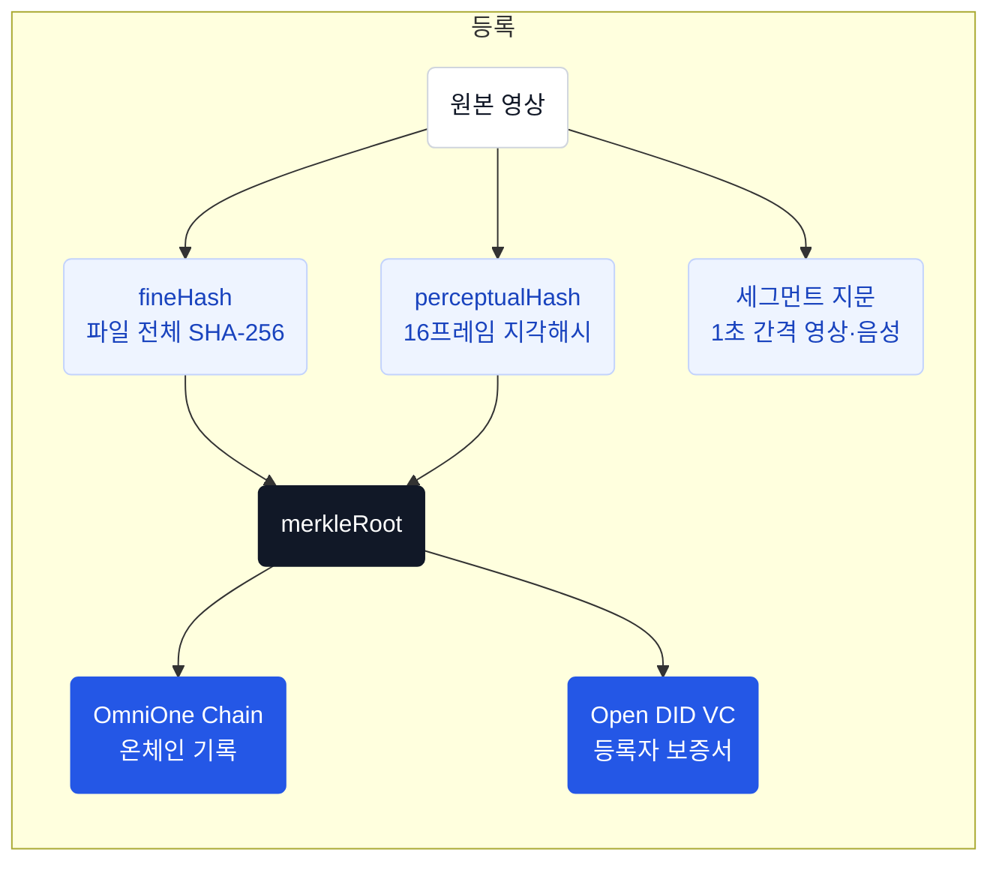

# 서비스 소개

> **등록 영상과의 일치, 등록자와 등록 시점을 확인합니다.**

## 진본이란?

영상은 복제와 재인코딩이 쉽습니다. 편집, 자막 추가, 재업로드를 거치면 파일 자체가 달라지기 때문에 단순 파일 비교로는 "같은 영상"인지조차 판단하기 어렵습니다.

**진본**은 이 문제를 해결하는 블록체인 기반 영상 진위 검증 서비스입니다. 원본 영상의 디지털 지문(해시)을 블록체인에 기록하고, 누가 언제 등록했는지를 DID 보증서(VC)로 증명합니다.

## 보증 범위

등록 영상은 비교 기준으로 등록된 파일입니다. 파일 정확 일치 또는 유사도 기준 통과와 등록 증거의 유효성을 확인합니다. 영상 속 사건의 사실성, AI 생성 여부, 촬영 원본 여부, 제작자·저작권자 여부는 보증하지 않습니다. 등록 시각은 촬영 시각과 다릅니다.

[검증 상태와 판정 한계](/verification-status)에서 파일 정확 일치·유사도 기준 통과·일부 구간 대응의 차이를 확인하세요.

## 핵심 원리

등록할 때는 영상에서 지문을 뽑아 블록체인에 남기고, 검증할 때는 같은 방식으로 지문을 다시 뽑아 대조합니다.

검증은 세 가지 질문에 차례로 답하는 과정입니다.

| 증명 | 질문 | 방법 |
|---|---|---|
| **동일성** | 등록된 그 영상이 맞는가? | 파일 해시 → 지각해시 → 영상·음성 세그먼트 대조 |
| **무결성** | 등록 기록이 조작되지 않았는가? | 서명 재계산 후 DB·온체인 양쪽 대조 (OmniOne Chain) |
| **신뢰성** | 누가 언제 등록했는가? | DID + VC 보증서 (Open DID), 모바일 신분증 본인확인 (OmniOne CX) |

::: tip 원본 미저장
원본 영상은 서버에 저장하지 않습니다. 지문만 계산한 뒤 임시 파일은 즉시 삭제합니다.
:::

## 세 종류의 지문

| 지문 | 무엇을 보는가 | 왜 필요한가 |
|---|---|---|
| **fineHash** | 파일 전체의 SHA-256 | 바이트 단위로 원본 그 자체인지 확인. 가장 빠르고 확실하지만, 재인코딩되면 못 찾습니다 |
| **perceptualHash** | 상대 시점 16프레임의 DCT 지각해시 | 재인코딩·리사이즈·압축을 거쳐도 값이 비슷하게 유지되어 **후보를 빠르게 추립니다** |
| **세그먼트 지문** | 1초 간격 영상·음성 해시 열 | 후보와 일정한 시간 간격으로 대조해 샘플 대응 비율과 불일치 구간을 계산합니다 |

두 해시(`fineHash`, `perceptualHash`)를 이어 SHA-256을 한 번 더 계산한 값이 **merkleRoot**이고, 블록체인에 기록되는 것은 이 값입니다.

::: info 지각해시만으로는 부족합니다
지각해시는 "비슷한 영상"을 찾아줄 뿐, 얼굴을 바꾸거나 음성을 교체한 영상도 통과시킬 수 있습니다. 세그먼트 대조를 추가해도 샘플 사이의 편집이나 작은 변화는 놓칠 수 있습니다. 유사도 기준 통과는 전체 무변조를 확정하는 의미가 아닙니다.
:::

## 검증 결과

사용자에게는 **진본 / 콘텐츠 유사 / 미인증 / 확인 중** 네 가지로 표시합니다.

| 표시 상태 | 의미 |
|---|---|
| **진본** | 파일 정확 일치 또는 영상·음성 유사도 기준 통과에 더해 블록체인·보증서 검증까지 통과한 영상. 등록자 표시명과 등록 시각, 원본에서의 대응 구간을 함께 보여줍니다 |
| **콘텐츠 유사** | 등록 후보는 찾았지만 유사도 승인 기준에 미달하거나 비교 정보가 부족한 영상. 후보의 등록자 정보와 VC 상태를 함께 안내합니다 |
| **미인증** | 등록 이력이 없거나, 등록이 취소되었거나, 보증서가 없거나 유효하지 않은 영상 |
| **확인 중** | 외부 장애 또는 온체인 무결성 검증 실패로 판정할 수 없는 상태. 상세 사유에 따라 재시도하거나 운영자 확인이 필요합니다 |

::: info 내부 판정값
백엔드는 `EXACT_MATCH`, `SAME_CONTENT`, `SIMILAR_MATCH`, `CONTENT_SIMILAR`, `PARTIAL_MATCH`, `NOT_REGISTERED`, `REGISTERED_BUT_REVOKED`, `CERTIFICATE_MISSING`, `CERTIFICATE_INVALID`, `VERIFICATION_UNAVAILABLE` 10종의 세분화된 verdict를 유지합니다. 클라이언트 매핑은 [검증 API](/developers/api/verify)를 참고하세요.
:::

::: warning 미등록 ≠ 조작
미등록은 비교 가능한 기록을 찾지 못했다는 뜻이며 조작의 증거가 아닙니다. 미인증에는 등록 비활성화·VC 미발급·VC 무효도 포함됩니다.
:::

## 사용자 유형

### 공인 등록자 (ISSUER)
모바일 신분증으로 본인확인을 마치고 Wallet DID를 연결한 회원입니다. 원본 영상을 등록하고, 블록체인 기록과 VC 보증서를 발급받을 수 있습니다.

### 비회원 검증자
가입이나 로그인 없이 영상을 검증할 수 있습니다. 공개 검증 결과만 볼 수 있고, 등록자의 개인정보나 Wallet에는 접근할 수 없습니다.

## 채널별 역할

| 채널 | 하는 일 | 로그인 |
|---|---|---|
| **iOS 앱** | 가입, DID/Wallet 관리, **영상 등록**, 보증서 보관 | 필요 |
| **웹** | 영상 파일 올려 검증 | 불필요 |
| **Chrome 확장** | YouTube·Instagram 영상 URL 기반 즉시 검증 | 불필요 |
| **카카오톡 챗봇** | 카카오톡 대화창에서 영상 URL 기반 검증 | 불필요 |

## 외부 연동

| 서비스 | 용도 |
|---|---|
| **OmniOne CX** | 등록자 본인확인 (모바일 신분증) |
| **Open DID** | VC 발급 및 검증 (백엔드는 TAS·Issuer 호출) |
| **OmniOne Chain** | 영상 해시(merkleRoot) 온체인 기록 (BESU 기반) |
| **yt-dlp** | URL 기반 검증 시 영상 다운로드 |
