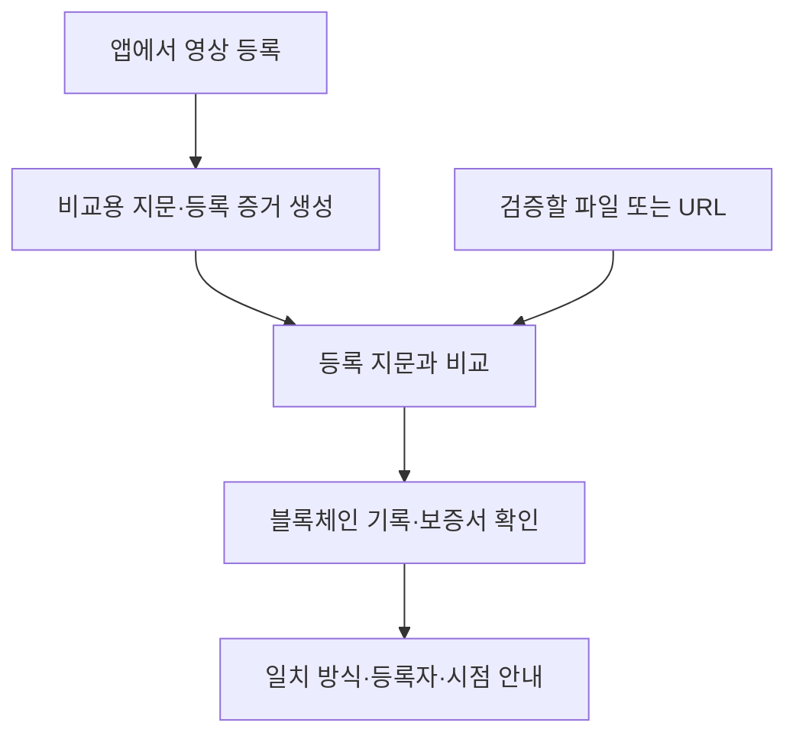

# 진본은 어떻게 동작하나요?

진본은 **등록해 둔 영상과 지금 확인하려는 영상을 비교하고, 누가 언제 등록했는지 확인하는 서비스**입니다.

등록자는 iOS 앱에서 영상과 보증서를 등록합니다. 검증자는 로그인 없이 파일이나 URL을 제출해 등록 영상과 비교합니다.

## 등록부터 검증까지

```mermaid
flowchart TD
  A[앱에서 영상 등록] --> B[비교용 지문·등록 증거 생성]
  B --> D[등록 지문과 비교]
  C[검증할 파일 또는 URL] --> D
  D --> E[블록체인 기록·보증서 확인]
  E --> F[일치 방식·등록자·시점 안내]
```

**등록할 때**는 영상에서 비교용 특징값인 ‘지문’을 만들고, 블록체인에 등록 기록을 남깁니다. 앱에서 등록 보증서(VC)를 발급받아 연결하면 검증에 필요한 증거가 준비됩니다. 영상 파일은 분석 후 장기 보관하지 않습니다.

**검증할 때**는 등록 파일과 정확히 같은지 먼저 봅니다. 파일이 다르면 화면과 음성 지문을 비교합니다. 파일 일치 또는 영상·음성 비교 기준을 통과하고, 등록 기록과 보증서도 유효해야 **진본**으로 표시합니다.

## URL과 파일 검증의 차이

**직접 올린 파일을 분석하느냐, 서버가 URL에서 내려받은 파일을 분석하느냐의 차이**입니다. 이후의 비교 기준은 같습니다.

예를 들어 등록 파일을 그대로 올리면 ‘파일 정확 일치’로, YouTube가 재압축한 사본은 ‘유사도 기준 통과’로 확인될 수 있습니다. 잘라낸 클립도 등록 영상의 대응 구간을 찾아 비교합니다.

## 어디서 이용하나요?

| 채널 | 역할 |
|---|---|
| **iOS 앱** | 본인확인·DID 연결, 영상 등록, 보증서 발급, 파일 검증 |
| **웹** | 파일 또는 URL로 검증 |
| **Chrome 확장** | YouTube·Instagram에서 URL로 검증 |
| **카카오톡 챗봇** | 대화창에 영상 URL을 보내 검증 |

## 무엇을 보증하나요?

이 문서의 **등록 영상**은 비교 기준으로 제출한 파일입니다. 진본은 그 파일과의 일치 여부와 등록 사실을 확인합니다. 영상 속 사건의 사실성, AI 생성 여부, 등록자의 저작권·기관 소속을 보증하지 않습니다. 등록 시점도 촬영 시점과 다릅니다.

유사도 검증은 샘플 비교라 모든 변경을 찾아내지는 못합니다. 등록 기록을 찾지 못했다는 결과 역시 가짜라는 뜻은 아닙니다.

## 궁금한 내용부터 읽어보세요

| 궁금한 내용 | 문서 |
|---|---|
| 영상을 올린 뒤 어떤 절차를 거치나요? | [영상 등록](/developers/flows/video-register) |
| URL·파일·잘라낸 클립은 어떻게 비교하나요? | [URL·파일 검증 차이](/developers/guide/verification-methods) |
| 어떤 기준으로 판정하나요? | [영상 검증](/developers/flows/video-verify) |
| 결과가 무엇을 뜻하나요? | [검증 결과 읽는 법](/developers/guide/verification-results) |
| 지문·DID·보증서는 무엇인가요? | [핵심 개념](/developers/guide/concepts) |
| 검증 기능을 연동하려면? | [검증 API](/developers/api/verify) |
