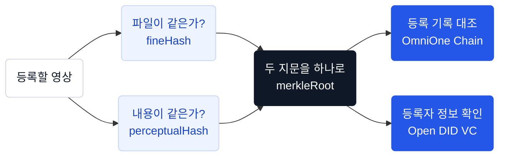

# 서비스 소개

> **영상이 진짜인지, 블록체인과 DID로 증명합니다.**

## 진본이란?

영상은 복제와 재인코딩이 쉽습니다. 편집, 자막 추가, 재업로드를 거치면 파일 자체가 달라지기 때문에 단순 파일 비교로는 "같은 영상"인지조차 판단하기 어렵습니다.

**진본**은 이 문제를 해결하는 블록체인 기반 영상 진위 검증 서비스입니다. 원본 영상의 디지털 지문(해시)을 블록체인에 기록하고, 누가 언제 등록했는지를 DID 보증서(VC)로 증명합니다.

## 핵심 원리

| 증명 | 질문 | 기술 |
|---|---|---|
| **무결성** | 이 영상이 변조되지 않았는가? | 블록체인 해시 대조 (OmniOne Chain) |
| **신뢰성** | 누가 언제 등록했는가? | DID + VC 보증서 (Open DID) |
| **본인확인** | 등록자가 진짜 본인인가? | 모바일 신분증 (OmniOne CX) |

::: tip 원본 미저장
원본 영상은 서버에 저장하지 않습니다. 해시만 계산한 뒤 임시 파일은 즉시 삭제합니다.
:::

## 두 종류의 해시

- **fineHash** — 파일 전체의 SHA-256. 바이트 단위로 동일한 원본인지 확인합니다.
- **perceptualHash** — 프레임에서 뽑은 DCT 기반 지각해시. 재인코딩, 리사이즈, 압축을 거쳐도 비슷한 값이 나와 **내용이 같은 영상**을 찾아냅니다.

두 해시를 이어 SHA-256을 한 번 더 계산한 값이 **merkleRoot**이고, 블록체인에 기록되는 것은 이 값입니다.

## 검증 결과

사용자에게는 세 가지 상태만 표시됩니다.

| 표시 상태 | 의미 |
|---|---|
| **진본 인증** | 블록체인에 등록이 확인된 영상 |
| **미인증** | 등록 이력이 없거나 보증서가 유효하지 않은 영상 |
| **확인 중** | 외부 시스템 장애로 일시적으로 확인 불가 (재시도 유도) |

::: info 내부 판정값
백엔드는 `EXACT_MATCH`, `SAME_CONTENT`, `SIMILAR_MATCH`, `NOT_REGISTERED`, `REGISTERED_BUT_REVOKED`, `CERTIFICATE_INVALID`, `VERIFICATION_UNAVAILABLE` 7종의 세분화된 verdict를 로그에 기록합니다. 클라이언트 매핑은 [검증 API](/api/verify)를 참고하세요.
:::

::: warning 미등록 ≠ 조작
미인증은 조작의 증거가 아닙니다. 등록된 적이 없다는 뜻일 뿐입니다.
:::

## 사용자 유형

### 공인 등록자 (ISSUER)
모바일 신분증으로 본인확인을 마치고 Wallet DID를 연결한 회원입니다. 원본 영상을 등록하고, 블록체인 기록과 VC 보증서를 발급받을 수 있습니다.

### 비회원 검증자
가입이나 로그인 없이 영상을 검증할 수 있습니다. 공개 검증 결과만 볼 수 있고, 등록자의 개인정보나 Wallet에는 접근할 수 없습니다.

## 채널별 역할

| 채널 | 하는 일 | 로그인 |
|---|---|---|
| **iOS 앱** | 가입, DID/Wallet 관리, **영상 등록**, 보증서 보관 | 필요 |
| **웹** | 영상 파일 올려 검증 | 불필요 |
| **Chrome 확장** | YouTube·Instagram 영상 URL 기반 즉시 검증 | 불필요 |

## 외부 연동

| 서비스 | 용도 |
|---|---|
| **OmniOne CX** | 등록자 본인확인 (모바일 신분증) |
| **Open DID** | VC 발급 및 검증 (Issuer, Verifier, TAS) |
| **OmniOne Chain** | 영상 해시(merkleRoot) 온체인 기록 (BESU 기반) |
| **yt-dlp** | URL 기반 검증 시 영상 다운로드 |
