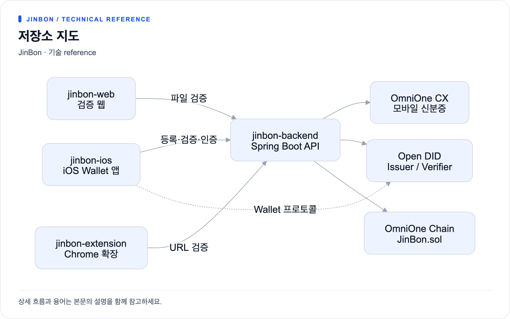

# 저장소 지도

진본은 네 개의 저장소로 구성됩니다. 모든 클라이언트는 백엔드 하나만 바라보며,
클라이언트끼리 직접 통신하지 않습니다.

[크게 보기](diagrams/repositories-1.png) · [Mermaid 원본](diagrams/repositories-1.mmd)

iOS 앱만 예외적으로 Open DID 서버군과 **직접** 통신합니다.
Wallet SDK가 DID 생성과 VC 수령을 담당하기 때문이며, 이 경로는 백엔드를 거치지 않습니다.

## jinbon-backend

영상 등록·검증, 인증, 외부 연동을 모두 담당하는 중심 서버입니다.

| 항목 | 값 |
|---|---|
| 언어 / 런타임 | Java 21 |
| 프레임워크 | Spring Boot 4.1.0 |
| 빌드 | Gradle 8.14 (`./gradlew bootRun`) |
| 기본 포트 | 8070 (`SERVER_PORT`) |
| DB | PostgreSQL 16.4 (`DB_PORT`, 기본 5432) |
| 캐시 | Redis 7 (호스트 6380 → 컨테이너 6379) |
| 주요 라이브러리 | web3j 4.12.3, JavaCV 1.5.11, jjwt 0.12.6, springdoc-openapi 2.8.8 |

JavaCV는 영상 프레임 추출과 지각해시 계산에 쓰이며, 네이티브 FFmpeg 바이너리를 포함하므로
빌드 산출물이 큽니다. URL 검증에는 별도로 시스템에 설치된 `yt-dlp`가 필요합니다.

## jinbon-ios

OmniOne의 오픈소스 `did-ca-ios`를 포크해 진본 기능을 얹은 Wallet 앱입니다.

| 항목 | 값 |
|---|---|
| 언어 | Swift (프로젝트 설정 `SWIFT_VERSION = 5.0`) |
| 최소 지원 | iOS 15 |
| SDK | `DIDWalletSDK` 2.0.1 (`source/Framework/did-wallet-sdk-ios-2.0.1`) |
| 프로젝트 | `source/DIDCA.xcodeproj` |
| 환경 설정 | `source/DIDCA/Configuration/{Dev,Prod}.xcconfig` |

원본 프로젝트의 화면(`MainViewController`, `AddVcViewController`, `QRScanViewController` 등)이 남아 있고,
그 위에 진본 화면(`JinBon*`, `Video*`)이 추가된 구조입니다.
앱 실행 시 사용자가 보는 것은 진본 화면이며, 원본 화면 일부는 DID 생성 단계에서만 재사용됩니다.

라이선스: 원저작물은 Apache License 2.0 (Copyright 2024 OmniOne).
자세한 내용은 저장소의 `THIRD_PARTY_NOTICES.md`를 참고합니다.

## jinbon-web

영상 파일을 올려 진본 여부를 확인하는 단일 페이지 웹입니다.

| 항목 | 값 |
|---|---|
| 프레임워크 | Next.js 16.2.6 / React 19.2.6 |
| 스타일 | Tailwind CSS 4.2.1 + `app/globals.css` |
| 빌드·실행 | `vinext` (Vite 기반) + Cloudflare Workers (`wrangler`) |
| 개발 포트 | 8071 |
| Node | 22.13.0 이상 |
| 백엔드 주소 | `NEXT_PUBLIC_API_BASE_URL` (기본 `http://localhost:8070`) |

화면은 `app/page.tsx` 하나이고, `tests/rendered-html.test.mjs`가 빌드된 HTML의 렌더링을 검사합니다.

## jinbon-extension

YouTube·Instagram 시청 페이지에서 바로 검증하는 Chrome 확장입니다.

| 항목 | 값 |
|---|---|
| 규격 | Manifest V3 |
| 버전 | 0.1.0 |
| 구현 | 순수 JavaScript (빌드 도구 없음) |
| 권한 | `storage`, `activeTab` |
| 호스트 권한 | `localhost:8070`, YouTube |

`src/content.js`가 페이지에 버튼을 주입하고, `src/background.js`가 백엔드를 호출하며,
`src/popup.html`에서 백엔드 주소를 바꿀 수 있습니다.

## 저장소별 커밋 규모

문서 작성 시점 기준 참고값입니다.

| 저장소 | 커밋 수(대략) | 상태 |
|---|---|---|
| `jinbon-backend` | 10+ | 기능 구현 및 보안 강화 반영 |
| `jinbon-ios` | 10+ | 진본 화면 및 온체인 보증서 화면 반영 |
| `jinbon-web` | 5 | 검증 화면 1개 구현 |
| `jinbon-extension` | 3 | 검증 버튼·패널 구현 |
