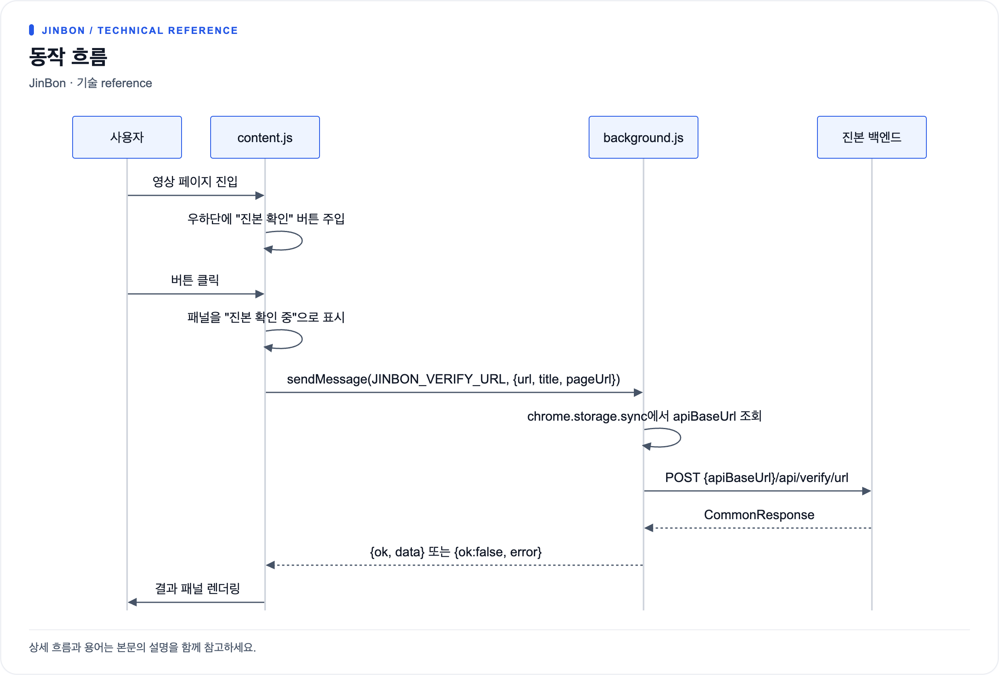

# 확장 프로그램 구조

저장소: `jinbon-extension` · 목적: YouTube 시청 페이지에서 즉시 진본 확인

## 파일 구성

```
manifest.json      Manifest V3 선언
src/
  content.js       페이지에 버튼·패널 주입, 결과 렌더링
  content.css      주입 UI 스타일
  background.js    서비스 워커. 백엔드 호출 담당
  popup.html       백엔드 주소 설정 화면
  popup.js         설정 저장·불러오기
  popup.css        팝업 스타일
```

빌드 도구가 없습니다. 소스를 그대로 Chrome에 `압축해제된 확장 프로그램 로드`로 설치합니다.

## manifest 요약

| 항목 | 값 |
|---|---|
| `manifest_version` | 3 |
| `name` | Jinbon Video Verifier |
| `version` | 0.1.0 |
| `permissions` | `storage`, `activeTab` |
| `host_permissions` | `http://localhost:8070/*`, YouTube |
| `background.service_worker` | `src/background.js` |
| `content_scripts` | YouTube 전체 경로, `run_at: document_idle` |
| `action.default_popup` | `src/popup.html` |

`host_permissions`에 `localhost:8070`이 하드코딩되어 있습니다.
팝업에서 백엔드 주소를 다른 호스트로 바꾸면 권한이 없어 요청이 차단되므로,
로컬이 아닌 서버를 쓰려면 manifest도 함께 수정해야 합니다.

## 동작 흐름



[크게 보기](diagrams/component-extension-1.png) · [Mermaid 원본](diagrams/component-extension-1.mmd)

메시지 리스너는 `return true`로 응답을 비동기 처리합니다.

## SPA 대응

YouTube는 페이지 이동 시 문서를 새로 불러오지 않습니다.
1초 간격 폴링으로 URL 변화를 감지해 다시 렌더링합니다.

```js
setInterval(() => {
  if (location.href !== lastUrl) init();
}, 1000);
```

## URL 정규화

`getCanonicalVideoUrl()`이 페이지 URL을 백엔드가 다루기 좋은 형태로 정리합니다.

현재 확장 프로그램은 YouTube와 Instagram의 영상 페이지에 버튼을 주입합니다. Instagram은 게시물(`/p`), 릴스(`/reel`), 동영상(`/tv`) 경로를 지원합니다.

| 입력 | 출력 |
|---|---|
| `youtube.com/watch?v=ID&list=…&t=…` | `https://www.youtube.com/watch?v=ID` |
| `youtube.com/shorts/ID` | `https://www.youtube.com/shorts/ID` |
| 그 외 | `location.href` 그대로 |

재생목록·타임스탬프 같은 부가 파라미터를 떼어내 같은 영상이 같은 캐시 키를 쓰도록 합니다.

## 백엔드 호출

```js
const endpoint = `${apiBaseUrl.replace(/\/$/, '')}/api/verify/url`;
fetch(endpoint, {
  method: 'POST',
  headers: { 'Content-Type': 'application/json' },
  body: JSON.stringify({ url: payload.url }),
});
```

- 기본 주소는 `http://localhost:8070`, `chrome.storage.sync`의 `apiBaseUrl`로 덮어씁니다.
- 응답 본문의 `data`를 우선 쓰고 없으면 본문 자체를 반환합니다.
- 비정상 응답이면 `body.message` 또는 `HTTP {status}`를 오류 메시지로 사용합니다.

## 결과 표시

`renderResult()`가 판정을 두 갈래로만 나눕니다.

```js
const title = result.authentic ? '진본으로 확인됨' : '진본 확인 안 됨';
const tone  = result.authentic ? 'success' : 'warning';
```

`verdict` 값 자체는 표에 한 줄로 표시하되, `formatVerdict()`가
`EXACT_MATCH` → `Exact Match`처럼 영문 그대로 보기 좋게 변환할 뿐 한국어로 옮기지는 않습니다.

패널에 들어가는 항목:

| 행 | 조건 |
|---|---|
| 판정 | `verdict`가 있을 때 |
| 유사도 거리 | `similarityDistance`가 숫자일 때, 소수점 1자리 |
| 영상 ID | `videoId`가 있을 때 |
| 등록 시각 | `registeredAt`이 있을 때 |
| 블록체인 | 항상. `검증됨` / `미검증` |
| VC | 항상. `검증됨` / `미검증` |

`message`는 본문에, `notice`는 하단 작은 글씨로 표시합니다.
모든 삽입값은 `escapeHtml()`을 거칩니다.
