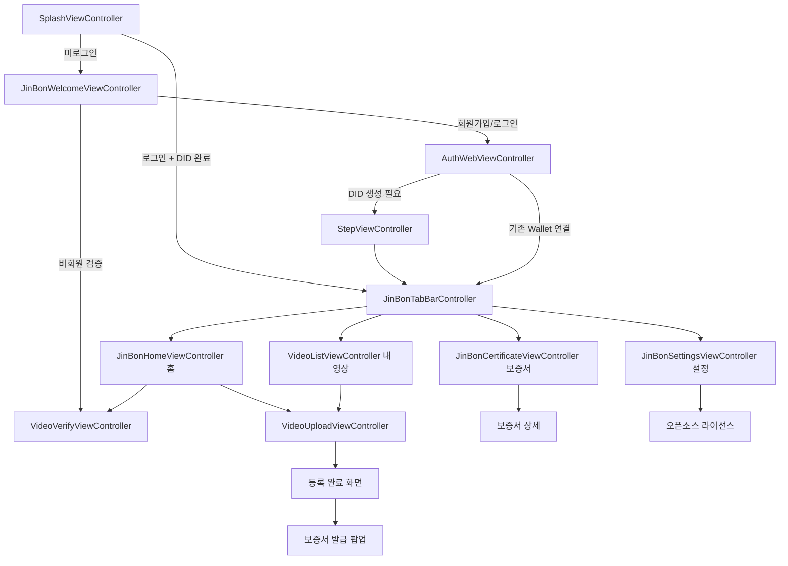

# iOS 앱 구조

저장소: `jinbon-ios` · 프로젝트: `source/DIDCA.xcodeproj` · 타깃명: `DIDCA`

## 출신과 구성

이 앱은 OmniOne의 오픈소스 `did-ca-ios`를 포크한 것입니다.
원본의 Wallet 기능(DID 생성, PIN, 생체인증, VC 저장, ZKP)을 그대로 두고
그 위에 진본 화면과 API 연동을 얹었습니다.

```
source/DIDCA/
├── Controller/       화면. JinBon*·Video*는 진본 추가분, 나머지는 원본 유래
├── Common/           JinBonAPIClient, Properties, KeychainHelper, SDKUtils 등
├── VO/               JinBonModels(진본 DTO), UserVO 등
├── Protocol/         원본 SDK 프로토콜 (IssueVc, RegUser, VerifyVc …)
├── Configuration/    Dev.xcconfig / Prod.xcconfig
├── Base.lproj/       Main.storyboard, LaunchScreen.storyboard
├── PIN/ Popup/       PIN 입력 및 공통 다이얼로그 스토리보드
├── Custom/ Cell/     커스텀 뷰와 셀
└── Assets.xcassets   이미지 · ColorAssets.xcassets
source/Framework/did-wallet-sdk-ios-2.0.1/DIDWalletSDK.xcframework
```

진본 화면은 스토리보드를 쓰지 않고 **코드로 UI를 구성**합니다(`buildUI()` 패턴).
원본 화면은 `Main.storyboard`에 남아 있으며 `ViewControllerID` enum으로 참조합니다.

## 화면 계층



화면별 상세 명세는 [iOS 화면 기획서](../70-screens/ios-screens.md)에 있습니다.

## 진입 분기 (SplashViewController)

1. Wallet 잠금 상태 확인 → 필요 시 잠금 해제 또는 Wallet 생성
2. `Properties.isLoggedIn()`이 false면 `JinBonWelcomeViewController`
3. 로그인 상태이고 `getRegDidDocCompleted() == true`면 `JinBonTabBarController`
4. 로그인 상태지만 DID 등록이 안 됐으면 다시 시작 화면으로 유도

## 백엔드 연동 (JinBonAPIClient)

`Common/JinBonAPIClient.swift`가 백엔드 호출을 전담합니다.
서버 주소는 xcconfig의 `JINBON_URL`에서 읽습니다.

호출하는 엔드포인트:

| 엔드포인트 | 용도 |
|---|---|
| `POST /api/signup/did/complete` | 가입 완료 (DID 연결) |
| `POST /api/auth/did/rebind` | 앱 재설치 후 DID 재연결 |
| `POST /api/auth/refresh` | 토큰 갱신 |
| `POST /api/auth/logout` | 로그아웃 |
| `POST /api/videos` | 영상 등록 |
| `GET /api/videos` | 내 영상 목록 |
| `POST /api/videos/{id}/vc/prepare` | VC 발급 준비·재개 |
| `POST /api/videos/{id}/vc/complete` | VC 발급 완료 연결 |
| `PATCH /api/videos/{id}/deactivate` | 영상 비활성화 |
| `POST /api/verify` | 파일 검증 |
| `POST /api/verify/url` | URL 검증 |

`/api/auth/token`, `/api/auth/app/request`, `/api/auth/app/verify`는 앱이 직접 호출하지 않습니다.
이 세 단계는 웹뷰가 로드하는 백엔드의 `/auth.html` 페이지 안에서 수행되고,
결과만 `WKScriptMessageHandler`로 앱에 전달됩니다.

## 인증 웹뷰 (AuthWebViewController)

`Mode`는 `.login`과 `.signup` 두 가지이며 화면 제목과 호출 API 접두사가 달라집니다.

```
mode == .signup  →  /auth.html?mode=signup  →  /api/signup/*
mode == .login   →  /auth.html              →  /api/auth/*
```

웹뷰가 인증을 마치면 델리게이트로 결과를 넘깁니다.

- `authDidComplete(tokenData:)` — 로그인 성공. `accessToken`, `refreshToken`, `did`, `didRebindToken` 포함
- `signupIdentityDidComplete(data:)` — 본인확인 성공. `signupToken` 포함
- `authDidCancel()` — 사용자가 취소

## Wallet DID 정합성 검사

로그인 직후 `WalletAccountValidator`가 기기 Wallet의 DID와 서버 계정의 DID를 대조합니다.

| 결과 | 의미 | 앱 동작 |
|---|---|---|
| `matches` | 일치 | 메인 화면 진입 |
| `noWallet` | 기기에 Wallet 없음 | `didRebindToken`으로 DID 재연결 안내 |
| `mismatch` | 다른 계정의 Wallet | 세션 삭제 후 오류 안내 |
| `accountDidMissing` | 서버 계정에 DID 없음 | 세션 삭제 후 재연결 안내 |

이 검사가 있어서 한 기기의 Wallet을 다른 사람의 진본 계정에 연결하는 것이 막힙니다.

## 로컬 저장 (Properties)

`UserDefaults`와 Keychain을 함께 씁니다.

| 저장 항목 | 용도 |
|---|---|
| `accessToken` / `refreshToken` | API 인증 |
| `memberId` / `memberName` / `memberRole` | 홈·설정 화면 표시 |
| `signupToken` | 가입 진행 중 임시 보관, 완료 후 삭제 |
| `didRebindToken` | DID 재연결 진행 중 임시 보관 |
| `pendingVideoVc(videoId)` | VC 발급 중단 시 재개용 문맥 |
| `regDidDocCompleted` / `submitCompleted` | 스플래시 라우팅 판정 |
| `tasUrl` / `verifierUrl` / `caAppId` | Wallet SDK 설정 |

등록한 영상 파일 자체도 `videoId` 기준으로 앱 로컬에 저장해 목록에서 재생할 수 있게 합니다
(`VideoUploadViewController` 하단의 로컬 저장 유틸).

## 환경 설정

`Dev.xcconfig`는 개발 서버 IP를, `Prod.xcconfig`는 도메인 자리표시자를 담고 있습니다.

| 키 | Dev | Prod |
|---|---|---|
| `JINBON_URL` | `http://10.48.200.183:8070` | `https://jinbon.example.com` |
| `TAS_URL` | `http://10.48.200.183:8090` | `https://jinbon-tas.example.com` |
| `VERIFIER_URL` | `http://10.48.200.183:8092` | `https://jinbon-verifier.example.com` |
| `CAS_URL` | `http://10.48.200.183:8094` | `https://jinbon-cas.example.com` |
| `WALLET_URL` | `http://10.48.200.183:8095` | `https://jinbon-wallet.example.com` |
| `API_URL` | `http://10.48.200.183:8093` | `https://jinbon-api.example.com` |
| `DEMO_URL` | `http://10.48.200.183:8099` | `https://jinbon-demo.example.com` |

Prod 값은 아직 실제 도메인으로 교체되지 않았습니다.
또한 HTTP 통신을 위해 `Info.plist`의 `NSAllowsArbitraryLoads`가 `true`로 열려 있으며,
두 xcconfig 파일 모두 프로덕션 배포 전 수정이 필요하다고 주석에 명시되어 있습니다.
자세한 내용은 [알려진 이슈](../90-status/open-issues.md)를 참고합니다.
