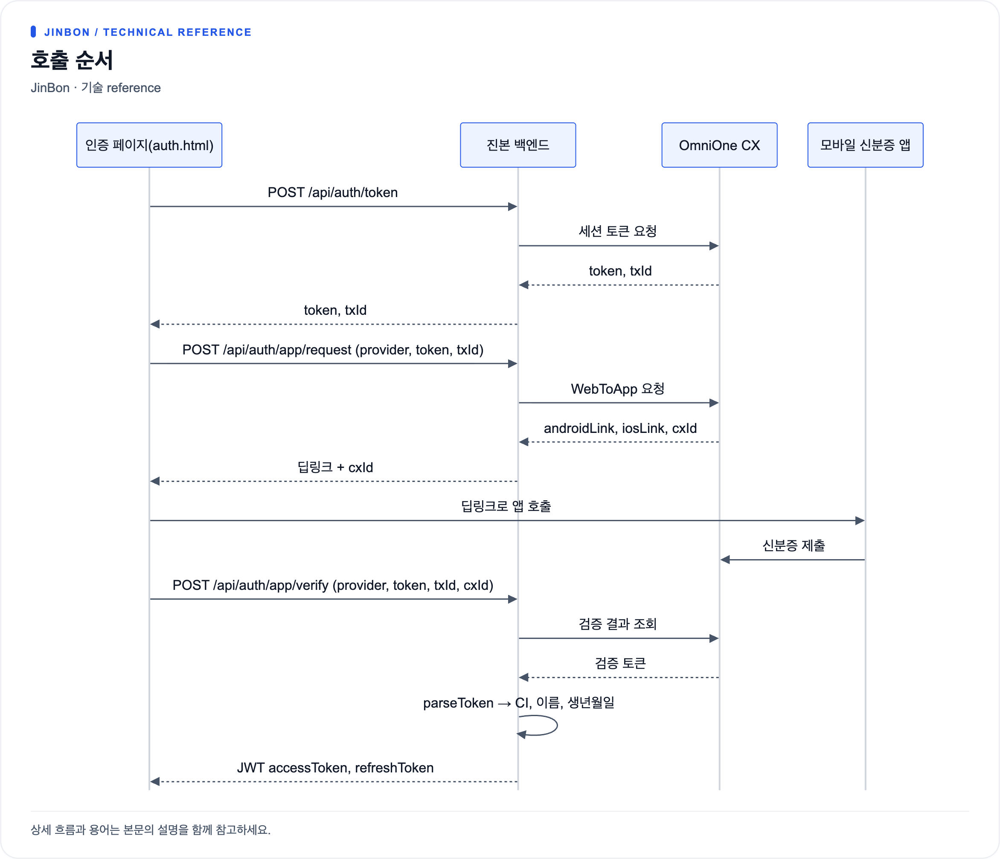

# 외부 연동

진본은 세 개의 외부 시스템과 연동합니다. 각각 해커톤 과제 하나에 대응합니다.

## 1. OmniOne CX — 모바일 신분증 (필수과제)

### 역할
등록자의 본인확인. 진본은 신분증 검증 결과에서 CI·이름·생년월일만 취합니다.

### 연동 지점
- 클라이언트: `com.jinbon.infra.omnione.OmniOneCxClient`, `OmniOneCxApi`
- 설정: `omnione.cx.server-url` (`OMNIONE_CX_URL`), `omnione.cx.config-path` = `/esign/config/config.mid.json`
- 인증사 코드: `comdl` (모바일 운전면허증)

### 호출 순서

[크게 보기](diagrams/external-integrations-1.png) · [Mermaid 원본](diagrams/external-integrations-1.mmd)

검증이 아직 진행 중이면 `ID_VERIFICATION_PENDING`(A007, 409)을 반환해
클라이언트가 다시 시도하도록 합니다.

### 개인정보 처리
CI 원문은 어디에도 저장하지 않습니다. `CiHasher`가 `HMAC-SHA256`으로 변환한
`h1:` 접두사 문자열만 `members.ci` 컬럼에 저장합니다.
이 값은 회원 중복 확인·로그인·DID 복구에만 쓰이고 VC·DID Document·블록체인에는 포함되지 않습니다.

## 2. Open DID — VC 보증서 (선택과제 1)

### 역할
"이 영상이 언제, 어떤 온체인 기록으로 등록되었는가"를 진본이 보증하는 VC를 발급하고 검증합니다.

### 구성
Open DID Orchestrator 2.0.0이 다음 서버를 한 번에 관리합니다.

| 서버 | 포트 | 백엔드가 직접 호출 | 앱이 직접 호출 |
|---|---|---|---|
| Orchestrator UI | 9001 | — | — |
| TAS | 8090 | 아니오 | 예 |
| Issuer | 8091 | **예** | 예 (발급 프로토콜) |
| Verifier | 8092 | **예** | 예 |
| API Gateway | 8093 | 아니오 | 예 |
| CA | 8094 | 아니오 | 예 |
| Wallet | 8095 | 아니오 | 예 |
| Demo | 8099 | 아니오 | — |

DID Document 앵커링용 블록체인으로 Hyperledger Besu를 사용하며,
이는 영상 기록용 OmniOne Chain과 **다른 체인**입니다.

### 백엔드 측 클래스

| 클래스 | 역할 |
|---|---|
| `VcIssuanceService` | 발급 준비 오케스트레이션. `prepareVideoVc(holderDid, claims)` |
| `OpenDidIssuerClient` | Holder·클레임 등록(`prepareHolder`), Offer 생성(`createIssueOffer`) |
| `VcVerificationService` | 상태·서명 검증. `verifyStatus(vcId)` |
| `OpenDidVerifierClient` | `getVcStatus`, `verifyVc` |

### 설정

| 키 | 값 |
|---|---|
| `opendid.enabled` | `OPENDID_ENABLED` (`.env.example` 기본값 `false`, `application.yml` 기본값 `true`) |
| `opendid.issuer-server-url` | `http://localhost:8091` |
| `opendid.verifier-server-url` | `http://localhost:8092` |
| `opendid.vc-plan-id` | `vcplan-jinbon-01` |
| `opendid.vc-claim-namespace` | `OPENDID_VC_CLAIM_NAMESPACE` (기본 `ns-jinbon-video-01`) |
| `opendid.issuer-did` | `did:omn:issuer` |

`opendid.issuer-did`는 설정 기본값이며, 실제 발급에 쓰이는 Issuer DID는
Offer 생성 응답에서 받은 값(`vcIssuerDid`)을 사용합니다.

### 검증 판정

`VcVerificationService.VerificationStatus`는 네 가지입니다.

| 값 | 조건 |
|---|---|
| `VERIFIED` | 상태가 `ACTIVE`이고 서명 검증 결과가 `VALID` |
| `INVALID` | 상태가 `ACTIVE`가 아니거나 서명 검증 실패 |
| `UNAVAILABLE` | Verifier 호출 중 예외 발생 |
| `DISABLED` | `opendid.enabled=false` 이거나 VC 미발급 |

## 3. OmniOne Chain — 온체인 등록 (선택과제 2)

### 역할
영상의 `merkleRoot`, 등록자 DID, 서명을 블록체인에 기록하고 검증 시 대조합니다.

### 연동 방식
- 체인: OmniOne Chain (BESU 기반)
- 접근: JSON-RPC (`BLOCKCHAIN_RPC_URL`) + API 토큰(`BLOCKCHAIN_API_TOKEN`)
- 라이브러리: web3j 4.12.3
- 서명 지갑: `src/main/resources/keystore/omnione-chain-keystore.json` + `KEYSTORE_PASSWORD`

### 클래스

| 클래스 | 역할 |
|---|---|
| `OmniOneChainClient` | `sendTransaction(data)`, `ethCall(data)`, `getTransactionReceipt(txHash)` |
| `ContractEncoder` | `encodeRegister`, `encodeDeactivate`, `encodeGetRecord` |
| `ContractDecoder` | `decodeGetRecord` → `VideoRecord(registered, active, issuerDid, signature, registeredAt)` |

### 컨트랙트
`contracts/JinBon.sol`. 상세는 [스마트 컨트랙트 문서](../40-data/smart-contract.md)를 참고합니다.

`register`와 `deactivate`에는 `onlyOwner` 제한이 걸려 있어
**컨트랙트를 배포한 지갑만** 호출할 수 있습니다.
따라서 `.env`의 `WALLET_ADDRESS`와 keystore는 배포 지갑과 반드시 일치해야 합니다.

### 트랜잭션 확정 대기
`VideoRegisterService.fetchBlockNumber()`가 영수증을 250ms 간격으로 최대 20회(약 5초) 조회합니다.
그 안에 영수증이 없거나 `status != 0x1`이면 `BLOCKCHAIN_TX_FAILED`(V008, 500)입니다.

## 4. yt-dlp — URL 영상 다운로드

Open DID·체인과 달리 외부 서비스가 아니라 서버에 설치되는 CLI 도구입니다.

- 사용처: `com.jinbon.infra.download.VideoDownloadService`
- 호출 시점: `POST /api/verify/url`
- 처리: 다운로드 → 해시 계산 → `cleanup()`으로 즉시 삭제
- 미설치 시 URL 검증만 실패하고 파일 업로드 검증은 정상 동작합니다

## 연동별 실패 영향 정리

| 연동 | 끊겼을 때 |
|---|---|
| OmniOne CX | 가입·로그인 불가. 검증은 정상 |
| Open DID Issuer | VC 발급 준비만 실패. 영상 등록은 성공 |
| Open DID Verifier | VC 발급된 영상 검증이 `VERIFICATION_UNAVAILABLE` |
| OmniOne Chain | 등록 실패, 검증은 `VERIFICATION_UNAVAILABLE` |
| yt-dlp | URL 검증만 실패 |
