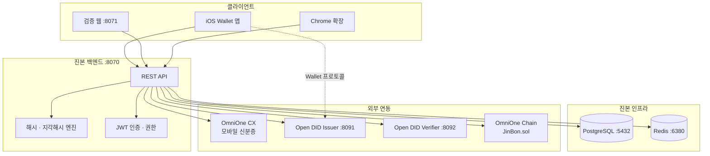

# 시스템 아키텍처

## 전체 구성

기존에 만들어 둔 구성도 이미지는 백엔드 저장소에 있습니다.

- `jinbon-backend/docs/system_diagram.png` — 시스템 구성도
- `jinbon-backend/docs/jinbon_selection_task.png` — 선택과제 조합

시각 자료는 [화면 흐름](../../visual/02-screen-flow.md)과
[핵심 시퀀스](../../visual/03-key-sequences.md)에 정리되어 있습니다.

## 계층별 책임

| 계층 | 책임 | 대표 클래스·파일 |
|---|---|---|
| Controller | HTTP 요청 수신, 인증 주체 추출 | `VideoRegisterController`, `VideoVerifyController`, `AuthController`, `SignupController` |
| Service (domain) | 등록·검증·인증 비즈니스 규칙 | `VideoRegisterService`, `VideoVerifyService`, `AuthService` |
| Service (기술) | 해시·서명 계산 | `HashService`, `PerceptualHashService`, `SignatureService` |
| Infra | 외부 시스템 호출 | `OmniOneChainClient`, `OpenDidIssuerClient`, `OpenDidVerifierClient`, `OmniOneCxClient`, `VideoDownloadService` |
| Global | 공통 응답·예외·보안 설정 | `CommonResponse`, `ErrorCode`, `SecurityConfig`, `JwtAuthenticationFilter` |

## 포트 맵

진본이 직접 운영하는 프로세스와, 별도로 설치해야 하는 Open DID Orchestrator를 구분합니다.

### 진본 구성 요소

| 포트 | 프로세스 | 비고 |
|---|---|---|
| 8070 | 진본 백엔드 | `SERVER_PORT`로 변경 가능 |
| 8071 | 검증 웹 (`npm run dev`) | vinext dev 고정 |
| 5432 | PostgreSQL (`jinbon-postgres`) | `DB_PORT`로 변경 가능 |
| 6380 | Redis (`jinbon-redis`) | 컨테이너 내부 6379 매핑 |

### Open DID Orchestrator (별도 저장소)

| 포트 | 서버 |
|---|---|
| 9001 | Orchestrator 관리 UI |
| 8090 | TAS (Trust Agent Server) |
| 8091 | Issuer |
| 8092 | Verifier |
| 8093 | API Gateway |
| 8094 | CA |
| 8095 | Wallet |
| 8099 | Demo |
| 5430 | Open DID 전용 PostgreSQL |

백엔드는 이 중 **Issuer(8091)와 Verifier(8092)만** 호출합니다(`application.yml`).
나머지 서버는 iOS 앱의 Wallet SDK가 직접 사용합니다.

## 데이터 흐름 요약

### 등록 (앱 → 백엔드 → 체인 → Issuer)

1. 앱이 영상 파일과 제목을 `POST /api/videos`로 전송
2. 백엔드가 fineHash·perceptualHash·merkleRoot·signature 계산
3. DB에 먼저 저장(unique 제약으로 중복 선점) 후 온체인 `register` 트랜잭션 전송
4. 확정된 온체인 기록을 다시 조회해 대조
5. Open DID Issuer에 Holder와 클레임 등록 → 발급 Offer 생성
6. 앱이 Offer로 Wallet 발급을 진행하고 `vcId`를 백엔드에 연결

### 검증 (웹·확장 → 백엔드)

1. 파일 또는 URL 수신
2. Redis 캐시 조회 (TTL 10분)
3. fineHash 정확 매칭 → 실패 시 perceptualHash 유사도 검색
4. 매칭된 영상에 대해 온체인 기록 조회 + 서명 재계산 대조
5. VC가 발급된 영상이면 Verifier로 상태·서명 확인
6. verdict 산출 후 캐싱

## 장애 격리 원칙

외부 시스템이 죽어도 서비스가 통째로 멈추지 않도록 다음과 같이 격리합니다.

| 장애 지점 | 영향 |
|---|---|
| Open DID Issuer 장애 | 영상 등록은 성공, VC 발급 준비만 생략(`vcIssuanceStatus`는 `NOT_REQUESTED` 유지) |
| Open DID Verifier 장애 | VC 발급된 영상은 `VERIFICATION_UNAVAILABLE`, 미발급 영상은 정상 판정 |
| OmniOne Chain 장애 | 검증은 `VERIFICATION_UNAVAILABLE`, 등록은 실패(트랜잭션 필수) |
| Redis 장애 | 캐시 미스로 동작하나 매 요청이 DB·체인 조회 |
| `OPENDID_ENABLED=false` | VC 발급·검증 전체 생략, `vcVerified`는 항상 `false` |

`VERIFICATION_UNAVAILABLE` 결과는 **캐싱하지 않습니다**. 일시 장애가 10분간 고정되는 것을 막기 위함입니다.

## 관련 문서

- [백엔드 구조](component-backend.md)
- [외부 연동](external-integrations.md)
- [영상 검증 플로우](../20-flows/video-verify.md)
