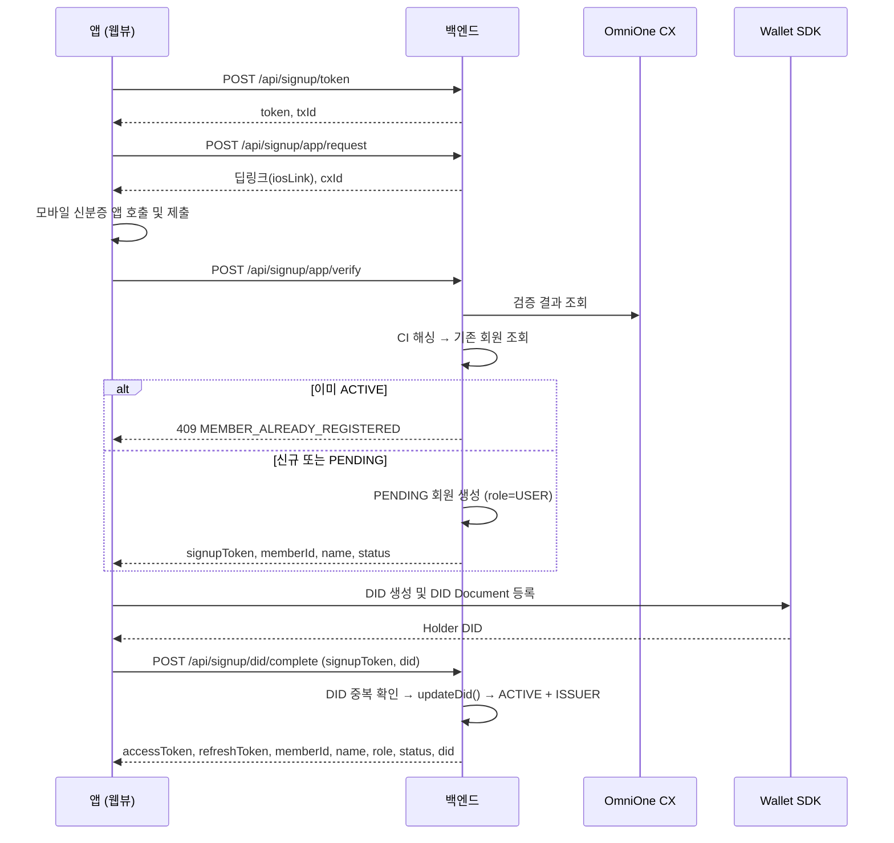
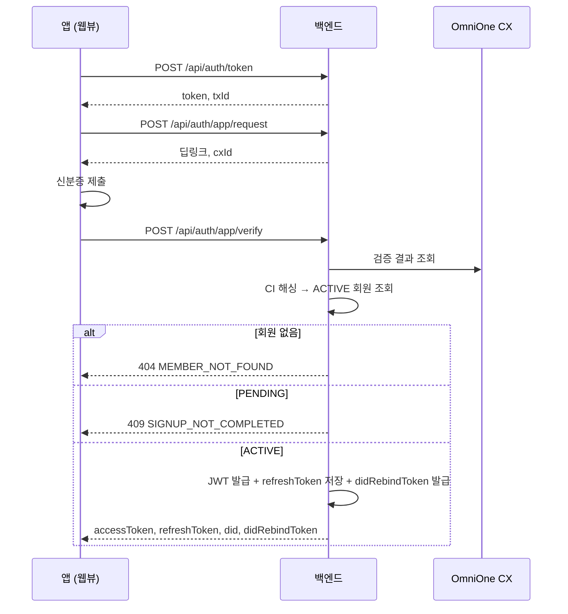
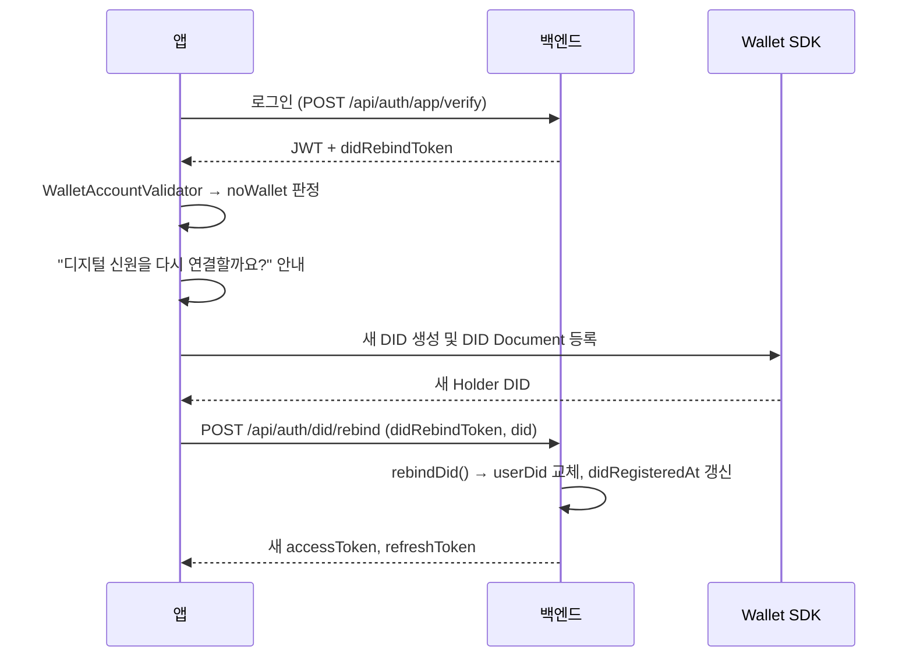

# 회원가입 · 로그인 플로우

## 원칙

회원가입과 로그인은 **완전히 분리된 흐름**입니다.
로그인 과정에서 회원을 자동 생성하지 않으며, 미가입자가 로그인을 시도하면 거부합니다.

| 흐름 | 엔드포인트 접두사 | 결과 |
|---|---|---|
| 회원가입 | `/api/signup` | `PENDING` 회원 생성 → DID 연결 → `ACTIVE` + `ISSUER` |
| 로그인 | `/api/auth` | 기존 `ACTIVE` 회원 조회 → JWT 발급 |

두 흐름 모두 앞의 3단계(토큰 발급 → 딥링크 요청 → 검증)는 동일하며,
마지막 단계에서만 갈라집니다.

## 회원가입



### 상태 전이

```
[없음] --본인확인--> PENDING(USER) --DID 연결--> ACTIVE(ISSUER)
```

`Member.updateDid(did)` 한 번의 호출로 DID 연결·역할 승격·상태 전환·가입 시각 기록이 모두 일어납니다.

### 예외 처리

| 상황 | 에러 |
|---|---|
| 이미 가입 완료된 CI | `MEMBER_ALREADY_REGISTERED` (M002, 409) |
| CI를 추출하지 못함 | `CI_NOT_FOUND` (A005, 400) |
| `signupToken`이 아님·만료 | `NOT_A_SIGNUP_TOKEN` (A006, 400) |
| 다른 회원이 쓰는 DID | `DID_ALREADY_REGISTERED` (M005, 409) |
| 신분증 검증 진행 중 | `ID_VERIFICATION_PENDING` (A007, 409) |

이미 `ACTIVE`인 회원이 같은 DID로 `did/complete`를 다시 호출하면
멱등하게 새 토큰만 발급합니다. 다른 DID로 호출하면 `MEMBER_ALREADY_REGISTERED`입니다.

### 기기에 이미 Wallet이 있는 경우

앱은 본인확인 후 `WalletAccountValidator.hasHolderDid()`로 기기 Wallet 존재를 확인합니다.
있으면 새로 만들지 않고 "기존 Wallet을 연결할까요?" 확인 후
기존 Holder DID로 바로 `did/complete`를 호출합니다.

## 로그인



로그인 응답에는 **항상 `didRebindToken`이 포함**됩니다.
앱은 기기 Wallet 상태를 확인한 뒤 필요할 때만 이 토큰을 사용합니다.

### 레거시 회원 보정

`MemberRole.USER`로 남아 있는 가입 완료 회원은 `promoteToIssuer()`로 자동 승격됩니다.
`USER` 역할로는 영상 등록이 불가능하므로(`ISSUER_ROLE_REQUIRED`) 이 보정이 필요합니다.

## DID 재연결 (앱 재설치)

앱을 지우면 기기의 Wallet과 DID가 사라집니다.
서버에는 이전 DID가 남아 있으므로 새 DID로 교체해야 합니다.



`didRebindToken`은 단기 토큰이며 `DidRebindTokenService`가 서버 측에서 관리합니다.
유효하지 않으면 `NOT_A_DID_REBIND_TOKEN`(A008, 401)입니다.

### DID가 바뀌면 기존 영상은 어떻게 되나

`Video.issuerDid`에는 등록 당시의 DID가 그대로 남습니다.
소유권 판정은 `memberId` 기준이므로 DID가 바뀌어도 내 영상 목록은 유지됩니다.

`memberId`가 없는 레거시 영상은 `issuerDid`가 일치할 때만 소유자로 인정하고,
조회 시 `claimLegacyVideos(memberId, userDid)`로 `memberId`를 채워 넣습니다.

다만 **검증 시 온체인 대조는 등록 당시 DID로 이뤄지므로** DID 교체 후에도
과거 영상의 블록체인 검증은 정상 동작합니다.

## 토큰 정책

| 토큰 | 만료 | 저장 위치 |
|---|---|---|
| accessToken | 30분 (`1800000`ms) | 앱 로컬 |
| refreshToken | 7일 (`604800000`ms) | 앱 로컬 + 서버(Redis) |
| signupToken | 단기 | 앱 로컬 (가입 완료 후 삭제) |
| didRebindToken | 단기 | 앱 로컬 (재연결 후 삭제) |

### Refresh Token Rotation

`POST /api/auth/refresh`는 새 accessToken과 **새 refreshToken을 함께** 발급하고
기존 refreshToken을 즉시 무효화합니다.

```
rotate(memberId, oldToken, newToken) == false  →  REFRESH_TOKEN_EXPIRED (A004, 401)
```

이미 사용된 토큰을 다시 쓰면 거부되므로 토큰 탈취 후 재사용을 막습니다.

### 로그아웃

`POST /api/auth/logout`은 서버의 refreshToken을 삭제합니다.
accessToken은 만료(최대 30분)까지 유효하므로 클라이언트도 로컬 토큰을 지워야 합니다.
앱 설정 화면의 안내 문구는 "Wallet과 인증서는 이 기기에 안전하게 유지됩니다."입니다.

## JWT 구조

`JwtTokenProvider`가 다음을 담습니다.

- subject: `memberId` (문자열)
- claim `role`: `USER` 또는 `ISSUER`
- claim `type`: `access` / `refresh` / `signup` / `did-rebind`

컨트롤러는 `Long.parseLong(authentication.getName())`으로 `memberId`를 꺼내 씁니다.
토큰 종류가 맞지 않으면 각각 `NOT_A_REFRESH_TOKEN`, `NOT_A_SIGNUP_TOKEN`,
`NOT_A_DID_REBIND_TOKEN`으로 거부합니다.
