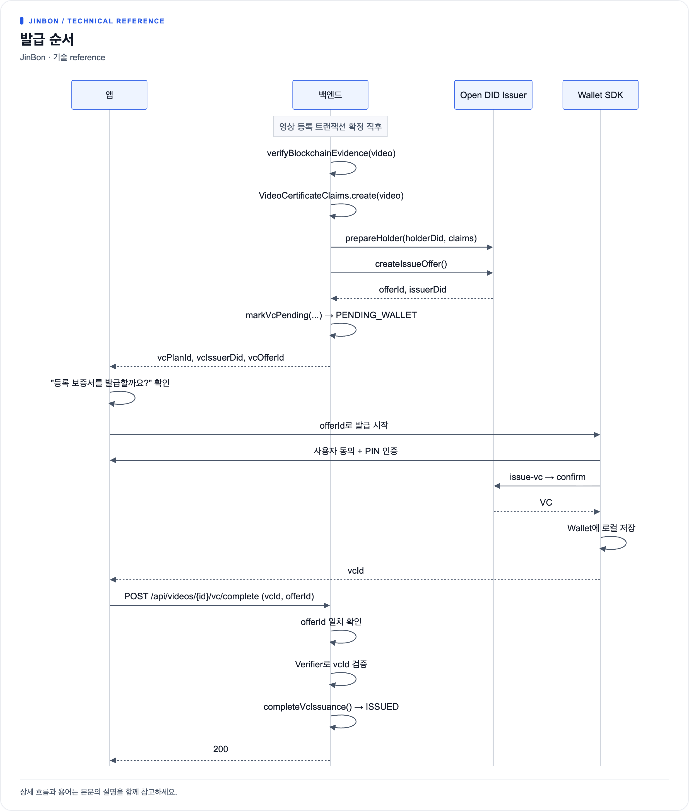

# VC 보증서 발급 플로우

## 이 VC가 보증하는 것

진본이 발급하는 VC는 **영상의 내용이 진실하다는 증명이 아닙니다**.
"진본 서비스가 이 영상의 디지털 지문을 확인했고, 그것이 특정 시각에
특정 블록체인 트랜잭션으로 기록되었음을 확인했다"는 사실을 보증합니다.

| 항목 | 값 |
|---|---|
| `credentialType` | `VideoRegistrationCredential` |
| `assuranceType` | `BLOCKCHAIN_REGISTRATION` |
| `schemaVersion` | `1` |
| VC Plan | `vcplan-jinbon-01` |
| 클레임 네임스페이스 | `ns-jinbon-video-01` (`OPENDID_VC_CLAIM_NAMESPACE`) |

## 클레임 구성

`VideoCertificateClaims.create(video)`가 만드는 클레임입니다.
각 키에는 네임스페이스 접두사가 붙습니다(`OpenDidProperties.claimKey()`).

| 클레임 | 출처 |
|---|---|
| `credentialType` | 고정값 `VideoRegistrationCredential` |
| `assuranceType` | 고정값 `BLOCKCHAIN_REGISTRATION` |
| `videoCommitment` | `video.merkleRoot` |
| `registrantDid` | `video.issuerDid` (등록자 DID) |
| `blockchainNetwork` | `blockchain.network` |
| `chainId` | `blockchain.chain-id` |
| `contractAddress` | `blockchain.contract-address` |
| `transactionHash` | `video.txHash` |
| `blockNumber` | `video.blockNumber` |
| `registeredAt` | `video.registeredAt` |
| `videoTitle` | `video.title` |
| `schemaVersion` | `1` |

원본 영상의 해시(`fineHash`, `perceptualHash`)는 VC에 들어가지 않습니다.
대표값인 `merkleRoot`만 `videoCommitment`로 포함됩니다.

### 발급 전 사전 조건

```java
txHash 또는 blockNumber가 비어 있음        → "Blockchain registration is not confirmed"
network / chainId / contractAddress 미설정 → "Blockchain evidence configuration is incomplete"
```

즉 **온체인 등록이 확정되지 않으면 VC 발급 준비 자체가 시작되지 않습니다.**

### 스냅샷 해시

발급 준비 시점의 클레임을 고정하기 위해 결속 해시를 계산합니다.

```
canonicalClaims = 아래 값들을 개행으로 이어붙인 문자열
  schemaVersion, credentialType, assuranceType, merkleRoot, issuerDid,
  network, chainId, contractAddress, txHash, blockNumber, registeredAt

snapshotHash = SHA-256(canonicalClaims + "\n" + credentialIssuerDid)
```

`Video.vcClaimSnapshotHash`에 저장되며, 발급 준비 당시의 증거 조합을 재확인하는 데 쓰입니다.

## 발급 순서



[크게 보기](diagrams/vc-issuance-1.png) · [Mermaid 원본](diagrams/vc-issuance-1.mmd)

Issuer-Initiated 방식이며, Wallet 측 프로토콜은
`request-offer → inspect-propose → generate-profile → issue-vc → complete-vc` 순서입니다.

## 상태 전이

```
NOT_REQUESTED  ──발급 준비 성공──>  PENDING_WALLET  ──Wallet 수령 확인──>  ISSUED
```

| 상태 | 의미 | 저장되는 값 |
|---|---|---|
| `NOT_REQUESTED` | 등록 직후 기본값 | — |
| `PENDING_WALLET` | Issuer에 Offer 생성 완료, Wallet 수령 대기 | `vcOfferId`, `vcPlanId`, `vcIssuerDid`, `vcClaimSnapshotHash`, `vcSchemaVersion`, `vcAssuranceType` |
| `ISSUED` | Wallet 수령·검증 완료 | `vcId` |

역방향 전이는 없습니다. `completeVcIssuance()`는 `PENDING_WALLET`에서만 호출 가능하며
다른 상태면 `VC_ISSUANCE_NOT_PREPARED`(D004, 400)입니다.

## 발급 완료 연결

`POST /api/videos/{videoId}/vc/complete`

```json
{ "vcId": "vc-abc123", "offerId": "offer-abc123" }
```

서버가 확인하는 순서:

1. `opendid.enabled` 확인 → 꺼져 있으면 `VC_FEATURE_DISABLED`(D006, 503)
2. 영상 소유권 확인 → 아니면 `VIDEO_NOT_OWNED`(V006, 403)
3. `video.vcOfferId == 요청 offerId` → 다르면 `VC_ISSUANCE_CONTEXT_MISMATCH`(D005, 400)
4. Verifier로 `vcId` 검증 → 실패면 `VC_VERIFICATION_FAILED`(D002, 500)
5. `completeVcIssuance(vcId, offerId)` → 상태 `ISSUED`

`offerId`를 함께 요구하는 이유는 다른 영상의 VC를 잘못 연결하는 것을 막기 위함입니다.
Offer는 영상당 1회성이며 두 곳에서 검사합니다(서비스 계층과 엔티티 내부).

## 발급 재개

앱에서 "나중에"를 선택했거나 발급 도중 앱이 종료된 경우,
영상 파일을 다시 올릴 필요 없이 발급 문맥을 되살릴 수 있습니다.

`POST /api/videos/{videoId}/vc/prepare`

```
vcId가 이미 있음                        → 기존 결과 반환 (offer 정보는 null)
vcOfferId·vcPlanId·vcIssuerDid 모두 존재 → 기존 Offer 그대로 반환
그 외                                   → 새로 발급 준비 시도
발급 준비 실패                          → VC_ISSUANCE_FAILED (D001, 500)
```

앱은 `Properties.setPendingVideoVc(_:videoId:)`로 발급 중 문맥을 로컬에도 보관해,
앱 재시작 후 목록 화면에서 발급을 이어갈 수 있습니다.

## 검증 시 VC 확인

영상 검증 과정에서 VC가 발급된 영상은 Verifier로 두 가지를 확인합니다.

1. VC 상태가 `ACTIVE`인가 (`getVcStatus`)
2. 서명 무결성 검증 결과가 `VALID`인가 (`verifyVc`)

| 결과 | verdict 영향 |
|---|---|
| `VERIFIED` | `vcVerified = true`, 판정 그대로 |
| `INVALID` | `CERTIFICATE_INVALID`, `authentic = false` |
| `UNAVAILABLE` | `VERIFICATION_UNAVAILABLE` (캐싱하지 않음) |
| `DISABLED` | VC 미발급 또는 기능 비활성. 블록체인 검증만으로 판정 |

**VC가 없다고 해서 진본이 아닌 것은 아닙니다.**
`authentic` 판정의 필수 조건은 블록체인 검증이며, VC는 발급된 경우에만 추가로 확인합니다.

## Open DID를 끈 경우

`OPENDID_ENABLED=false`이면:

- `VcIssuanceService.prepareVideoVc()`가 `null`을 반환 → 발급 준비 생략
- 등록 응답의 `vcPlanId`·`vcIssuerDid`·`vcOfferId`가 모두 `null`
- `vc/complete`, `vc/prepare` 호출 시 `VC_FEATURE_DISABLED`(D006, 503)
- 검증 시 `vcVerified`는 항상 `false`

영상 등록과 블록체인 기록, 검증은 정상 동작합니다.
