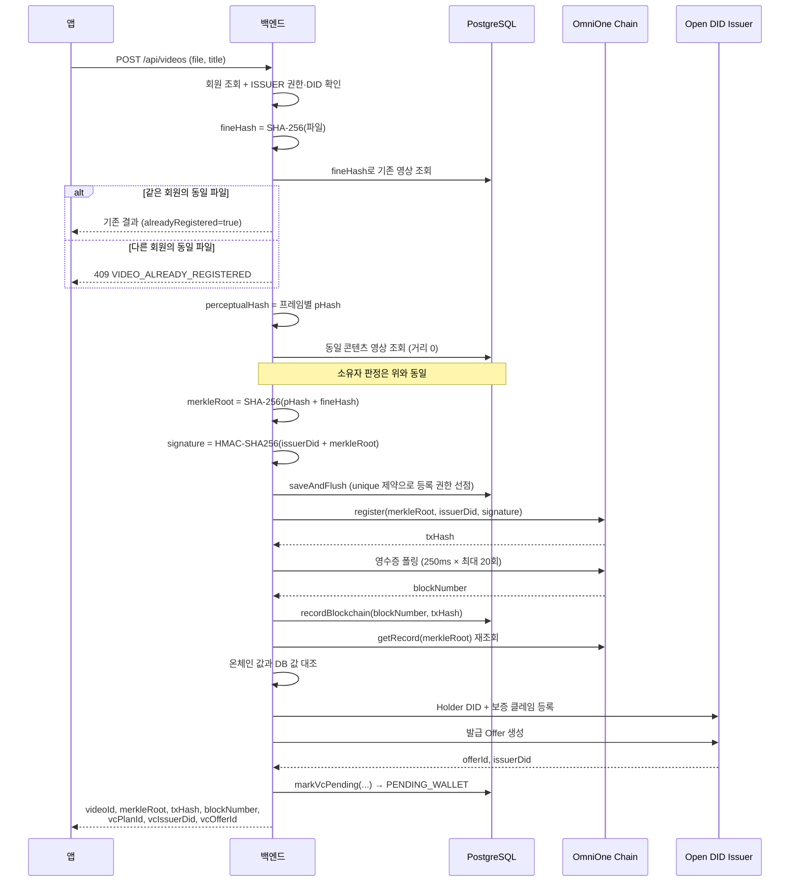

# 영상 등록 플로우

`POST /api/videos` · 권한: `ISSUER` · 요청 형식: `multipart/form-data` (`file`, `title`)

## 전체 순서



## 단계별 상세

### 1. 권한 검증

```
role != ISSUER            → ISSUER_ROLE_REQUIRED (V001, 403)
member.userDid == null    → ISSUER_DID_NOT_REGISTERED (V002, 400)
```

영상의 `issuerDid`에는 회원의 `userDid`가 그대로 들어갑니다.

### 2. fineHash 생성과 중복 확인

파일 전체를 8KB 버퍼로 스트리밍하며 SHA-256을 계산합니다.
`videos.fine_hash`에 unique 제약이 있어 DB 레벨에서도 중복이 막힙니다.

중복 발견 시 소유자 판정 규칙:

```
같은 회원 (memberId 일치, 또는 레거시 영상이면서 issuerDid 일치)
  → 기존 등록 결과를 그대로 반환, alreadyRegistered = true
  → VC가 아직 없으면 발급 준비를 새로 시도

다른 회원
  → VIDEO_ALREADY_REGISTERED (V004, 409)
```

메시지는 "동일한 영상이 다른 계정에 이미 등록되어 있습니다."입니다.
진본은 여기서 **누가 진짜 소유자인지 판정하지 않습니다**. 먼저 등록한 쪽을 유지할 뿐입니다.

### 3. perceptualHash 생성과 동일 콘텐츠 확인

컨테이너나 메타데이터만 달라 fineHash가 바뀐 경우를 잡아냅니다.

```
findSameContentVideo(pHash):
  전체 영상을 순회하며
  정방향 거리 == 0.0 AND 역방향 거리 == 0.0 인 영상을 반환
```

양방향을 모두 확인하는 이유는 프레임 수가 다를 때 최근접 매칭이 비대칭이기 때문입니다.
한쪽 방향만 0인 경우는 부분 포함 관계일 수 있어 동일 콘텐츠로 보지 않습니다.

동일 콘텐츠가 발견되면 fineHash 중복과 같은 소유자 판정 규칙을 적용합니다.

### 4. merkleRoot와 서명

```
merkleRoot = SHA-256(perceptualHash || fineHash)
merklePath = {"leaves": [perceptualHash, fineHash], "root": merkleRoot}
signature  = HMAC-SHA256(issuerDid + merkleRoot)   // 키: JWT secret
```

### 5. DB 선점 후 블록체인 기록

이 순서가 동시성 방어의 핵심입니다.

```java
Video saved = videoRepository.saveAndFlush(video);   // 먼저 DB
// DataIntegrityViolationException → VIDEO_ALREADY_REGISTERED
String txHash = sendBlockchainTx(encodeRegister(...)); // 통과한 요청만 체인
```

블록체인을 먼저 호출하면 동시에 들어온 같은 파일이 여러 트랜잭션을 만들 수 있습니다.
DB unique 제약으로 하나만 통과시킨 뒤 체인에 기록합니다.

트랜잭션 영수증은 250ms 간격으로 최대 20회(약 5초) 폴링하며,
`status != 0x1`이거나 `blockNumber`가 없으면 `BLOCKCHAIN_TX_FAILED`(V008, 500)입니다.

### 6. 온체인 증거 재확인

VC에 담을 증거가 실제 온체인 상태와 일치하는지 다시 확인합니다.

```java
ContractDecoder.VideoRecord record = decodeGetRecord(ethCall(encodeGetRecord(merkleRoot)));
if (!record.registered() || !record.active()
    || !video.getIssuerDid().equals(record.issuerDid())
    || !video.getSignature().equals(record.signature())) {
    throw new IllegalStateException("Blockchain evidence does not match");
}
```

트랜잭션 영수증만으로는 최종 상태를 보증할 수 없으므로,
조회 호출로 확정된 값을 다시 읽어 대조합니다.

### 7. VC 발급 준비

`VideoCertificateClaims.create(video)`가 보증 클레임을 만들고
`VcIssuanceService.prepareVideoVc()`가 Issuer에 등록합니다.
자세한 내용은 [VC 보증서 발급](vc-issuance.md)에 있습니다.

이 단계 전체가 `try/catch`로 감싸여 있습니다.

```java
catch (Exception e) {
    log.warn("VC preparation failed, video remains registered ...");
    return null;   // 등록 결과는 유지
}
```

## 응답

```json
{
  "status": 200,
  "message": "Success",
  "data": {
    "videoId": 1,
    "title": "기자회견 원본 영상",
    "merkleRoot": "a1b2c3...",
    "txHash": "0xabc123...",
    "blockNumber": "12345",
    "vcId": null,
    "registeredAt": "2026-09-07T14:30:00",
    "alreadyRegistered": false,
    "vcPlanId": "vcplan-jinbon-01",
    "vcIssuerDid": "did:omn:issuer123",
    "vcAssuranceType": "BLOCKCHAIN_REGISTRATION",
    "vcOfferId": "offer-abc123"
  }
}
```

`vcId`는 Wallet 발급이 완료되기 전까지 `null`입니다.
`vcPlanId`·`vcIssuerDid`·`vcOfferId`는 발급 준비에 실패했거나 이미 발급된 경우 `null`입니다.

## 영상 비활성화

`PATCH /api/videos/{videoId}/deactivate` · 권한: 본인 영상

```
소유권 확인
  → 이미 비활성이면 VIDEO_ALREADY_DEACTIVATED (V007, 400)
  → 온체인 deactivate(merkleRoot, issuerDid) 전송
  → DB active=false, deactivatedAt 기록
  → 검증 캐시 무효화 (verify:video:{videoId} 인덱스의 모든 키 삭제)
```

블록체인 기록이 먼저이고 DB 변경이 나중입니다.
체인 전송이 실패하면 트랜잭션이 롤백되어 DB도 활성 상태로 남습니다.

비활성화된 영상은 검증 시 `REGISTERED_BUT_REVOKED`로 판정되며,
등록 기록 자체가 사라지지는 않습니다.

## 저장하지 않는 것

원본 영상 파일은 서버에 남지 않습니다.
지각해시 계산을 위해 임시 파일(`jinbon-phash-*.tmp`)을 만들지만
`finally` 블록에서 즉시 삭제합니다.

DB에 남는 것은 해시·서명·체인 증거·메타데이터뿐입니다.
