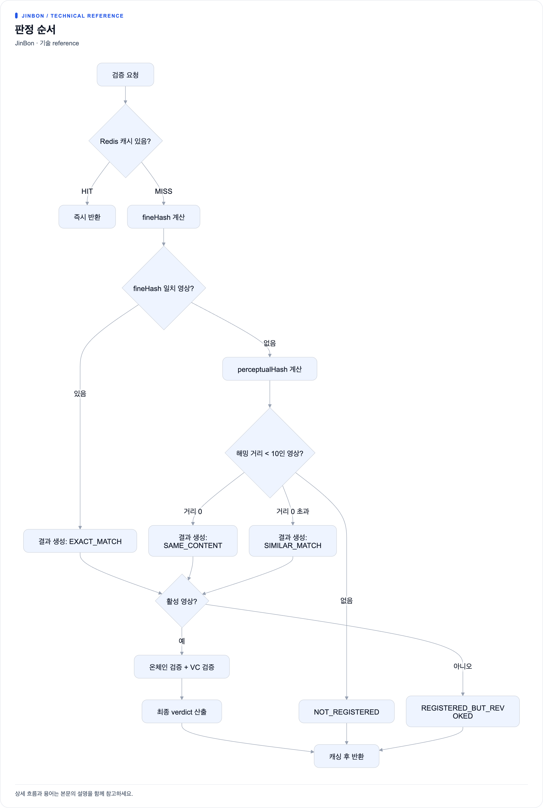
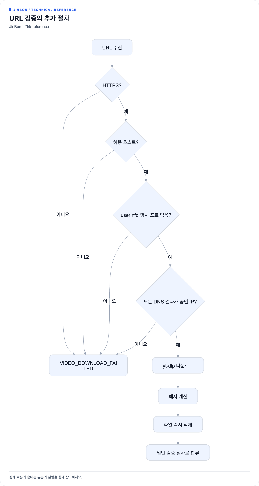

# 영상 검증 플로우

인증이 필요 없는 공개 API입니다. 두 가지 진입점이 있습니다.

| 엔드포인트 | 입력 | 사용 채널 |
|---|---|---|
| `POST /api/verify` | `multipart/form-data`의 `file` | 웹, iOS 앱 |
| `POST /api/verify/url` | JSON `{ "url": "..." }` | Chrome 확장 |

## 판정 순서



[크게 보기](diagrams/video-verify-1.png) · [Mermaid 원본](diagrams/video-verify-1.mmd)

## 1단계: 캐시

| 항목 | 값 |
|---|---|
| 결과 키 | `verify:result:{fineHash}` |
| URL 검증 키 | `verify:result:url:{SHA-256(url)}` |
| 영상별 인덱스 | `verify:video:{videoId}` (Set) |
| TTL | 10분 |

URL을 그대로 키로 쓰지 않고 해싱하는 이유는 악의적으로 긴 URL이
Redis 메모리를 잠식하는 것을 막기 위함입니다.

캐시에서 꺼낸 값의 `verdict`가 `null`이면(구버전 포맷) 키를 삭제하고 캐시 미스로 처리합니다.

`VERIFICATION_UNAVAILABLE` 결과는 캐싱하지 않습니다.
외부 시스템의 일시 장애가 10분간 고정되는 것을 막기 위함입니다.

## 2단계: 정확 일치

파일 전체 SHA-256을 계산해 `videos.fine_hash`와 대조합니다.
일치하면 `EXACT_MATCH`이며, 이때는 지각해시를 계산하지 않습니다.

## 3단계: 유사도 검색

정확 일치가 없으면 프레임별 지각해시를 만들어 활성 영상 전체와 비교합니다.

```java
List<Video> activeVideos = videoRepository.findByActiveTrue();
double bestDistance = SIMILARITY_THRESHOLD;   // 10
for (Video v : activeVideos) {
    double d = compareFingerprints(input, v.getPerceptualHash());
    if (d < bestDistance) { bestDistance = d; bestMatch = v; }
}
```

| 거리 | 판정 |
|---|---|
| `0.0` | `SAME_CONTENT` — 동일 콘텐츠 |
| `0.0 < d < 10` | `SIMILAR_MATCH` — 재인코딩·부분 변환 가능 |
| `>= 10` | 매칭 없음 → `NOT_REGISTERED` |

`SIMILAR_MATCH`일 때만 응답에 `similarityDistance`가 포함됩니다.

전체 활성 영상을 메모리에 올려 순회하는 방식이라 영상 수가 늘면 선형으로 느려집니다.
MVP 범위에서 의도된 단순화입니다.

## 4단계: 온체인 검증

```java
ContractDecoder.VideoRecord record = decodeGetRecord(ethCall(encodeGetRecord(merkleRoot)));

// 온체인 레코드 확인
!record.registered() || !record.active()
  || !video.getIssuerDid().equals(record.issuerDid())   → INVALID

// 서명 재계산 대조
String recalculated = signatureService.sign(issuerDid + merkleRoot);
!recalculated.equals(video.getSignature())
  || !recalculated.equals(record.signature())           → INVALID

// 호출 자체가 실패                                       → UNAVAILABLE
```

서명을 **재계산해서** DB 값과 온체인 값 양쪽에 대조합니다.
DB가 조작되었더라도 서버 비밀키 없이는 서명을 다시 만들 수 없고,
온체인 값은 애초에 바꿀 수 없으므로 두 값이 동시에 맞아야 통과합니다.

## 5단계: VC 검증

`video.vcId`가 있을 때만 Verifier를 호출합니다.
없으면 `DISABLED`로 처리하고 블록체인 검증만으로 판정합니다.
자세한 규칙은 [VC 보증서 발급](vc-issuance.md)에 있습니다.

## 최종 판정 규칙

```java
certificateIssued        = video.vcId != null
verificationUnavailable  = 블록체인 UNAVAILABLE
                           || (certificateIssued && VC UNAVAILABLE)
certificateInvalid       = certificateIssued && VC INVALID
authentic = blockchainVerified && !verificationUnavailable && !certificateInvalid
```

우선순위대로 verdict가 결정됩니다.

| 순위 | 조건 | verdict | authentic |
|---|---|---|---|
| 0 | 영상이 비활성 | `REGISTERED_BUT_REVOKED` | `false` |
| 1 | 외부 검증 불가 | `VERIFICATION_UNAVAILABLE` | `false` |
| 2 | 블록체인 검증 실패(INVALID) | `VERIFICATION_UNAVAILABLE` | `false` |
| 3 | VC가 유효하지 않음 | `CERTIFICATE_INVALID` | `false` |
| 4 | 매칭 결과 그대로 | `EXACT_MATCH` / `SAME_CONTENT` / `SIMILAR_MATCH` | `true` |
| — | 매칭 없음 | `NOT_REGISTERED` | `false` |

## verdict 7종

| verdict | 의미 | 사용자에게 전하는 뜻 |
|---|---|---|
| `EXACT_MATCH` | 등록된 원본 파일과 SHA-256이 정확히 일치 | 등록된 그 파일 그대로입니다 |
| `SAME_CONTENT` | 프레임 지각해시가 완전히 일치 | 파일은 달라도 같은 영상입니다 |
| `SIMILAR_MATCH` | 지각해시 거리가 임계값 미만 | 재인코딩되었을 수 있는 같은 영상입니다 |
| `REGISTERED_BUT_REVOKED` | 등록 기록은 있으나 비활성화됨 | 등록자가 등록을 취소했습니다 |
| `CERTIFICATE_INVALID` | 온체인 등록은 확인, VC가 유효하지 않음 | 보증서가 폐기·만료되었습니다 |
| `NOT_REGISTERED` | 일치·유사 기록 없음 | 등록 이력이 없습니다 |
| `VERIFICATION_UNAVAILABLE` | 외부 검증 장애 또는 무결성 확인 불가 | 지금은 확인할 수 없습니다 |

### 응답 메시지

| verdict | `message` | `notice` |
|---|---|---|
| `EXACT_MATCH` | 등록된 원본 파일과 정확히 일치합니다. | — |
| `SAME_CONTENT` | 등록된 영상과 동일한 콘텐츠로 판단됩니다. | 영상 프레임을 비교한 결과이며, 파일의 바이트가 동일하다는 의미는 아닙니다. |
| `SIMILAR_MATCH` | 등록 영상과 유사합니다. 재인코딩 또는 일부 변환되었을 수 있습니다. | 유사 일치는 원본 파일과 바이트 단위로 동일하다는 의미가 아닙니다. |
| `REGISTERED_BUT_REVOKED` | 등록 후 비활성화된 영상입니다. | — |
| `CERTIFICATE_INVALID` | 영상의 블록체인 등록 기록은 확인했지만 VC 보증서가 유효하지 않습니다. | 보증서가 폐기·만료되었거나 서명 검증을 통과하지 못했습니다. |
| `NOT_REGISTERED` | 진본에 등록된 기록을 찾지 못했습니다. | 미등록은 영상이 조작되었다는 의미가 아닙니다. |
| `VERIFICATION_UNAVAILABLE` (외부 장애) | 외부 검증 서비스에 연결할 수 없어 현재 진본 여부를 확인할 수 없습니다. | 잠시 후 다시 검증해 주세요. |
| `VERIFICATION_UNAVAILABLE` (체인 불일치) | 등록 기록은 찾았지만 블록체인 무결성 검증을 통과하지 못했습니다. | 운영자 확인이 필요합니다. |

### `NOT_REGISTERED`를 다룰 때의 주의

미등록은 **조작의 증거가 아닙니다**. 애초에 진본에 등록된 적이 없다는 뜻일 뿐입니다.
백엔드가 `notice`에 이 문구를 넣어 보내므로 클라이언트는 이를 반드시 노출해야 합니다.

## URL 검증의 추가 절차



[크게 보기](diagrams/video-verify-2.png) · [Mermaid 원본](diagrams/video-verify-2.mmd)

허용 호스트: `youtube.com`, `youtu.be`, `instagram.com`, `tiktok.com`,
`twitter.com`, `x.com`, `vimeo.com` (서브도메인 포함)

DNS 응답의 **모든** IP를 검사해 루프백·사설·링크로컬·멀티캐스트가 하나라도 있으면 차단합니다.
공인 IP와 사설 IP를 섞어 응답하는 DNS 리바인딩 공격을 막기 위함입니다.

다운로드한 파일은 해시 계산 후 `finally` 블록에서 삭제합니다.

## 응답 예시

```json
{
  "status": 200,
  "message": "Success",
  "data": {
    "verdict": "EXACT_MATCH",
    "similarityDistance": null,
    "authentic": true,
    "videoId": 1,
    "issuerDid": "did:omn:abc123",
    "registeredAt": "2026-09-07T14:30:00",
    "blockchainVerified": true,
    "vcVerified": true,
    "active": true,
    "message": "등록된 원본 파일과 정확히 일치합니다.",
    "notice": null
  }
}
```

`issuerDid` 필드는 이름과 달리 **VC 발급기관이 아니라 영상 등록자의 DID**입니다.
구버전 필드명을 호환을 위해 유지한 것입니다.

`authentic` 역시 구버전 클라이언트 호환용이며,
신규 화면은 `verdict`를 기준으로 구성해야 합니다.
