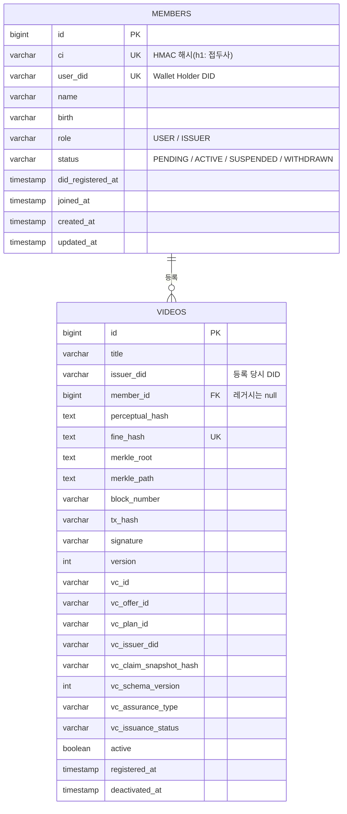
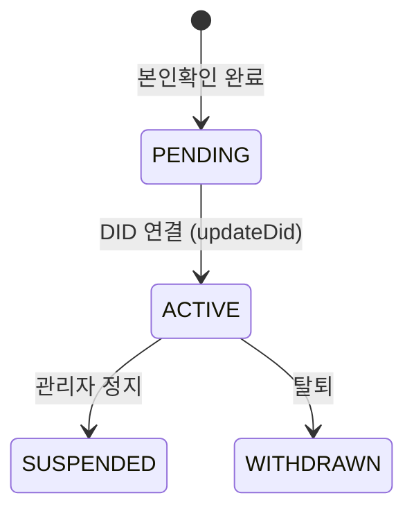
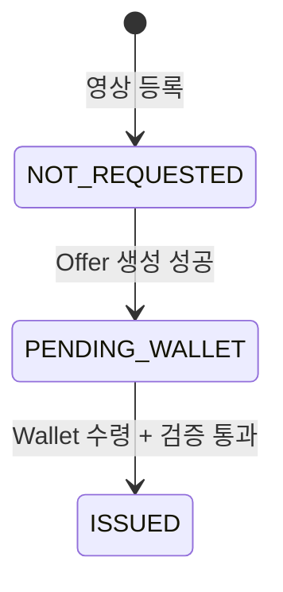

# 데이터 모델

PostgreSQL 16.4, JPA `ddl-auto: update`로 스키마를 관리합니다.
별도 마이그레이션 도구는 쓰지 않습니다.

## ER 개요



`videos.member_id`에 실제 FK 제약이 걸려 있지는 않습니다.
논리적 참조이며 레거시 데이터는 `null`일 수 있습니다.

## members

| 컬럼 | 타입 | 제약 | 설명 |
|---|---|---|---|
| `id` | bigint | PK, identity | |
| `ci` | varchar | not null, **unique** | CI의 HMAC-SHA256 해시. `h1:` 접두사 포함 |
| `user_did` | varchar | unique | Wallet이 생성한 Holder DID. 가입 전에는 null |
| `name` | varchar | not null | 신분증에서 추출한 실명 |
| `birth` | varchar | | 생년월일 |
| `role` | varchar | not null | `USER` / `ISSUER` |
| `status` | varchar | not null | `PENDING` / `ACTIVE` / `SUSPENDED` / `WITHDRAWN` |
| `did_registered_at` | timestamp | | DID 최초 등록 또는 재연결 시각 |
| `joined_at` | timestamp | | 가입 완료 시각 |
| `created_at` / `updated_at` | timestamp | | |

컬럼명이 `ci`지만 **값은 언제나 해시**입니다. 레거시 호환을 위해 이름만 유지했고
엔티티 필드명은 `ciHash`입니다. 평문 CI는 어떤 경로로도 저장되지 않습니다.

### 상태 전이



`SUSPENDED`와 `WITHDRAWN`은 enum에 정의되어 있으나
이 상태로 전이시키는 API나 관리 화면은 아직 없습니다.

### 역할

| 역할 | 영상 등록 | 비고 |
|---|---|---|
| `USER` | 불가 | 레거시. 로그인 시 `promoteToIssuer()`로 자동 승격 |
| `ISSUER` | 가능 | `updateDid()` 시점에 자동 부여 |

현재 설계에서 가입을 완료하면 모두 `ISSUER`가 됩니다.
"공인 등록자"를 별도 심사로 구분하는 절차는 없습니다.

### 주요 메서드

| 메서드 | 동작 |
|---|---|
| `create(ciHash, userDid, name, birth, role, status)` | 생성. `status`가 null이면 `PENDING` |
| `updateDid(userDid)` | DID 연결 + `ISSUER` 승격 + `ACTIVE` 전환 + `joinedAt` 기록 |
| `rebindDid(userDid)` | DID만 교체, 상태·역할은 유지 |
| `promoteToIssuer()` | 역할이 `ISSUER`가 아니면 승격 |
| `migrateCiHash(ciHash)` | 레거시 평문 CI를 해시로 교체 (마이그레이션 전용) |

## videos

| 컬럼 | 타입 | 제약 | 설명 |
|---|---|---|---|
| `id` | bigint | PK, identity | |
| `title` | varchar | not null | 영상 제목 |
| `issuer_did` | varchar | not null | 등록 당시 등록자 DID |
| `member_id` | bigint | | 등록자 회원 ID. 레거시는 null |
| `perceptual_hash` | text | not null | 프레임별 pHash 목록(쉼표 구분) |
| `fine_hash` | text | not null, **unique** | 파일 전체 SHA-256 |
| `merkle_root` | text | not null | `SHA-256(pHash + fineHash)` |
| `merkle_path` | text | | 루트 재구성용 JSON |
| `block_number` | varchar | | 등록 트랜잭션 블록 번호 |
| `tx_hash` | varchar | | 등록 트랜잭션 해시 |
| `signature` | varchar | not null | `HMAC-SHA256(issuerDid + merkleRoot)` |
| `version` | int | | 데이터 스키마 버전 (현재 1) |
| `active` | boolean | not null | 비활성화 시 false |
| `registered_at` | timestamp | | |
| `deactivated_at` | timestamp | | |

### VC 관련 컬럼

| 컬럼 | 채워지는 시점 | 설명 |
|---|---|---|
| `vc_offer_id` | 발급 준비 | 1회성 Offer ID |
| `vc_plan_id` | 발급 준비 | `vcplan-jinbon-01` |
| `vc_issuer_did` | 발급 준비 | Offer 응답에서 받은 실제 Issuer DID |
| `vc_claim_snapshot_hash` | 발급 준비 | 클레임 결속 해시 |
| `vc_schema_version` | 발급 준비 | 현재 1 |
| `vc_assurance_type` | 발급 준비 | `BLOCKCHAIN_REGISTRATION` |
| `vc_issuance_status` | 등록 시 초기화 | `NOT_REQUESTED` / `PENDING_WALLET` / `ISSUED` |
| `vc_id` | 발급 완료 | Wallet이 수령한 VC 식별자 |

`vc_issuer_did`는 **VC 발급기관**이고 `issuer_did`는 **영상 등록자**입니다.
이름이 비슷하지만 다른 주체입니다.

### 상태 전이



역방향 전이는 없습니다. `completeVcIssuance()`는 `PENDING_WALLET`에서만 허용하며
`vcOfferId`가 요청의 `offerId`와 일치해야 합니다.

`active`는 별도 축입니다. `ISSUED` 상태의 영상도 비활성화될 수 있고,
그 경우 검증은 `REGISTERED_BUT_REVOKED`가 됩니다.

### 주요 메서드

| 메서드 | 동작 |
|---|---|
| `create(...)` | 생성. `active=true`, `vcIssuanceStatus=NOT_REQUESTED` |
| `recordBlockchain(blockNumber, txHash)` | DB 선점 후 확정된 체인 정보 연결 |
| `markVcPending(offerId, planId, issuerDid, snapshotHash, schemaVersion, assuranceType)` | `PENDING_WALLET`로 전이 |
| `completeVcIssuance(vcId, offerId)` | 상태·Offer 검증 후 `ISSUED`로 전이 |
| `deactivate()` | `active=false`, `deactivatedAt` 기록 |

`markVcPending`에는 인자 3개짜리 오버로드가 남아 있습니다.
기존 호출부 호환용이며 신규 발급은 6개짜리를 사용합니다.

## 소유권 판정

`videos.member_id`가 정본이고, 없을 때만 `issuer_did`로 보완합니다.

```java
boolean legacyOwned = video.getMemberId() == null
    && video.getIssuerDid().equals(member.getUserDid());
if (legacyOwned) {
    videoRepository.claimLegacyVideos(memberId, member.getUserDid());
}
if (!memberId.equals(video.getMemberId()) && !legacyOwned) {
    throw new BusinessException(ErrorCode.VIDEO_NOT_OWNED);
}
```

`claimLegacyVideos`는 `member_id`가 비어 있고 `issuer_did`가 일치하는 영상에
`member_id`를 채워 넣습니다. 목록 조회와 상세 조회 시점에 자동 실행됩니다.

이 설계 덕분에 DID를 재연결해도 과거 영상의 소유권이 유지됩니다.

## 중복 방지 계층

같은 영상의 중복 등록은 세 겹으로 막습니다.

| 계층 | 방식 | 잡아내는 경우 |
|---|---|---|
| 1 | `fineHash` 조회 | 완전히 같은 파일 |
| 2 | `perceptualHash` 양방향 거리 0 | 컨테이너·메타데이터만 다른 파일 |
| 3 | `fine_hash` unique 제약 | 동시 요청 경합 |

1·2단계는 같은 회원이면 멱등 응답, 다른 회원이면 409로 나뉩니다.
3단계는 `DataIntegrityViolationException`을 잡아 409로 변환합니다.

## Redis 키

| 키 | 타입 | TTL | 용도 |
|---|---|---|---|
| `verify:result:{fineHash}` | string | 10분 | 파일 검증 결과 캐시 |
| `verify:result:url:{sha256(url)}` | string | 10분 | URL 검증 결과 캐시 |
| `verify:video:{videoId}` | set | 10분 | 영상별 캐시 키 인덱스 |
| refresh token 저장 | — | 7일 | `RefreshTokenService` |
| DID 재연결 토큰 | — | 단기 | `DidRebindTokenService` |
