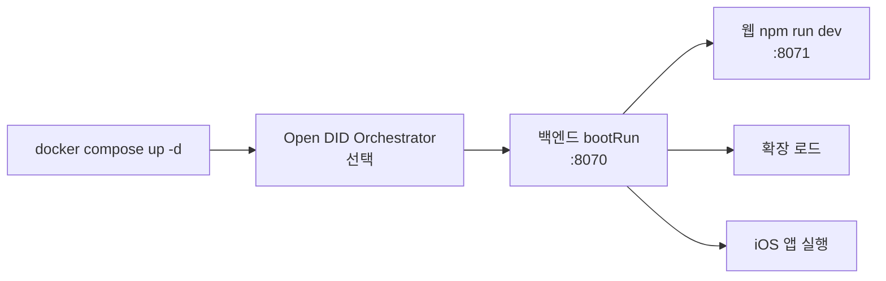

# 로컬 실행 가이드

네 저장소를 한 대의 개발 머신에서 띄우는 순서입니다.

## 사전 요구사항

| 도구 | 버전 | 필요한 곳 |
|---|---|---|
| JDK | 21 | 백엔드 |
| Docker / Docker Compose | 최신 | PostgreSQL, Redis |
| Node.js | 22.13.0 이상 | 웹 |
| Xcode | 26.x 권장 | iOS 앱 |
| Chrome | 최신 | 확장 |
| `yt-dlp` | 최신 | URL 검증(선택) |

추가로 다음이 준비되어야 완전한 기능을 쓸 수 있습니다.

- Open DID Orchestrator 2.0.0 (별도 저장소, 선택)
- 배포된 `JinBon.sol` 컨트랙트와 **배포에 사용한 지갑의 keystore**
- OmniOne CX 연동 정보

Open DID나 블록체인 없이도 실행은 가능하지만 기능이 제한됩니다.
[제한 모드](#제한-모드로-실행하기)를 참고합니다.

## 1. 진본 인프라 기동

```bash
cd jinbon-backend
docker compose up -d
```

| 컨테이너 | 호스트 포트 | 내부 포트 |
|---|---|---|
| `jinbon-postgres` | `${DB_PORT:-5432}` | 5432 |
| `jinbon-redis` | 6380 | 6379 |

DB 이름·계정은 모두 `jinbon`이고 비밀번호는 `DB_PASSWORD`(기본 `jinbon`)입니다.
데이터는 `jinbon_postgres_data`, `jinbon_redis_data` 볼륨에 남습니다.

```bash
docker compose ps        # 상태 확인
docker compose down      # 중지
docker compose down -v   # 볼륨까지 삭제 (초기화)
```

## 2. Open DID Orchestrator 기동 (선택)

별도 저장소입니다.

```bash
cd /path/to/did-orchestrator-server
sh download.sh 2.0.0          # 최초 1회
./gradlew clean build -x test
java -jar did-orchestrator-server-2.0.0.jar
```

브라우저에서 `http://localhost:9001` 접속 후:

1. Repository를 **Hyperledger Besu**로 선택
2. **Generate All** — Wallet과 DID Document 생성
3. **Start All** — TAS(8090), Issuer(8091), Verifier(8092), API GW(8093), CA(8094), Wallet(8095), Demo(8099) 기동

백엔드는 Issuer(8091)와 Verifier(8092)만 호출합니다.
나머지는 iOS 앱의 Wallet SDK가 사용합니다.

## 3. 백엔드 실행

```bash
cd jinbon-backend
cp .env.example .env
# .env를 채운다 — 아래 표 참고
./gradlew bootRun
```

`.env`에서 반드시 채워야 기동되는 값:

| 키 | 비고 |
|---|---|
| `DB_PASSWORD` | docker-compose와 동일하게 |
| `JWT_SECRET` | 토큰 및 영상 서명 키 |
| `CI_HMAC_SECRET` | **32자 이상**, `JWT_SECRET`과 달라야 함. 미달 시 기동 실패 |

컨트랙트를 쓰려면 추가로 채웁니다.

```bash
# contracts/JinBon.sol을 배포한 뒤
CONTRACT_ADDRESS=0x...        # 새로 배포한 주소
WALLET_ADDRESS=0x...          # 배포에 사용한 지갑
KEYSTORE_PASSWORD=...
BLOCKCHAIN_RPC_URL=...
BLOCKCHAIN_CHAIN_ID=...
BLOCKCHAIN_API_TOKEN=...
```

keystore 파일을 다음 경로에 둡니다.

```
src/main/resources/keystore/omnione-chain-keystore.json
```

이 지갑이 컨트랙트 배포 지갑과 다르면 `register`가 `"Only owner"`로 revert됩니다.

확인:

```bash
curl http://localhost:8070/health
open http://localhost:8070/swagger-ui/index.html
```

Swagger는 활성 프로필이 `dev`이거나 지정되지 않았을 때만 열립니다.

## 4. 웹 실행

```bash
cd jinbon-web
cp .env.example .env.local
npm install
npm run dev
```

`http://localhost:8071`에서 열립니다.
백엔드 주소를 바꾸려면 `.env.local`의 `NEXT_PUBLIC_API_BASE_URL`을 수정합니다.

```bash
npm run test    # build 후 렌더링 테스트
npm run lint
```

## 5. Chrome 확장 설치

1. Chrome 주소창에 `chrome://extensions` 입력
2. 우상단 **개발자 모드** 켜기
3. **압축해제된 확장 프로그램을 로드합니다** 클릭
4. `jinbon-extension` 디렉터리 선택

설치 후 YouTube 영상 페이지에 들어가면 우하단에 `진본 확인` 버튼이 나타납니다.

백엔드 주소가 `localhost:8070`이 아니면 확장 아이콘 → 팝업에서 주소를 바꿉니다.
다만 `manifest.json`의 `host_permissions`에도 해당 호스트를 추가해야 요청이 나갑니다.

## 6. iOS 앱 실행

```bash
cd jinbon-ios
open source/DIDCA.xcodeproj
```

1. `Dev.xcconfig`의 URL을 개발 머신 주소로 수정
   - 시뮬레이터에서 로컬 백엔드를 쓰려면 `JINBON_URL = http:/$()/localhost:8070`
   - 실기기라면 개발 머신의 LAN IP
2. 시뮬레이터 또는 실기기 선택 후 실행

`Dev.xcconfig`의 URL 표기에 있는 `$()`는 xcconfig가 `//`를 주석으로 해석하는 것을 막는 관용 표현입니다.
지우면 URL이 잘립니다.

## 기동 순서 요약



백엔드가 먼저 떠 있어야 나머지 세 클라이언트가 동작합니다.

## 제한 모드로 실행하기

외부 연동 없이 최소 구성으로 띄우는 방법입니다.

### Open DID 없이

```bash
OPENDID_ENABLED=false
```

- 영상 등록·검증·블록체인 기록: 정상
- VC 발급 준비·완료·검증: 생략
- 검증 응답의 `vcVerified`는 항상 `false`
- `vc/prepare`, `vc/complete` 호출 시 `D006`(503)

### 블록체인 없이

블록체인은 **끌 수 있는 스위치가 없습니다.**
`CONTRACT_ADDRESS`나 RPC가 없으면 영상 등록이 `BLOCKCHAIN_TX_FAILED`(V008)로 실패합니다.
검증은 `VERIFICATION_UNAVAILABLE`로 응답하며 서비스 자체는 뜹니다.

### yt-dlp 없이

URL 검증(`POST /api/verify/url`)만 실패합니다.
파일 업로드 검증과 웹 화면은 정상 동작하고, Chrome 확장만 쓸 수 없습니다.

## 자주 겪는 문제

| 증상 | 원인과 해결 |
|---|---|
| 기동 즉시 `CI_HMAC_SECRET must be at least 32 characters` | `.env`의 `CI_HMAC_SECRET`을 32자 이상으로 |
| 영상 등록이 `Only owner`로 revert | keystore·`WALLET_ADDRESS`가 컨트랙트 배포 지갑과 다름 |
| 등록이 `V008`로 실패 | RPC 연결 불가 또는 영수증 5초 내 미확정 |
| 검증이 계속 `VERIFICATION_UNAVAILABLE` | 체인 조회 실패, 또는 `JWT_SECRET`이 등록 시점과 달라짐 |
| Swagger가 401·403 | 활성 프로필이 `dev`가 아님 |
| 웹에서 "검증 서버에 연결할 수 없습니다" | 백엔드 미기동 또는 `NEXT_PUBLIC_API_BASE_URL` 불일치 |
| 확장 버튼을 눌러도 응답 없음 | 백엔드 주소가 `host_permissions`에 없음 |
| 확장에서 Netflix 검증 실패 | 백엔드 허용 호스트에 Netflix가 없음 ([알려진 이슈](../90-status/open-issues.md)) |
| 지각해시 생성 실패 | JavaCV 네이티브 로드 실패. 아키텍처에 맞는 의존성 확인 |

## 참고

- 저장소별 상세 설정값: [환경 설정값](environment-config.md)
- 포트 전체 목록: [시스템 아키텍처](../10-architecture/system-architecture.md)
