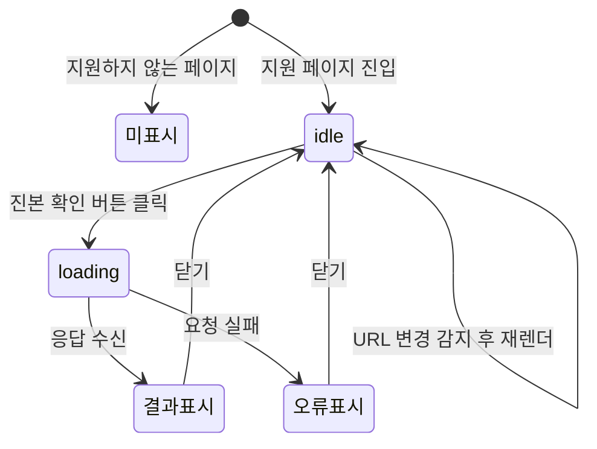

# 확장 화면 기획서

`jinbon-extension`의 현재 구현 화면 명세입니다.
모든 문구는 `src/content.js`, `src/popup.html`, `src/popup.js`에 있는 그대로입니다.

## 주입 방식

`content.js`가 `<html>` 바로 아래에 컨테이너를 하나 추가합니다.

```js
const ROOT_ID = 'jinbon-extension-root';
root.setAttribute('data-jinbon-state', 'idle');
document.documentElement.appendChild(root);
```

`data-jinbon-state` 속성이 `idle` / `loading`으로 바뀌며 스타일 상태를 표현합니다.

### 표시 조건

```js
const SUPPORTED_HOSTS = ['youtube.com', 'netflix.com'];
```

| 사이트 | 경로 조건 |
|---|---|
| YouTube | `/watch` 또는 `/shorts/`로 시작 |
| Netflix | `/watch/`로 시작 |

`www.` 접두사는 제거하고 비교하며, 서브도메인도 허용합니다.
조건에 맞지 않으면 컨테이너를 아예 제거합니다.

### SPA 대응

YouTube와 Netflix는 페이지 이동 시 문서를 새로 불러오지 않습니다.
1초 간격 폴링으로 URL 변화를 감지해 다시 그립니다.

```js
setInterval(() => {
  if (location.href !== lastUrl) init();
}, 1000);
```

---

## E-01 진본 확인 버튼

**위치** 페이지 우하단 고정 · **상태** `data-jinbon-state="idle"`

```html
<button class="jinbon-button" type="button" title="현재 영상 진본 여부 확인">
  <span class="jinbon-mark">J</span>
  <span>진본 확인</span>
</button>
```

| 요소 | 내용 |
|---|---|
| 마크 | `J` |
| 라벨 | `진본 확인` |
| 툴팁 | `현재 영상 진본 여부 확인` |

클릭하면 검증이 시작되고, 검증 중 재클릭은 `isVerifying` 플래그로 무시합니다.

---

## E-02 결과 패널

**요소** `<section class="jinbon-panel">` · 기본 `hidden`

버튼과 같은 컨테이너 안에 있으며 상태에 따라 클래스가 `jinbon-panel is-{tone}`으로 바뀝니다.

**공통 구조**

```html
<div class="jinbon-panel-header">
  <strong>{제목}</strong>
  <button class="jinbon-close" type="button" title="닫기">×</button>
</div>
<p>{메시지}</p>
<dl>…상세 행…</dl>     ← 있을 때만
<small>{주의}</small>   ← 있을 때만
```

닫기 버튼을 누르면 패널을 숨기고 상태를 `idle`로 되돌립니다.

### 상태별 표시

| 톤 | 제목 | 메시지 |
|---|---|---|
| `loading` | `진본 확인 중` | `현재 영상 URL을 분석하고 있어요.` |
| `success` | `진본으로 확인됨` | 서버 `message` 또는 `등록된 진본 기록과 일치합니다.` |
| `warning` | `진본 확인 안 됨` | 서버 `message` 또는 `등록된 진본 기록을 찾지 못했습니다.` |
| `error` | `확인 실패` | 오류 메시지 또는 `백엔드 서버가 켜져 있는지 확인해주세요.` |

성공/경고 판정 기준은 `result.authentic` 하나입니다.

```js
const title = result.authentic ? '진본으로 확인됨' : '진본 확인 안 됨';
const tone  = result.authentic ? 'success' : 'warning';
```

### 상세 행

| 라벨 | 값 | 표시 조건 |
|---|---|---|
| 판정 | `verdict`를 Title Case로 변환 | `verdict`가 있을 때 |
| 유사도 거리 | 소수점 1자리 | `similarityDistance`가 숫자일 때 |
| 영상 ID | 숫자 문자열 | `videoId`가 있을 때 |
| 등록 시각 | 포맷된 날짜 | `registeredAt`이 있을 때 |
| 블록체인 | `검증됨` / `미검증` | 항상 |
| VC | `검증됨` / `미검증` | 항상 |

**판정 변환** — 언더스코어를 공백으로 바꾸고 각 단어 첫 글자를 대문자로 만듭니다.

| 백엔드 값 | 화면 표시 |
|---|---|
| `EXACT_MATCH` | `Exact Match` |
| `SAME_CONTENT` | `Same Content` |
| `SIMILAR_MATCH` | `Similar Match` |
| `REGISTERED_BUT_REVOKED` | `Registered But Revoked` |
| `CERTIFICATE_INVALID` | `Certificate Invalid` |
| `NOT_REGISTERED` | `Not Registered` |
| `VERIFICATION_UNAVAILABLE` | `Verification Unavailable` |

한국어로 번역하지 않고 영문 그대로 노출합니다.
나머지 화면 문구가 모두 한국어인 점과 대비됩니다.

### 보안 처리

패널에 들어가는 모든 값은 `escapeHtml()`을 거쳐 삽입됩니다.
`innerHTML`을 쓰지만 서버 응답이 그대로 실행되지 않습니다.

---

## E-03 설정 팝업

**파일** `src/popup.html` · **진입** 확장 아이콘 클릭 · **언어** `lang="ko"`

| 요소 | 내용 |
|---|---|
| 제목 | `Jinbon` (`<h1>`) |
| 라벨 | `백엔드 주소` |
| 입력 | `type="url"`, `spellcheck="off"`, `autocomplete="off"` |
| 버튼 | `저장` |
| 상태 | `role="status"` |

**동작**

- 열릴 때 `chrome.storage.sync`에서 `apiBaseUrl`을 읽어 입력란에 채웁니다(기본 `http://localhost:8070`).
- 저장 시 앞뒤 공백과 끝의 `/`를 제거하고, 비어 있으면 기본값으로 되돌립니다.
- 저장 후 `저장됨`을 표시하고 1.6초 뒤 지웁니다.

```js
const value = input.value.trim().replace(/\/$/, '') || DEFAULT_API_BASE_URL;
```

> 주소를 바꿔도 `manifest.json`의 `host_permissions`에 해당 호스트가 없으면
> 요청이 차단됩니다. 현재는 `http://localhost:8070/*`만 등록되어 있습니다.

---

## 화면 흐름



## Netflix에서의 동작

버튼은 Netflix 시청 페이지에도 정상적으로 표시됩니다.
다만 백엔드의 URL 검증 허용 호스트에 Netflix가 없어
요청을 보내면 `VIDEO_DOWNLOAD_FAILED`(VF002, 400)가 돌아오고
패널에 `확인 실패`가 표시됩니다.

`manifest.json`의 설명과 `README.md`는 Netflix 지원을 명시하고 있으므로
문구와 실제 동작이 어긋납니다. 자세한 내용은 [알려진 이슈](../90-status/open-issues.md)를 참고합니다.
