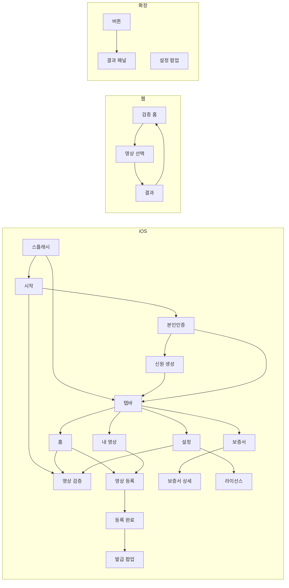

# 화면 목록

세 클라이언트의 **현재 구현된 화면** 전체 목록입니다.
디자인 시안이 아니라 코드에서 확인한 실제 화면이며, 문구도 코드에 있는 그대로입니다.

## 요약

| 채널 | 화면 수 | 비고 |
|---|---:|---|
| iOS 앱 (진본 화면) | 14 | 팝업·다이얼로그 포함 |
| iOS 앱 (원본 SDK 화면) | 다수 | DID 생성 등에서만 재사용 |
| 인증 웹페이지 | 1 | 백엔드가 서빙, 앱 웹뷰에서 표시 |
| 웹 | 1 | 상태에 따라 3개 뷰로 전환 |
| Chrome 확장 | 3 | 주입 버튼, 결과 패널, 설정 팝업 |

## iOS 앱

상세: [iOS 화면 기획서](ios-screens.md)

| # | 화면 | 클래스 | 진입 경로 |
|---|---|---|---|
| A-01 | 스플래시 | `SplashViewController` | 앱 실행 |
| A-02 | 시작 화면 | `JinBonWelcomeViewController` | 미로그인 시 |
| A-03 | 본인인증 웹뷰 | `AuthWebViewController` | 시작 화면의 회원가입·로그인 |
| A-04 | 디지털 신원 생성 | `StepViewController` | 본인확인 후 DID 없을 때 |
| A-05 | 탭바 | `JinBonTabBarController` | 로그인 완료 |
| A-06 | 홈 | `JinBonHomeViewController` | 탭 1 |
| A-07 | 내 영상 | `VideoListViewController` | 탭 2 |
| A-08 | 등록 보증서 목록 | `JinBonCertificateViewController` | 탭 3 |
| A-09 | 설정 | `JinBonSettingsViewController` | 탭 4 |
| A-10 | 영상 온체인 등록 | `VideoUploadViewController` | 홈·내 영상의 등록 버튼 |
| A-11 | 등록 완료 | `VideoRegistrationCompletionViewController` | 등록 성공 후 |
| A-12 | 보증서 발급 확인 팝업 | `JinBonVcOfferViewController` | 등록 완료 후 |
| A-13 | 영상 검증 | `VideoVerifyViewController` | 홈·시작 화면·설정 |
| A-14 | 등록 보증서 상세 | `JinBonCertificateDetailViewController` | 보증서 목록에서 선택 |
| A-15 | 오픈소스 라이선스 | `OpenSourceLicensesViewController` | 설정 |
| A-16 | 문서 뷰어 | `LicenseDocumentViewController` | 라이선스 화면 |

A-11·A-12는 `VideoUploadViewController.swift`, A-14는 `JinBonCertificateViewController.swift`,
A-15·A-16은 `JinBonSettingsViewController.swift` 안에 `private final class`로 정의되어 있습니다.

### 재사용하는 원본 SDK 화면

진본 화면에서 호출하는 원본 `did-ca-ios` 화면입니다.

| 화면 | 식별자 | 용도 |
|---|---|---|
| 단계 안내 | `StepViewController` | DID 생성·등록 진행 |
| PIN 입력 | `PincodeViewController` | Wallet 잠금 해제, 발급 승인 |
| 공통 다이얼로그 | `ErrorDialogViewController`, `OneButtonDialogViewController`, `TwoButtonDialogViewController`, `InputPopUpViewController` | 알림·확인 |
| 로딩 | `ActivityIndicatorViewController` | 처리 중 표시 |

`MainViewController`, `AddVcViewController`, `QRScanViewController`, `VCDetailViewController`,
`IssueProfileViewController`, `VerifyProfileViewController` 등 원본 화면은
스토리보드에 남아 있으나 **진본 사용자 흐름에서는 진입하지 않습니다.**

## 인증 웹페이지

상세: [iOS 화면 기획서](ios-screens.md#a-03-본인인증-웹뷰)

| # | 화면 | 파일 | 표시 위치 |
|---|---|---|---|
| W-00 | 모바일 신분증 본인확인 | `jinbon-backend/src/main/resources/static/auth.html` | 앱 `AuthWebViewController` 내 `WKWebView` |

`?mode=signup` 유무로 회원가입/로그인을 구분하며 화면 구조는 동일합니다.

## 웹

상세: [웹 화면 기획서](web-screens.md)

| # | 화면 | 상태 | 구성 |
|---|---|---|---|
| W-01 | 검증 홈 (초기) | `result == null`, `file == null` | 드롭존 + 안내 |
| W-02 | 영상 선택됨 | `file != null` | 미리보기 + 검증 버튼 |
| W-03 | 검증 결과 | `result != null` | 결과 패널 |

세 화면은 같은 라우트(`/`)에서 상태로 전환됩니다. 페이지 이동이 없습니다.

## Chrome 확장

상세: [확장 화면 기획서](extension-screens.md)

| # | 화면 | 파일 | 표시 위치 |
|---|---|---|---|
| E-01 | 진본 확인 버튼 | `src/content.js` | YouTube·Netflix 페이지 우하단 |
| E-02 | 결과 패널 | `src/content.js` | 버튼 위 오버레이 |
| E-03 | 설정 팝업 | `src/popup.html` | 확장 아이콘 클릭 |

## 화면 간 이동 경로

## 화면이 없는 기능

백엔드에 있으나 어느 화면에서도 노출되지 않는 것들입니다.

| 기능 | 상태 |
|---|---|
| 영상 상세 조회 API | 목록 응답에 상세가 다 들어 있어 별도 화면 없음 |
| 회원 정지·탈퇴 | 상태값만 정의, 관리 화면 없음 |
| VC 폐기 | 에러 코드만 정의 |
| 웹에서의 URL 검증 | 백엔드 API는 있으나 웹에 입력란 없음 |
