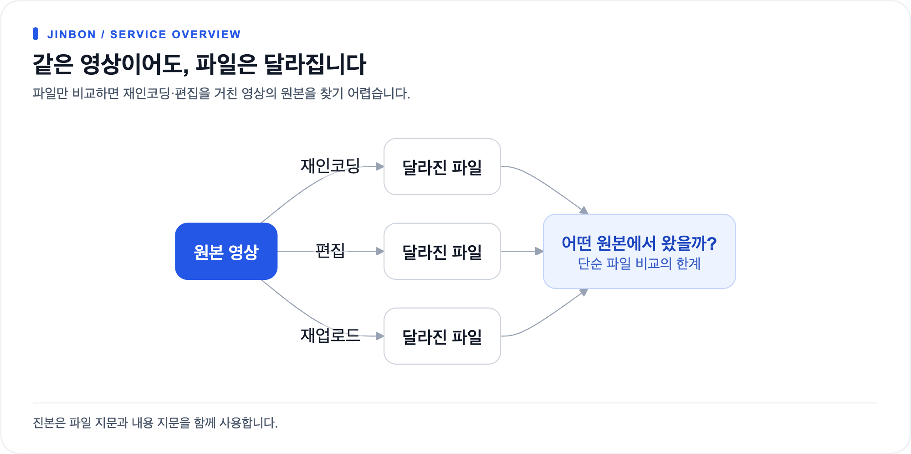
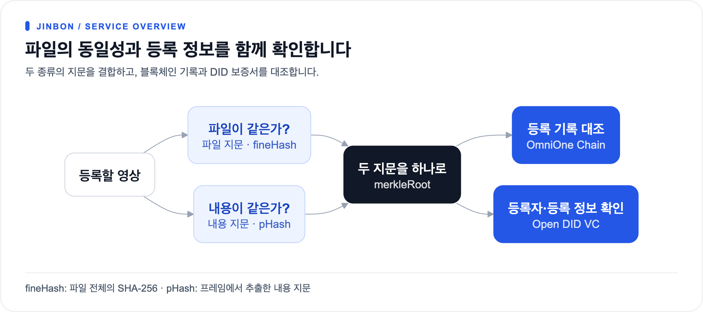
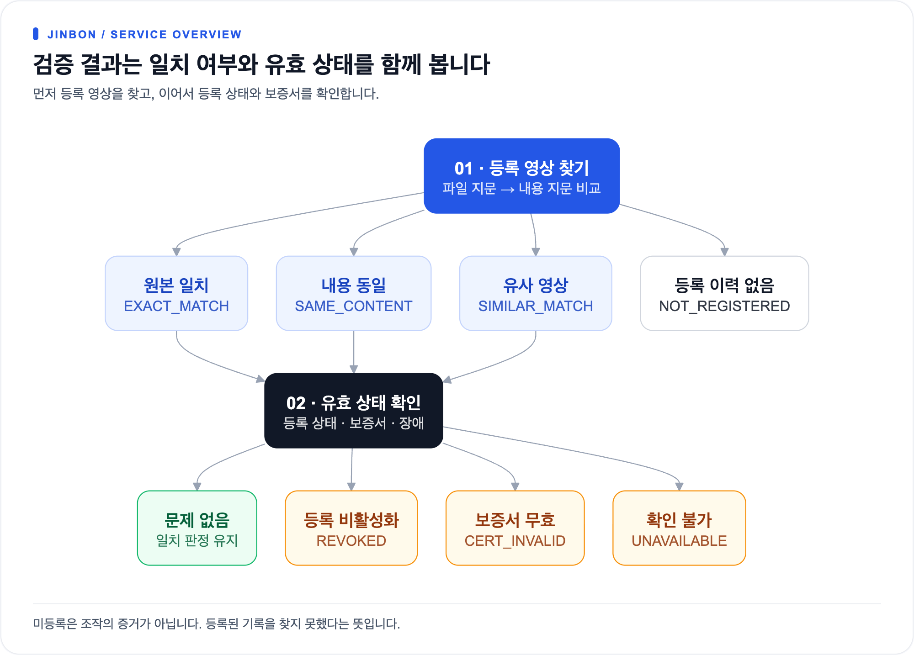
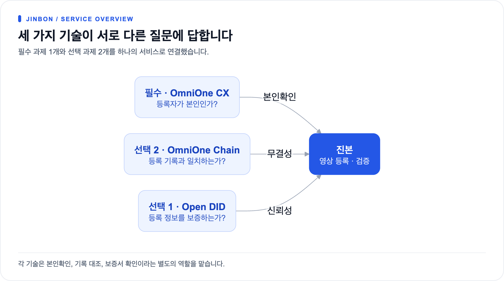
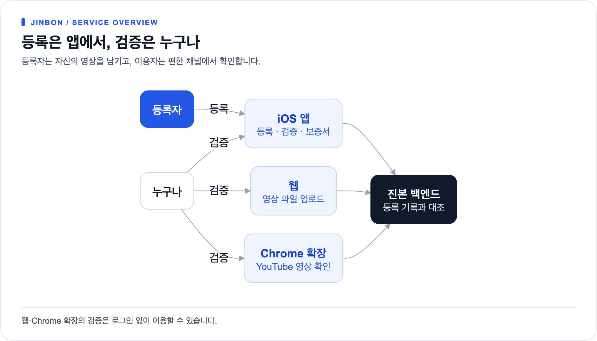
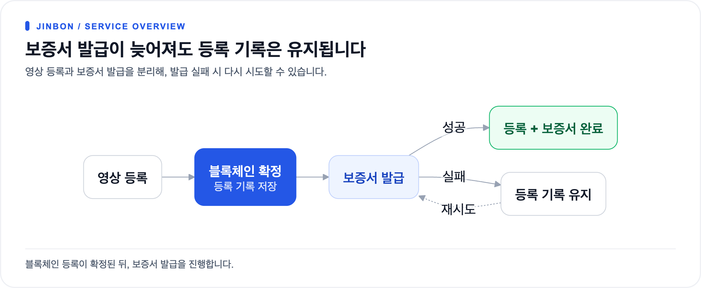

# 서비스 한눈에

## 문제

[크게 보기](diagrams/01-service-at-a-glance-1.png) · [Mermaid 원본](diagrams/01-service-at-a-glance-1.mmd)

파일이 조금만 달라져도 단순 비교로는 **같은 영상인지조차** 알 수 없습니다.

---

## 해결 — 두 갈래 증명

[크게 보기](diagrams/01-service-at-a-glance-2.png) · [Mermaid 원본](diagrams/01-service-at-a-glance-2.mmd)

| 해시 | 성격 | 잡아내는 것 |
|---|---|---|
| **fineHash** | 바이트 단위 | 완전히 동일한 원본 파일 |
| **perceptualHash** | 내용 기반 | 재인코딩·리사이즈해도 **같은 영상** |

두 해시를 이어 SHA-256을 한 번 더 → `merkleRoot` → **이 값만 블록체인에 기록**

---

## 검증 결과 — 일치 여부와 유효 상태

[크게 보기](diagrams/01-service-at-a-glance-3.png) · [Mermaid 원본](diagrams/01-service-at-a-glance-3.mmd)

> **미등록은 조작의 증거가 아닙니다.** 등록된 적이 없다는 뜻일 뿐이며,
> 서버가 이 안내 문구를 응답에 함께 담아 보냅니다.

---

## 해커톤 과제 대응

[크게 보기](diagrams/01-service-at-a-glance-4.png) · [Mermaid 원본](diagrams/01-service-at-a-glance-4.mmd)

| 과제 | 진본에서의 역할 | 상태 |
|---|---|---|
| 필수 · OmniOne CX | 등록자 본인확인 및 로그인 | ✅ 구현 |
| 선택 1 · Open DID | 온체인 등록 사실을 보증하는 VC | ✅ 구현 |
| 선택 2 · OmniOne Chain | merkleRoot 기록 + 서명 대조 | ✅ 구현 |

---

## 사용자와 채널

[크게 보기](diagrams/01-service-at-a-glance-5.png) · [Mermaid 원본](diagrams/01-service-at-a-glance-5.mmd)

| 채널 | 하는 일 | 로그인 |
|---|---|---|
| 📱 **iOS 앱** | 가입 · DID/Wallet 관리 · **영상 등록** · 보증서 보관 | 필요 |
| 🌐 **웹** | 영상 파일 올려 검증 | 불필요 |
| 🧩 **Chrome 확장** | 보고 있는 YouTube·Instagram 영상 즉시 검증 | 불필요 |

---

## 설계상 중요한 선택

[크게 보기](diagrams/01-service-at-a-glance-6.png) · [Mermaid 원본](diagrams/01-service-at-a-glance-6.mmd)

**등록과 보증서 발급을 분리**했습니다.
Open DID 서버가 꺼져 있어도 영상 등록·블록체인 기록·검증은 정상 동작합니다.

| 지키는 원칙 | 방법 |
|---|---|
| 원본 영상을 서버에 남기지 않음 | 해시 계산 후 임시 파일 즉시 삭제 |
| 개인 식별정보(CI)를 저장하지 않음 | HMAC-SHA256 해시만 보관 |
| 중복 등록 차단 | 파일해시 · 내용해시 · DB 제약 **3중** |
| 동시 요청에 중복 트랜잭션 방지 | DB 선점 후 블록체인 전송 |
| DB가 조작돼도 탐지 | 서명 재계산 후 **온체인 값과 대조** |

---

→ 서비스 개요는 **[서비스 개요](../reference/00-overview/service-overview.md)**
→ 영상 검증 로직은 **[영상 검증 플로우](../reference/20-flows/video-verify.md)**
