# 화면 흐름

아래 목업은 **실제 구현된 화면의 문구·색상·레이아웃을 코드에서 그대로 옮긴 것**입니다.
디자인 시안이 아니라 지금 빌드되는 화면입니다.

> 색상 출처 — iOS `ColorPalette.swift` (`#2457E6`), 웹 `globals.css` (`#ff6a3d`)
> 목업 재생성 — `python3 mockups/generate.py`

---

## 📱 iOS — 등록자 여정

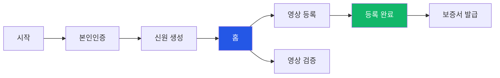

### 1 · 진입과 가입

<table>
<tr>
<td align="center" width="50%">
 
<b>시작 화면</b>
</td>
<td align="center" width="50%">
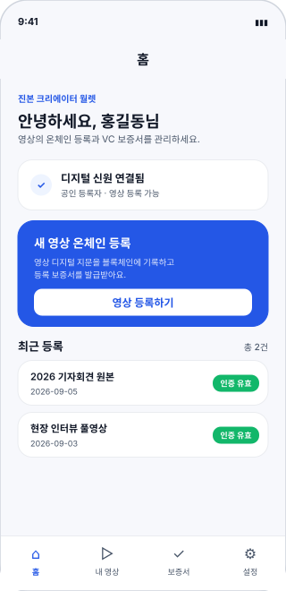 
<b>홈</b>
</td>
</tr>
<tr>
<td valign="top">

`JinBonWelcomeViewController`

- 회원가입 / 로그인 카드 2종
- **로그인 없이 영상 검증하기** 진입점
- 로그인 후 기기 Wallet DID와 계정 DID를 대조해
  다른 계정 Wallet 연결을 차단

</td>
<td valign="top">

`JinBonHomeViewController`

- 신원 연결 상태 · 등록 권한 표시
- **새 영상 온체인 등록** 주요 동작
- 최근 등록 목록 + 인증 유효 배지
- 당겨서 새로고침

</td>
</tr>
</table>

### 2 · 영상 등록

<table>
<tr>
<td align="center" width="33%">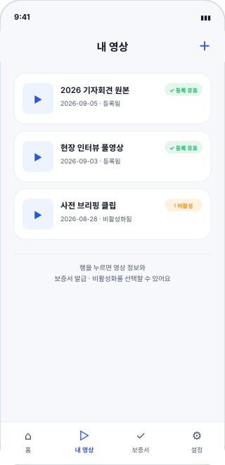 <b>내 영상</b></td>
<td align="center" width="33%">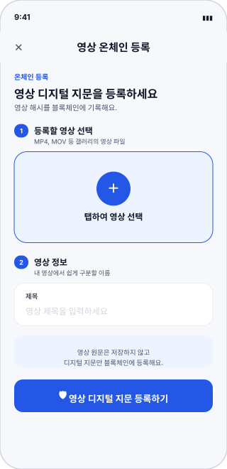 <b>영상 온체인 등록</b></td>
<td align="center" width="33%">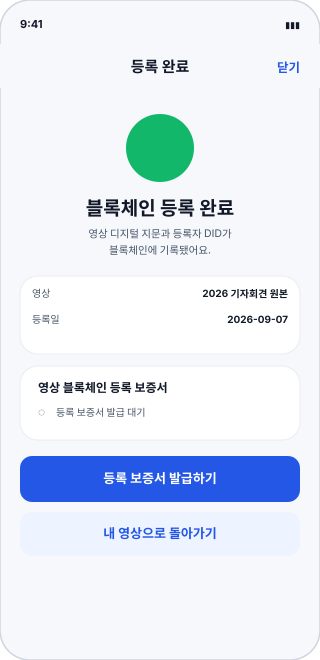 <b>등록 완료</b></td>
</tr>
<tr>
<td valign="top">

등록 유효 / 비활성 상태를 배지로 구분.
행을 누르면 재생 · 보증서 발급 · 비활성화 선택.

</td>
<td valign="top">

**STEP 1** 영상 선택 → **STEP 2** 제목 입력.
"영상 원문은 저장하지 않고 디지털 지문만 등록해요" 고지.

</td>
<td valign="top">

블록체인 기록 확정 표시.
보증서는 아직 **발급 대기** 상태.

</td>
</tr>
</table>

### 3 · 보증서

<table>
<tr>
<td align="center" width="50%">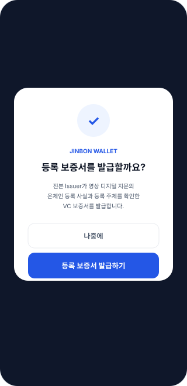 <b>발급 확인 팝업</b></td>
<td align="center" width="50%"> <b>등록 보증서 상세</b></td>
</tr>
<tr>
<td valign="top">

`JinBonVcOfferViewController`

**나중에** 를 선택해도 등록은 유지되며
내 영상 목록에서 언제든 재발급할 수 있습니다.

</td>
<td valign="top">

`JinBonCertificateDetailViewController`

VC 클레임을 한국어로 변환해 표시.
하단에 **"영상 내용의 사실성은 보증하지 않는다"** 고지.

</td>
</tr>
</table>

### 4 · 검증

<table>
<tr>
<td align="center" width="42%"></td>
<td valign="middle">

**영상 검증** `VideoVerifyViewController`

3개 항목을 항상 같은 순서로 보여줍니다.

| 항목 | 예시 값 |
|---|---|
| 영상 디지털 지문 | 정확히 일치 |
| 블록체인 등록 | 확인됨 |
| 진본 VC 보증서 | 유효 |

판정 7종을 **각각 다른 제목·아이콘·색**으로 구분합니다.

| 판정 | 표시 |
|---|---|
| `EXACT_MATCH` | 🟢 등록 영상과 정확히 일치합니다 |
| `SAME_CONTENT` | 🔵 등록된 영상과 내용이 일치합니다 |
| `SIMILAR_MATCH` | 🔵 등록 영상과 유사합니다 |
| `REGISTERED_BUT_REVOKED` | 🟠 비활성화된 등록 영상입니다 |
| `CERTIFICATE_INVALID` | 🟠 등록은 확인됐지만 보증서가 유효하지 않습니다 |
| `NOT_REGISTERED` | ⚪ 등록 기록을 찾지 못했습니다 |
| `VERIFICATION_UNAVAILABLE` | 🟠 현재 검증할 수 없습니다 |

</td>
</tr>
</table>

### 탭 구조

| 탭 | 화면 | 역할 |
|---|---|---|
| 홈 | `JinBonHomeViewController` | 대시보드 · 등록 진입 |
| 내 영상 | `VideoListViewController` | 등록 영상 관리 |
| 보증서 | `JinBonCertificateViewController` | Wallet 내 VC 목록 |
| 설정 | `JinBonSettingsViewController` | 신원 · 보안 · 라이선스 |

---

## 🌐 웹 — 비회원 검증

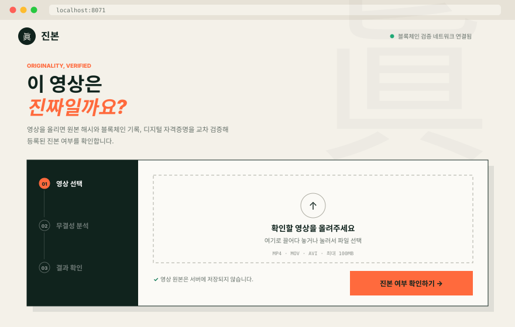

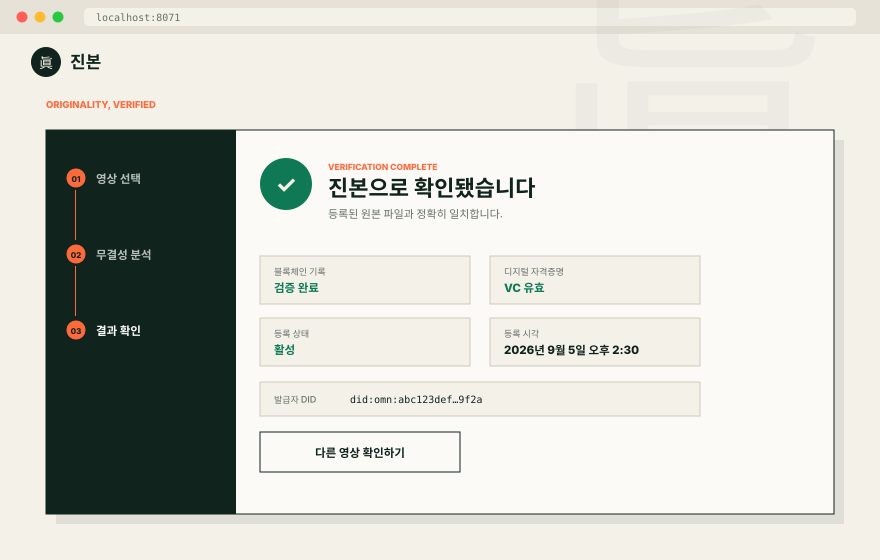

`app/page.tsx` 단일 페이지. 페이지 이동 없이 상태로만 전환됩니다.

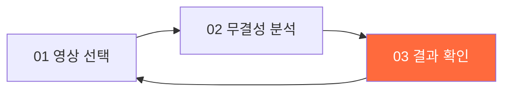

| 특징 | 내용 |
|---|---|
| 디자인 | 편집디자인 스타일 · 眞 워터마크 · 하드 섀도 |
| 검사 | 업로드 전 영상 타입 · 100MB 확인 |
| 고지 | "영상 원본은 서버에 저장되지 않습니다." |
| 결과 | 블록체인 · 자격증명 · 등록 상태 · 등록 시각 4칸 |

> ⚠️ 웹은 판정 7종을 **3가지 톤**(진본 / 미등록 / 주의)으로만 축약해 보여줍니다.
> `CERTIFICATE_INVALID`와 일시 장애가 한 문구로 묶입니다. → [알려진 이슈 #2](../reference/90-status/open-issues.md)

---

## 🧩 Chrome 확장 — 보던 자리에서 검증

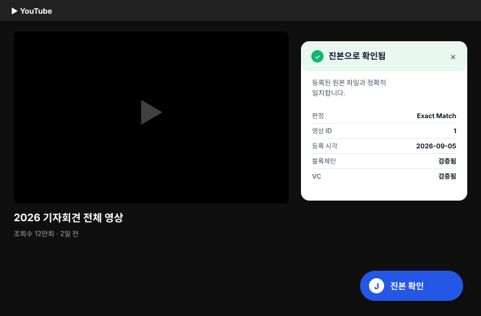

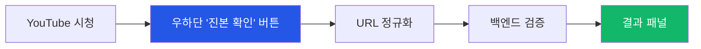

| 요소 | 동작 |
|---|---|
| 버튼 주입 | YouTube `/watch`·`/shorts/`, Netflix `/watch/` |
| SPA 대응 | 1초 간격 URL 변화 감지 후 재렌더 |
| URL 정규화 | 재생목록·타임스탬프 제거 → 캐시 적중률 향상 |
| 결과 | 판정 · 유사도 · 영상 ID · 등록 시각 · 블록체인 · VC |

> ⚠️ Netflix는 버튼이 뜨지만 백엔드 허용 호스트에 없어 실패합니다. → [알려진 이슈 #3](../reference/90-status/open-issues.md)

---

## 전체 화면 지도

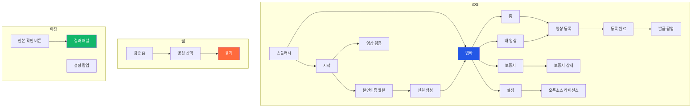

전 화면의 문구·상태·분기까지 담은 명세는
**[reference/70-screens/](../reference/70-screens/screen-inventory.md)** 에 있습니다.
