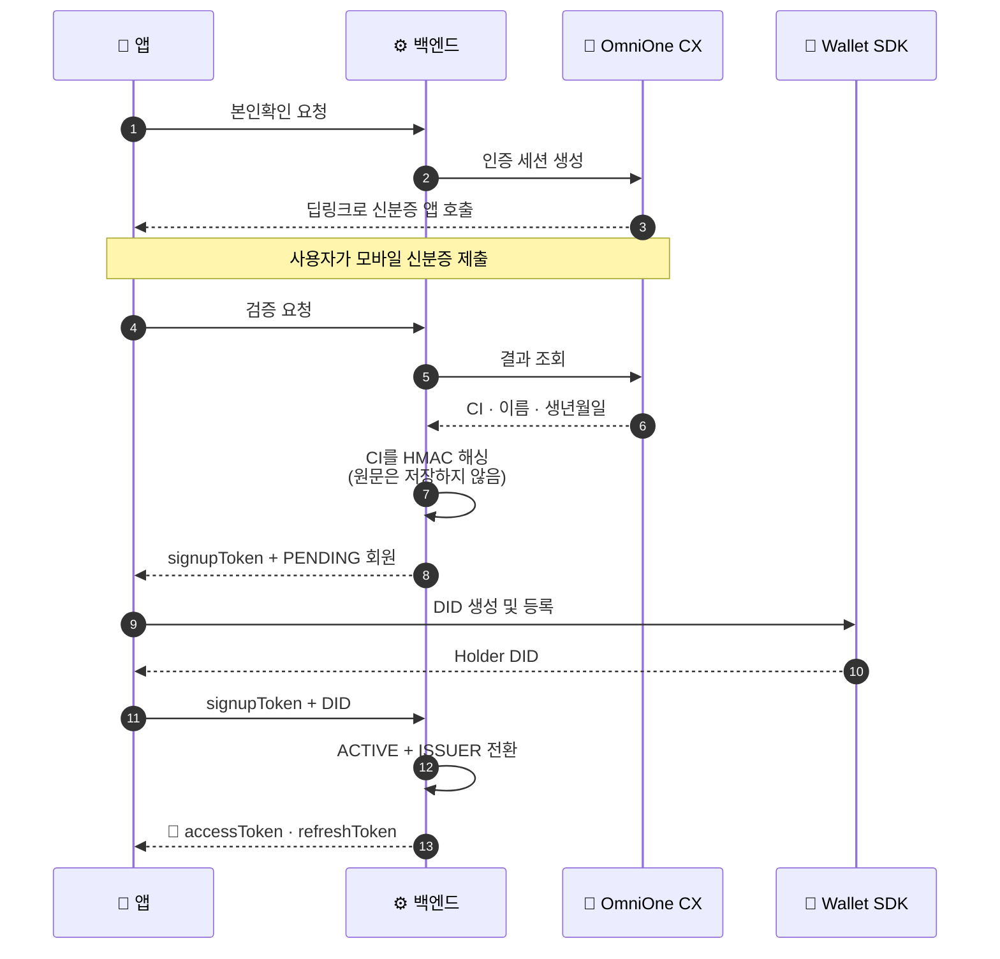
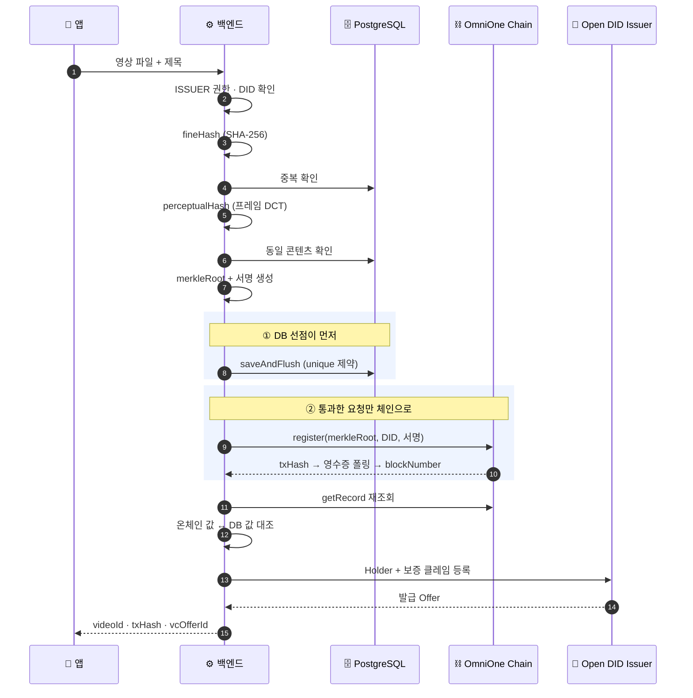
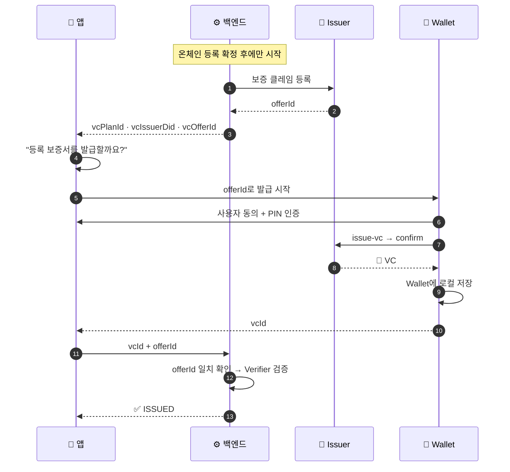
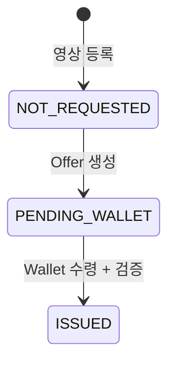
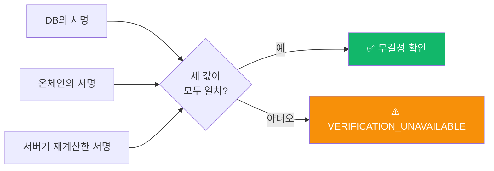
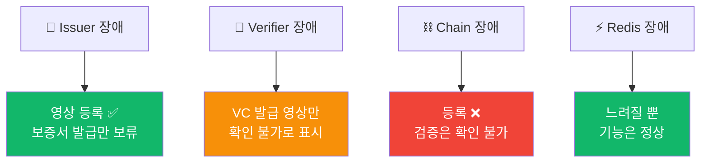

# 핵심 시퀀스

진본의 동작을 네 장면으로 나눠 봅니다.

---

## 1 · 가입 — 신분증에서 DID까지



| 지키는 것 | 방법 |
|---|---|
| CI 원문 미저장 | `HMAC-SHA256` 해시(`h1:` 접두사)만 DB에 |
| 자동 가입 방지 | 로그인 흐름에서 회원을 만들지 않음 |
| 계정 도용 방지 | 기기 Wallet DID ≠ 계정 DID면 연결 거부 |

> **앱 재설치로 DID가 사라지면?** 로그인 시 함께 받은 단기 `didRebindToken`으로
> 새 DID를 안전하게 재연결합니다. 기존 영상 소유권은 `memberId` 기준이라 유지됩니다.

---

## 2 · 등록 — 해시에서 온체인까지



**왜 DB를 먼저 저장할까요?**
블록체인을 먼저 부르면 동시에 들어온 같은 파일이 **여러 트랜잭션**을 만듭니다.
DB의 unique 제약으로 하나만 통과시킨 뒤 체인에 기록합니다.

**왜 기록 후 다시 조회할까요?**
트랜잭션 영수증만으로는 최종 상태를 보증할 수 없습니다.
확정된 값을 다시 읽어 대조한 뒤에야 보증서 발급을 시작합니다.

---

## 3 · 보증서 발급 — Wallet이 받아가는 구조





VC에 담기는 것은 **온체인 등록 증거**입니다.

| 클레임 | 값 |
|---|---|
| 영상 디지털 지문 | `merkleRoot` |
| 등록자 DID | 영상을 등록한 사람 |
| 블록체인 네트워크 · 체인 ID · 컨트랙트 | 어디에 기록했는지 |
| 트랜잭션 해시 · 블록 번호 | 어느 기록인지 |
| 온체인 등록 시각 | 언제인지 |

> 원본 해시(`fineHash`, `perceptualHash`)는 VC에 넣지 않습니다. 대표값만 담습니다.

---

## 4 · 검증 — 누구나, 로그인 없이

```mermaid
sequenceDiagram
  autonumber
  participant U as 🌐 웹 · 🧩 확장
  participant B as ⚙️ 백엔드
  participant R as ⚡ Redis
  participant DB as 🗄️ DB
  participant CH as ⛓️ Chain
  participant V as 📜 Verifier

  U->>B: 영상 파일 또는 URL
  B->>R: 캐시 조회 (TTL 10분)
  alt 캐시 적중
    R-->>U: ⚡ 즉시 반환
  else 캐시 없음
    B->>B: fineHash 계산
    B->>DB: 정확 일치 조회
    alt 불일치
      B->>B: perceptualHash 계산
      B->>DB: 유사도 검색 (해밍 거리 &lt; 10)
    end
    B->>CH: getRecord(merkleRoot)
    B->>B: 서명 재계산 → 온체인 값과 대조
    opt VC 발급된 영상
      B->>V: 상태 + 서명 검증
    end
    B->>R: 결과 캐싱
    B-->>U: verdict + message + notice
  end
```

**무결성이 보장되는 이유**



DB가 조작돼도 서버 비밀키 없이는 서명을 다시 만들 수 없고,
온체인 값은 애초에 바꿀 수 없습니다. **셋이 동시에 맞아야** 통과합니다.

---

## 장애가 나면 어떻게 되나



일시 장애 결과(`VERIFICATION_UNAVAILABLE`)는 **캐싱하지 않습니다.**
10분 동안 잘못된 결과가 고정되는 것을 막기 위해서입니다.

---

각 흐름의 조건·예외·에러 코드까지 필요하면
**[reference/20-flows/](../reference/20-flows/video-verify.md)** 를 참고하세요.
